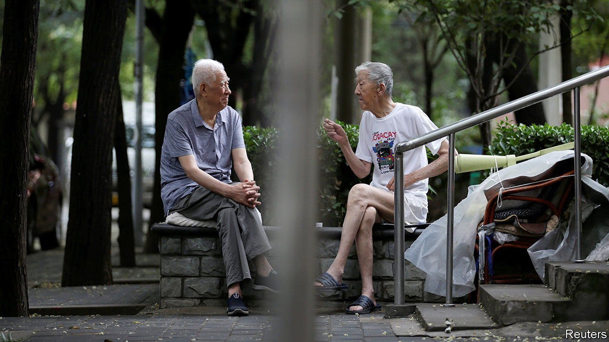
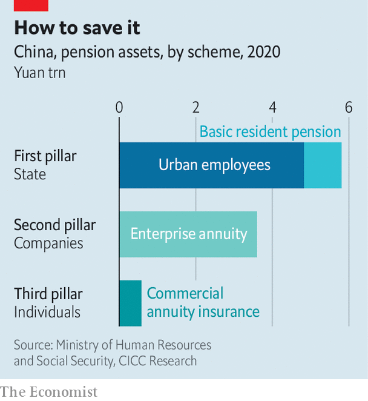

###### Pillar talk

# China plans to roll out private, personal pensions 

##### About time 

 

> Apr 28th 2022 

“ASTONISHING”, “SPECTACULAR”, “unprecedented”: China has won plaudits from the World Bank and other experts for the rapid expansion of its basic state pensions over the past dozen years. The number enrolled in these schemes (including one for urban employees) crossed 1bn in 2021. But the speedy construction of this first “pillar” of China’s pension system has not been matched elsewhere in the planned edifice.

A second pillar is supposed to rest on firms, which can enroll employees in a company pension. But fewer than 29m people, less than 10% of the eligible workforce, had signed up for these “enterprise annuities” by the end of last year. China’s third pillar—personal pensions—is even stumpier. Although individuals in China save a lot, buying homes and other assets, they have little reason (or inclination) to set up personal pensions. To give them a nudge, China’s government launched pilot schemes in Shanghai, Fujian and part of Suzhou back in 2018. These schemes offered modest tax breaks to people willing to lock up their money in pension products offered by approved financial institutions. But take-up was disappointing and the third pillar has made little progress since.


The delay is a pity, because China is not getting any younger. By the end of this decade, it will have more people aged 60 or above than America will have people. Many of these old folk face a precarious retirement, balanced only on the first pillar. And time is also running out for China’s younger cohorts. Well-designed pension products work best when people start contributing in their 20s, allowing them to make high-risk, high-return investments they should avoid later in life. But China’s population of 20-somethings peaked in the 1990s and has shrunk by almost 50m in the past ten years.

The urgency is not entirely lost on China’s leaders. On April 21st the State Council, China’s cabinet, released a set of guidelines on private personal pensions, instructing ministries to launch more pilot projects, then roll out schemes nationwide. “There is not much meat on it,” says Nicholas Omondi of Z-Ben, a financial consultancy in Shanghai. But the announcement nonetheless sends a “strong message” to China’s rivalrous regulators “to get their act together and get this done”.

If personal pensions do take off, they could have salutary effects on China’s investment habits and financial markets. At the moment, city-dwellers keep two-thirds of their wealth in housing, according to a survey in 2019 by Southwestern University of Finance and Economics. Too much of the rest is either in barren cash or “rolling from one end of the stockmarket to another”, as Mr Omondi puts it, “without much of a fundamental anchor”. In China “saving is not a problem”, says Yothin Jinjarak of the Asian Development Bank. “But where the savings go, that’s the question.”

 


Well-run pension funds, with a longer-term horizon, could contribute to a better allocation of capital in China. That, in turn, would make future workers more productive—which they will need to be if they are to take care of themselves, their children and their elderly parents comfortably.

But even if China’s authorities speedily approve these better financial mousetraps, will customers beat a path to them? The tax breaks on offer are not wildly tempting. People can deduct contributions of up to 12,000 yuan ($1,800) a year from their taxable income, according to the guidelines. That is about a quarter of average disposable income in urban China. But it is only 15% in a place like Shanghai. That will seem meagre to the city’s higher earners. And if funds keep a tight lid on risk, as they should in a contributor’s later years, returns may not look enticing to Chinese investors, says Janet Li of Mercer, a consultancy, given that people dislike locking up their money for decades.

Thus, before Chinese households will invest enthusiastically in the third pillar, the government and industry will have to invest in educating them. As an example of what is required, Ms Li cites the animated videos prepared by the Insurance Asset Management Association of China. In one, a man sits behind a desk imagining all of his expenses—mortgage, children, car—and other burdens, such as elderly care. Even thinking about it turns his hair grey. The message is clear: if you fail to prepare for it, ageing will age you. ■

