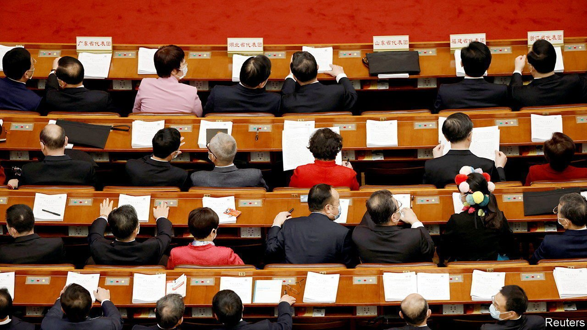

###### Chain, reaction

# Grim tales test China’s claim to be governed by the people 

##### When changes to the law are needed, does the state respond? 

 

> Apr 30th 2022 

MOST CHINESE with an internet connection have probably seen the video of a mentally ill woman chained by the neck in the province of Jiangsu. Identified as Yang Qingxia, she was sold to her husband in 1998 and bore him eight children. Ms Yang’s plight was revealed in February. The next month another trafficked woman, with the surname Tao, was discovered locked in a cage in Shaanxi province. Her husband paid 8,000 yuan ($1,220) for her in 2010. The cases sparked outrage. A well-known lawyer pointed out that the punishment for buying a woman in China is just three years in jail—less than that for buying two endangered parrots.

As a result, low-ranking officials were sacked or disciplined in both provinces. The public-security ministry declared a “special action” to crush trafficking. Members of the National People’s Congress (NPC), China’s legislature, suggested changes to the law, such as locking up buyers of women for the same amount of time (up to ten years) as sellers. The actions show that the state is responsive, say officials. Their claims are in keeping with China’s broader argument to be a “Democracy That Works”—the title of an official white paper from December.


That notion is being challenged in Shanghai, where millions of frustrated people have been locked down for weeks, some lacking food or medicine, in an effort to suppress a covid-19 outbreak. The trafficked women pose a different sort of test for the system: whether it is able to produce legal and legislative reforms in the face of a public outcry. Officials claim it is passing. A deeper look suggests it is not.

The NPC is at the heart of China’s democratic claims. The biggest parliament in the world, with nearly 3,000 members, caps a pyramid of lower congresses. They guarantee “the people’s status as masters of the country”, says the white paper. Yet only the bottom level is directly elected. NPC members are chosen, in effect, by the Communist Party. Their suggestions, such as increasing sentences for trafficking, are rarely debated and often ignored by the government. The body’s full session ended in March with no changes to trafficking laws.

The party dictates the direction of the legislature. Officials may get angry when the NPC is called a “rubber stamp”, but members do tend to pass everything put in front of them. One of the biggest shows of opposition was in 2012, when only 92.4% supported an amendment to the criminal-procedure law. This year members took the bold step of commending Xi Jinping, China’s supreme leader, for “doing a great job at being in charge”. When one took to social media to call for more flexibility in Shanghai’s covid response, his comments were censored.

The NPC’s standing committee, which met in April, is often more active. For example, when dud vaccines were injected into thousands of children in 2018, the committee pushed through reforms in a matter of months—but only after Mr Xi got involved. He has not commented publicly on the trafficking cases. The committee recently suggested some additions to a pre-existing law protecting women. These would merely require local authorities to “promptly report” suspected trafficking cases to the police.

The party may ultimately decide to make the criminal code tougher. It gets a facelift every four years on average, says Changhao Wei of Yale Law School. But reformists once had high hopes that the NPC would actually make China more democratic. The constitution, after all, guarantees free speech and an elected parliament. A notable event occurred in 2003, when activists pushed the NPC to act after the police beat a migrant worker to death. The regulations under which the victim was detained were ultimately repealed—but not by the parliament. The government did it directly. Allowing the NPC to do it would have set a dangerous precedent. ■

