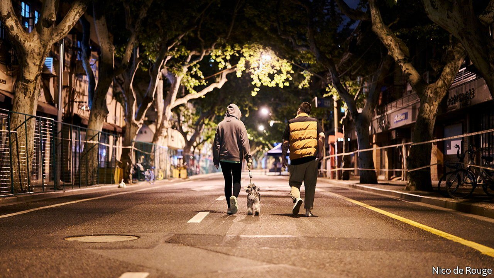
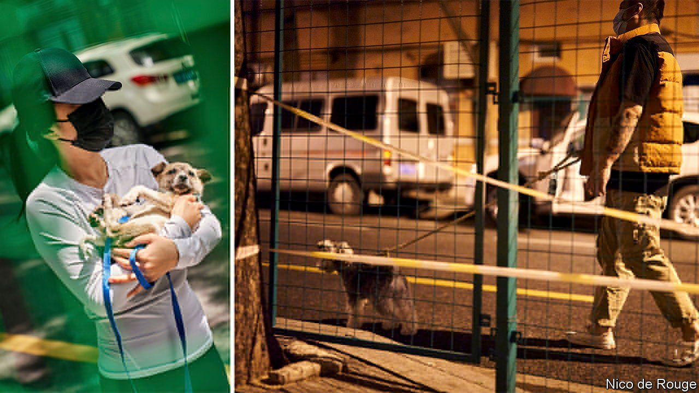

###### Leave no dog behind

# Pet-owners in China are banding together to save furry lives 

##### When humans test positive for covid, animals pay the price 

 

> Apr 28th 2022 

ASK URBAN Chinese if they see upsides to life in covid-19 lockdown, and a common reply is: I know my neighbours better. This is especially true of pet-owners. Tens of millions of Chinese are currently unable to leave their homes. All face being taken to isolation centres, should they test positive or be declared close contacts of a virus-carrier. A grim fate for anyone, centralised quarantine is terrifying for pet-owners, who must scramble to find a shelter or someone to foster their animals. If they fail, the creatures may starve in an empty flat or—as has happened in several cities—be bludgeoned to death by workers sent to disinfect homes.

 


One positive result is an outbreak of neighbourly spirit. Nationwide, online pet-rescue group chats have formed to swap tips on shelters and pet-food deliveries, and to draw up lists of neighbours willing to foster. Some 4,000 pet-owners, Chinese and foreign, have joined group chats in Shanghai alone. Animal-lovers connected by social media have saved furry lives by lobbying local officials or security guards bent on killing.


To date the World Health Organisation has found only farmed mink and pet hamsters capable of giving covid to humans, with a case involving a white-tailed deer also under review. Federal health officials in America call infection risks from pets in general low. No national policy in China identifies pets as virus vectors. Instead, powers of life and death have been delegated to grassroots officials told to stop covid at almost any cost. Several pets have paid the price. In early April a corgi was filmed being killed with a spade by a guard in Shanghai. Moments earlier, his despairing, quarantine-bound owner had set him loose outside his housing compound, not knowing where else to turn.

 


In Shanghai, pet-owners shared screenshots of a Chinese-language release form used when some locals were quarantined. Near the end it authorised pet-killing. With Beijing intent on beating back an Omicron wave, the capital’s pet-lovers are now mobilising. Unbeknown to Little Black, a six-year-old mutt being walked this week in eastern Beijing, he has foster-parents on standby. “I have arranged it with my neighbours already,” said his owner, a middle-aged woman. “We won’t leave the dog alone.”

Dig deeper

All our stories relating to the pandemic can be found on our . You can also find trackers showing ,  and the virus’s spread across .

