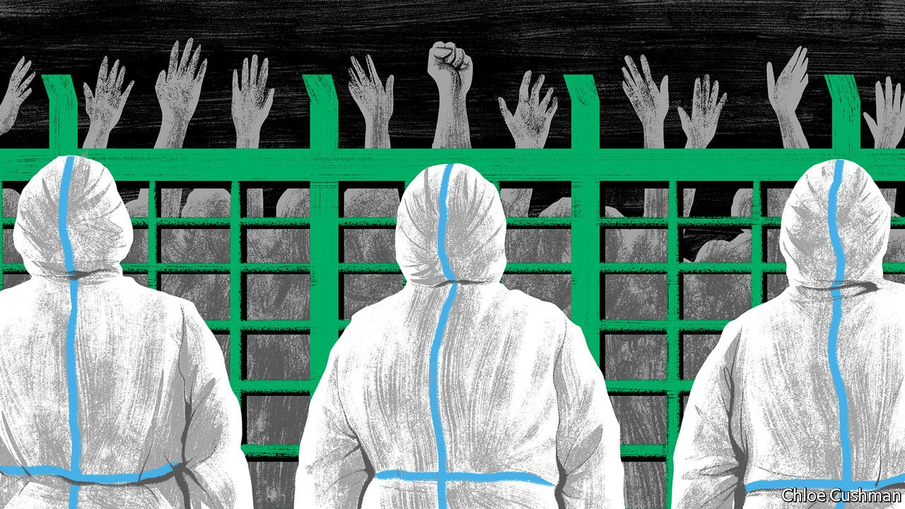

###### Chaguan

# Why some Chinese are angry about covid 

##### The politics of a bungled lockdown of 25m people in Shanghai 

 

> Apr 30th 2022 

ONE CONSEQUENCE of imposing a pandemic lockdown on Shanghai, China’s worldliest and stroppiest city, is a stream of smartphone videos showing officials being yelled at by locals. As this metropolis of 25m people approaches a month of near-paralysis, these filmed confrontations have taken on a darker tone.

Social-media posts show locked-in residents shouting at visiting delegations of officials that they have no food, or that government rations are rotten when delivered. There are videos of Shanghai citizens tearing down green metal fences that suddenly appeared around apartment blocks and streets designated as “hard quarantine” sites, after covid-19 cases were found nearby. Other locals filmed their neighbours being beaten by white-overalled guards for defying pandemic controls. A Shanghai blogger released “Voices of April”, a six-minute compilation of protest slogans chanted from windows, citizens’ complaints live-streamed from grim quarantine centres, anguished telephone calls to government hotlines, and other recorded moments of discontent. Shared widely as an online video, it was viewed more than 100m times before censors set to work deleting every version they could find. This draconian response was an own goal, as even relatively sheltered, apolitical netizens across the country were given a glimpse of censorship at work in real time.


These rare displays of public anger in tightly policed China have made headlines worldwide. In the leafy embassy districts of Beijing, 1,100km north of Shanghai, envoys ask one another whether a crisis looms for the ruling Communist Party. As China’s pandemic controls become ever more openly repressive, some foreigners wonder whether growing brutality indicates that the machinery of state is malfunctioning. Behind closed doors, foreign diplomats and business bosses debate whether a public loss of trust in the party’s competence might complicate the year’s big political event: a congress expected to crown Xi Jinping China’s supreme leader for a further five years, or even for life. Some of those questions are the wrong ones to ask.

In a country with a free press, a functioning opposition or a political system that set any store by the rights of individuals, scenes of mass hunger in Shanghai, China’s most affluent city, would already be a vulnerability for Mr Xi—especially when the concurrent lockdowns imposed on dozens of less privileged cities are added to the tally sheet of China’s pandemic-control costs and benefits. After all, for two years now Mr Xi has been lionised by propaganda outlets as the “commander-in-chief of a people’s war” against covid, whose stringent but benevolent strategies have saved millions of lives, demonstrating the superiority of Communist Party rule over decadent, liberty-obsessed Western democracies.

Yet as it is, images of Shanghainese being clubbed as they tear down fences do not by themselves mean that China’s machinery of power is misfiring. Bossy, even arbitrary or irrational orders that must be obeyed are a feature of Communist Party rule working as intended, not a bug. China’s covid response is a utilitarian experiment. To stop the virus from killing millions in a country with lots of unhealthy, poorly vaccinated old people and a weak health-care system, leaders have spent two years locking down cities and regions unlucky enough to harbour cases. In return, most of China’s 1.4bn people have lived in an orderly, largely covid-free society, albeit one marked by intrusive surveillance and movement-tracking that most Westerners would never accept.

In China’s majoritarian system, minorities who resist the party’s will must be crushed. In other contexts those minorities may be ethnic, religious or ideological, or unlucky sorts in the way of a party priority. In all cases, dissent is treated as sabotage. Some anger on display in Shanghai arguably stems from locals’ shock at being on the wrong end of a minority-majority divide for once.

If they were a bit less paranoid, party bosses might be somewhat comforted by complaints heard in Shanghai. Citizens filmed shouting at officials are demanding more government help, not calling for a revolution. Even those silenced “Voices of April” are hardly subversive. That video includes recordings of Shanghai citizens pleading for officials to admit loved ones to hospital or to distribute rations as promised. Party workers are heard sighing for superiors to issue better orders. In another clip a lorry driver thanks a kindly policeman for bringing him food. These voices fit within Chinese traditions of citizens petitioning those in power for aid or redress. Still they were censored.

Plan B is Plan A with fences and sticks

Nor are China’s angry voices accusing party chiefs of having made a mistake by pursuing a zero-covid strategy until now. Rather, most are expressing disappointment at how badly it is working in Shanghai and other cities, and alarm at its spiralling economic and social costs. It does not help that party chiefs spent two years over-claiming for policies that were always a least-bad option in a country with China’s chronic health woes. Instead of reckoning honestly with the trade-offs inherent in their strict approach, officials and propaganda outlets called it a wise and kindly choice that helps all Chinese people. Then those same official voices quickly pivoted back to their preferred pandemic narrative: the many downsides of covid responses in the West. Now, the disadvantages of China’s policies are in turn becoming hard to hide.

If party history is any guide, public anger is rarely by itself a threat to Chinese leaders. Popular discontent matters when it gives cover to rival factions within the elite, allowing them to argue that poor performance is undermining the party’s claim to rule. A flawless 20th Party Congress for Mr Xi later this year may rest on eliminating all possible rivals, and making others carry the can if covid continues to batter China. Before then, if party leaders are at all vulnerable, it is because they look incompetent, not because their ruthlessness has been caught on camera. ■

Read more from Chaguan, our columnist on China: (Apr 23rd)

 (Apr 16th) (Apr 9th)

All our stories relating to the pandemic can be found on our . You can also find trackers showing ,  and the virus’s spread across .

