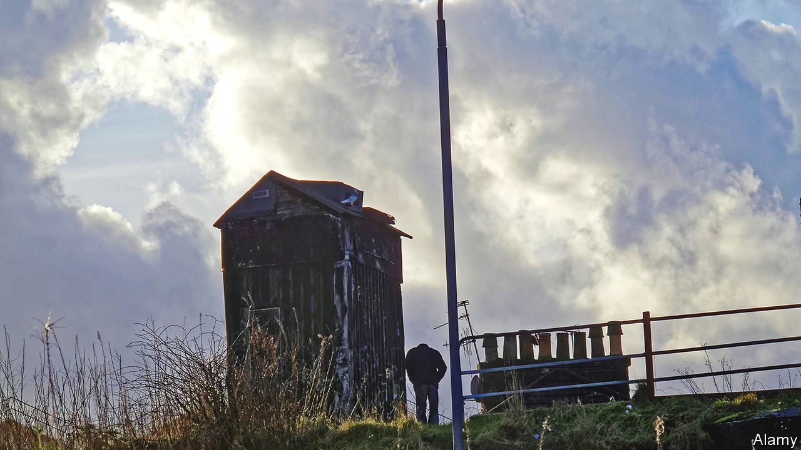

###### Scottish fiction

# Douglas Stuart returns with a deft, brutal new novel 

##### Like “Shuggie Bain”, the author’s Booker-prizewinning debut, “Young Mungo” is set in poverty-stricken Glasgow 

 

> Apr 30th 2022 

Young Mungo. By Douglas Stuart. Grove Press; 400 pages; $27. Picador; £16.99

MUCH IN “SHUGGIE BAIN” echoed Douglas Stuart’s own life. As a child the author lived in Sighthill, a poor neighbourhood north of the River Clyde in Glasgow, as does his young protagonist. Also like Shuggie, Mr Stuart was bullied and felt at odds in a hyper-masculine environment; he preferred the company of his mother, fictionalised as Agnes, who died from alcoholism when Mr Stuart was in his teens. Over the course of a decade he transmogrified these experiences into a haunting, powerful debut novel. It won the Booker prize in 2020 and has sold more than 1.5m copies in English worldwide.


“Young Mungo”, Mr Stuart’s new work, is a close sibling to “Shuggie Bain”. It, too, is set in poverty-stricken Glasgow and follows the coming-of-age of its gay protagonist. There are absent fathers and mothers in thrall to the bottle; the youngsters don’t know what they want out of life from an already limited set of options. Mr Stuart again displays his talent for character, grotesque ones in particular, and humorous dialogue.

But this second work is even bleaker than the first. Unlike Agnes, who persistently elicited the reader’s sympathy despite her failings, Mungo’s mother has no redeeming qualities. When steeped in drink, Mo-Maw becomes “Tattie-bogle”, a horrid creature whose “lower jaw would hang loose and her tongue would roll in her mouth in a dirty, lascivious way, like she wanted very badly to lick something”. She absconds to live with a new lover and doesn’t think of her children much at all, leaving Jodie, Mungo’s bright older sister, to look after him.

“Young Mungo” is more brutal than its predecessor as well. Never far away in “Shuggie Bain”, violence is omnipresent in this book. Mungo’s brother, Hamish, is the leader of a bloodthirsty Protestant gang; its members wield homemade weapons when mutilating their Catholic rivals. Mr Stuart’s descriptions of injuries are grimly vivid: a gash is “raised and puckered white at the edges, like the torn fat on a rasher of bacon”.

Mungo is perceived by all as too naive, too sensitive and too uninterested in girls. Hamish thinks inducting him into the gang would set him right. Mo-Maw dispatches Mungo with two strangers on a fishing trip to “make a man” out of him. Both schemes have disastrous results.

The light in all this darkness is Mungo’s relationship with James, a Catholic boy who finds a reprieve from the estate by tending to pigeons. The two fall in love, despite the obvious peril, and plot their escape. At times the barbarity described so unflinchingly in “Young Mungo” can be hard to stomach. But Mr Stuart’s deft, lyrical prose, and the flicker of hope that remains for Mungo, keep the reader turning the page.

