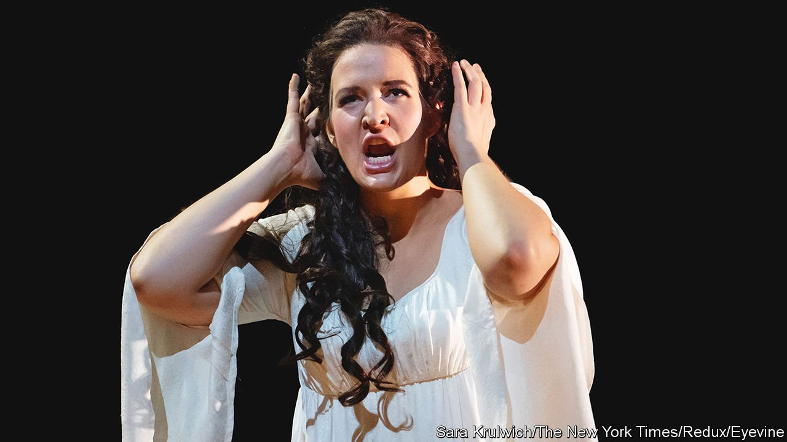

###### Classical music

# Lise Davidsen is opera’s newest star 

##### The Norwegian soprano has recently beguiled audiences at the Met 

 

> Apr 30th 2022 

WITH ALMOST 4,000 seats, the Metropolitan Opera House in New York is the largest indoor venue of its kind in the world. A solo singer can struggle to be heard over a full-sized orchestra playing forte, but Lise Davidsen, a 35-year-old Norwegian soprano, makes it seem effortless. The thrilling power of her luminous voice is even more remarkable considering she initially aspired to be a singer-songwriter in the style of Eva Cassidy or Joni Mitchell.

It is fortunate, says Peter Gelb, the general manager of the Met, that Ms Davidsen “discovered opera is her destiny”. He describes her as “one of the greatest singing talents to emerge in decades”, able to fill the cavernous space “in a way that is extraordinary”. Her voice is unique in its magnitude and distinguished by its timbre, technique and expressivity. Her skill was evident at the Met this spring when she sang the title role in Strauss’s “Ariadne auf Naxos” and performed as Chrysothemis in a brilliant staging of his “Elektra”. Next season she will star as the Marschallin in “Der Rosenkavalier”, another piece by the German composer.


In May she will sing the part of Sieglinde in “Die Walküre”, part of Wagner’s gargantuan “Ring of the Nibelung”, at the Vienna State Opera. This summer Ms Davidsen will also appear at the Bayreuth Festival, an annual celebration of Wagner’s oeuvre in Germany, and headline the Last Night of the Proms in London.

The opera world is primed for another star: Ms Davidsen’s rapid ascent coincides with the sudden descent of Anna Netrebko, the diva currently in operatic exile from most houses because of her association with Russia’s president, Vladimir Putin. Ms Davidsen is a statuesque six foot two inches (1.88 metres) tall. On stage, she has a regal and magnetic presence.

Her stardom is unlikely. Born in Stokke, a small town in south-eastern Norway, she is the youngest of three siblings in a family that prized athletic talent more than the musical kind. Her parents were not of an artistic bent—her mother worked in health care and her father is an electrician—but she played the guitar as a teenager and sang pop, jazz and folk songs.

It was while completing a bachelor’s degree at the Grieg Academy in Norway that she saw her first opera, “Der Rosenkavalier”. “I remember thinking it was absolutely beautiful. It was so overwhelming,” she says. “It sounds weird because it was just 15 years ago and I was studying music, but to stand on the stage like that seemed as impossible as if I would speak Chinese tomorrow.” During a master’s degree at the Royal Opera Academy in Copenhagen, she finally decided to try her luck as a professional opera singer.

After she won Plácido Domingo’s Operalia competition in 2015 she made debuts at Bayreuth, the Royal Opera, Glyndebourne and La Scala. The Queen of Norway flew to New York to see her first Met performance in Tchaikovsky’s “Queen of Spades” in 2019 and she won rave reviews for her turn as Leonore in Beethoven’s “Fidelio” at the Royal Opera in early 2020. At the time, she was suffering from such extreme exhaustion and brain fog that she thought she was having a mental breakdown; in fact, she had covid-19. With opera houses closed, she returned to Oslo and focused on projects including a recording of songs by Edvard Grieg, a Norwegian composer and pianist, with Leif Ove Andsnes. The duo recently took the album on tour and will perform on May 27th in Bergen.

Ms Davidsen says she enjoys the direct communication with audiences that is possible with the recital format. Strauss’s “Four Last Songs”, which she sang poignantly at the Met’s Ukraine fund-raiser on March 14th, are among her signature pieces. She dismisses critics who say younger musicians shouldn’t perform late Beethoven string quartets or autumnal works such as the Strauss songs. The ability to feel and convey deep emotions, she points out, is not restricted to those over a certain age: “We all have different stories.”

She is adamant, however, that she is not ready for the emotional and physical challenge of singing Brunnhilde in Wagner’s “Ring” cycle, the pinnacle of the dramatic soprano repertory and a role that administrators are eager to hire her for. (It lasts 15 hours and is performed over four evenings.) Ms Davidsen compares preparing for such roles to training for a marathon: when developing delicate vocal muscles, she says, it’s important to build stamina.

Seasoned opera lovers say that younger listeners not lucky enough to have heard the marvellous Swedish soprano Birgit Nilsson will experience similar thrills when they hear Ms Davidsen perform. As Mr Gelb points out, the opera world struggles to stay artistically relevant and to connect with a broader public, a problem even more acute after the pandemic. Ms Davidsen has the voice to lure a new generation of fans to fill those seats. ■

