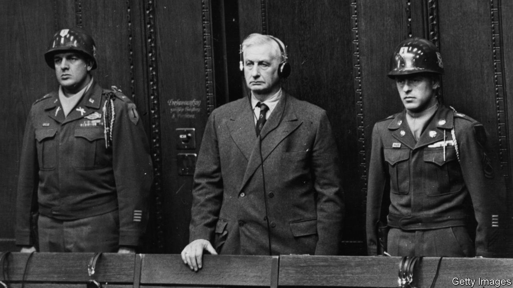

###### Hitler’s enablers

# The German industrialists who aided and abetted the Nazi regime 

##### “The ghosts of the Third Reich still haunt” many German businesses, David de Jong argues 

 

> Apr 30th 2022 

Nazi Billionaires: The Dark History of Germany’s Wealthiest Dynasties. By David de Jong. Mariner Books; 400 pages; $28.99. William Collins; £25

AT THE APPEALS hearing in April 1949 of Günther Quandt, one of Nazi Germany’s top industrialists, Julius Herf, the prosecutor, read from “The Protestant Ethic and the Spirit of Capitalism” in his closing argument. He felt the passage in Max Weber’s magnum opus elucidated Quandt’s single-minded personality:


He did not manage to persuade the Munich court of Quandt’s guilt, nor the Bavarian court of cassation where he again appealed the verdict. Judges argued there was no “clear proof” that Quandt had procured “excessive advantages” for himself under the Nazis. As David de Jong describes in “Nazi Billionaires”, other German magnates, including Rudolf-August Oetker and August von Finck, got “little more than a slap on the wrist”.

After Adolf Hitler’s rise to power, German companies benefited from lucrative contracts related to rearmament. They took over Jewish-owned businesses. Facing a shortage of workers during the war, German firms staffed their factories with concentration-camp inmates and forced labourers from occupied territories in Europe. Many of these 13.5m people died from starvation, abuse or poor living and working conditions.

Yet businessmen were often deemed by regional denazification courts to be mere followers of the regime rather than active supporters. Executives went back to work in the newly founded federal republic to become even richer. Friedrich Flick (pictured on next page) was an exception: Mr de Jong describes him as “one of the Third Reich’s largest arms producers, Aryanisers, and exploiters of forced and slave labour through his steel, coal and machinery conglomerate”. In December 1947, during the Nuremberg trials, Flick was convicted of war crimes and crimes against humanity and sentenced to seven years in prison.

The shameful role of Germany’s business dynasties during the Nazi regime has been known for decades, but Mr de Jong’s investigative work adds detail. “Initially, most business tycoons viewed Hitler and his Nazis as loud, violent, boorish, brutish uniformed curiosities from the uneducated and impoverished hinterlands,” he writes. That changed after the global stockmarket crash in 1929, which took a devastating toll on the German economy. In September 1930 the Nazi party became the second-largest in the Reichstag. For Hitler, economic malaise opened the door to Germany’s richest businessmen: they hoped a Faustian pact with the upstart from Austria would help to shield their business empires from a rebellion on the left.

Von Finck, a financier who joined the Nazi party after Hitler came to power in 1933, “believed that Hitler was sent by God to become Führer of the German people”; a friend observed that the dictator exercised “a hypnotic influence” on him. Flick, Oetker, Albert Reimann and Ferdinand Porsche also subscribed to Hitler’s imagined future for the country.

Quandt disliked the Nazis, yet he had no scruples about facilitating their rise. When Quandt met Hitler in 1931 he described him as “perfectly average”. A widower with two sons, Quandt married Magda Friedländer, the stepdaughter of a German-Jewish businessman, with whom he had another son, Harald. After divorcing Quandt, Magda married Joseph Goebbels, Hitler’s propaganda minister. Quandt and Goebbels deeply resented each other and fought over the custody of Harald, who had caught Hitler’s eye as he looked like the perfect Aryan child.

The second half of “Nazi Billionaires” is devoted to the decades after the end of the war, through West Germany’s economic miracle to the present day. After his premature release from prison in 1950, Flick managed to rebuild his business empire; he became one of the largest shareholders of Daimler-Benz and, for a period of time, West Germany’s richest person. Every one of the titans, and their heirs, examined their Nazi past only belatedly, very reluctantly and under pressure.

The sins of their forefathers are a legacy that some of Germany’s best-known brands, including Allianz (insurance), Mercedes, Volkswagen, Porsche and BMW (cars), Oetker (foodstuffs) and others still carry. “Many German business dynasties continue to sidestep a complete reckoning with the dark history that stains their fortunes,” Mr de Jong says. “The ghosts of the Third Reich still haunt them.” ■

