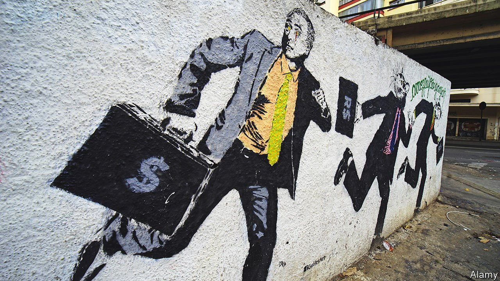

###### Lava Jato

# Two law-enforcement officials reflect on a Brazilian corruption scandal 

##### In “Operation Car Wash”, a new book, they argue that the country suffers from “institutionalised crime” 

 

> Apr 30th 2022 

Operation Car Wash. By Jorge Pontes and Márcio Anselmo. Translated by Anthony Doyle. Bloomsbury; 208 pages; $27 and £20

AT SIX O’CLOCK one morning in June 2015 nine agents of Brazil’s Federal Police raided a mansion in Morumbi, a swanky neighbourhood in São Paulo, and arrested its owner. Marcelo Odebrecht was the boss of a family business—Latin America’s largest multinational construction conglomerate—and his detention was a watershed in a police investigation into the promiscuous relationship between money and political power in Brazil.


Originally focused on Petrobras, the country’s state-controlled oil and gas giant, the investigation was dubbed Lava Jato (Car Wash) because one of the money-launderers used an exchange house at a petrol station in Brasília. Odebrecht’s managers would eventually confess to operating a “bribes department” which handed out nearly $800m to politicians and officials in a dozen countries; in return, they secured more than 100 overpriced public-works contracts across Latin America and Africa. Brazilian prosecutors charged dozens of politicians. In 2017 they secured the jailing of Luiz Inácio Lula da Silva, the country’s president from 2003 to 2011 and a hero of the Latin American left.

Led by a new generation of young, often foreign-educated, detectives, prosecutors and judges, Lava Jato seemed to be a decisive offensive against ingrained corruption in Brazil. Yet the sentencing of Lula by Sergio Moro, a crusading judge in the southern city of Curitiba, to 12 years for allegedly receiving a penthouse from a construction magnate, both marked its apogee and signalled its overreach.

The wrongdoing uncovered by Lava Jato and the political controversy surrounding it have spawned a large literature in Brazil. “The Mechanism”, an early journalistic report by Vladimir Netto in which Mr Moro is the hero, became a Netflix series. Deltan Dallagnol, the lead prosecutor in Curitiba, published a personal account. The most notable contribution is “A Organização” (“The Organisation”), a thorough and readable chronicle of the rise and fall of Odebrecht by Malu Gaspar, another journalist.

Now comes “Operation Car Wash” by Jorge Pontes and Márcio Anselmo, first published in Brazil in early 2019 and translated into English by Anthony Doyle. The authors are federal policemen. When Lava Jato began, Mr Pontes had recently retired after a distinguished career which included campaigning to set up an environmental-crimes division of the force. Mr Anselmo led the team which arrested Mr Odebrecht. Their thesis is that Brazil suffers from “institutionalised crime”, by which they mean “a fraudulent system that operates with the blessing of the nation’s power structures and the support of a network that pervades all three powers of the state”.

This system involved all the main political parties, who shared out state procurement jobs. Construction companies received padded contracts in return for bribes, many of which went to finance political campaigns. Although it dates back at least to Brazil’s military dictatorship of 1964-85, the authors claim that the system was perfected under the governments of Lula’s Workers’ Party, when an oil boom offered bounteous revenues and party officials centralised corruption.

There is much truth in this. Systematic corruption has contributed to an expensive state in Brazil that offers poor public services. Lava Jato turned up cases of grotesque greed. Sérgio Cabral, a former governor of Rio de Janeiro now in prison, pocketed around $100m, levying 5% on construction contracts and embezzling budgets from health care to prison meals.

Yet the authors push their thesis too far. They never discuss in detail how much of the bribery involved personal enrichment and how much campaign finance. They attribute adverse judicial decisions and budget cuts to conspiracy. Brazil’s Supreme Court has shown greater independence than they give it credit for. But their pleas for the independence of the Federal Police, and for more resources for the force, are well made. They are particularly scathing about the distorted priorities imposed by the war on drugs: tens of thousands of poor Brazilians have been locked up while the crimes of the rich and powerful have often gone unpunished.

Some Brazilians believed that Mr Moro was simply out to get Lula. There was no evidence the former president had occupied the penthouse (there was stronger proof in another case involving a country retreat). Lula’s conviction, upheld on appeal, prevented him from running in an election in 2018 and paved the way for Jair Bolsonaro, a right-wing populist, to win the presidency. Suspicion of Mr Moro’s motives was aroused when he released damaging plea-bargaining testimony implicating Lula days before the vote. It was reinforced when the judge agreed to become Mr Bolsonaro’s justice minister.

Since 2019 the tables have turned against Lava Jato. Leaked messages showed that Mr Moro broke the rules of judicial impartiality by coaching Mr Dallagnol. By a narrow majority the Supreme Court reversed its previous ruling that the guilty should be imprisoned after a first appeal and thus freed Lula. The court also ruled that Mr Moro had exceeded his jurisdiction in pursuing the former president for matters not directly related to Petrobras.

Although he campaigned against corruption, Mr Bolsonaro has shown little interest in fighting it. He appointed a public prosecutor and a federal police chief who do his bidding. The pandemic and economic troubles have displaced corruption in the public mind. Many of those jailed for Lava Jato are agitating for their release.

One lasting benefit of the scandal is a reform that bars corporate political donations. In other respects, the struggle against institutionalised crime has not yielded the fruits that Mr Pontes, Mr Anselmo and many others hoped for. ■

