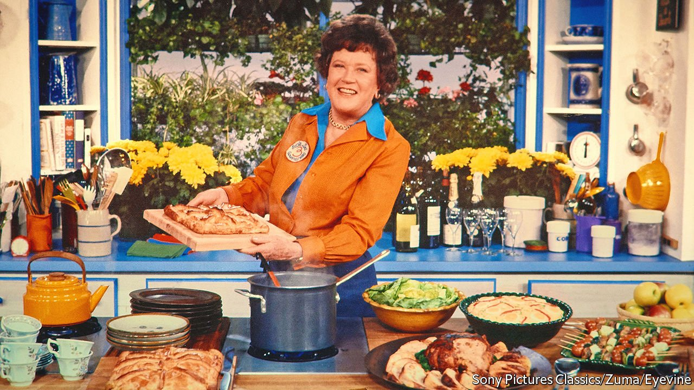

###### World in a dish

# What’s behind a revival of interest in Julia Child? 

##### Big, brave lives contain multitudes, and appeal across ages 

 

> Apr 30th 2022 

JULIA CHILD died almost 18 years ago, at the enviable age of 91, having done more to enrich American culinary life than anyone before or since. She wrote many books, including her two-volume landmark “Mastering the Art of French Cooking”; presented numerous television series; and won a cabinet full of awards, including the Presidential Medal of Freedom. Her life in food was public—so is her private life, thanks to several biographies and films. There seems to be little left to say about her.

And yet HBO Max and Sky Atlantic are airing a new series, “Julia”, dramatising the start of her TV career. On the Food Network, contestants on “The Julia Child Challenge” make Child’s recipes in a replica of her kitchen. And Helen Lefkowitz Horowitz, a historian at Smith College, recently published “Warming Up Julia Child”, about the friends and colleagues who nurtured her career. Why the sudden burst of interest?


One answer is that contemporary popular culture loves familiar successes—witness the current fad for remakes, reboots and the ever-expanding superhero “universes”. Child was wildly popular, with a literary and television career spanning the 20th century’s last four decades. Studios and publishers imagine that she has legions of fans who will eagerly watch and read anything about her.

But that is too cynical by half. The real answer is that Child lived a bold and eventful life, capacious enough to offer nostalgia to those who remember her and inspiration to those who do not. In effect, she was a populariser of French cuisine—but that carries the implication that she somehow diluted it for the masses. In fact, her recipes are not simple or dumbed down: they are clear.

At heart she was a demystifier and a pragmatist. She ensured that all her recipes could be recreated in the average mid-century American home kitchen. She took food seriously, but unlike generations of men in white toques who cultivated imperious, remote demeanours, she had no patience for cant or pomp. Cooking French food does not require that the chef be touched by God, or begin an apprenticeship in childhood; it merely requires that they follow a series of easily explicable steps. In a letter to a friend written while she was living in Paris, before she was famous, she referred to France’s most esteemed food writer as “a dogmatic meatball”. His insistence on rigid culinary rules was “so damned typical, making a damned mystery out of perfectly simple things”.

That line is quintessential Child: straightforward, funny and confident in the best sense. To earlier generations, she was an emissary from the refined world of French gastronomy. Today’s viewers may see her, rightly, as a feminist icon who broke into the then-overwhelmingly male worlds of haute cuisine and television despite having no professional experience in either, on the strength of unfussy charm, wit and hard work (producing “Mastering the Art of French Cooking” took years, partly because she rigorously tested and refined the recipes to ensure they were foolproof). Those qualities are timeless. ■

