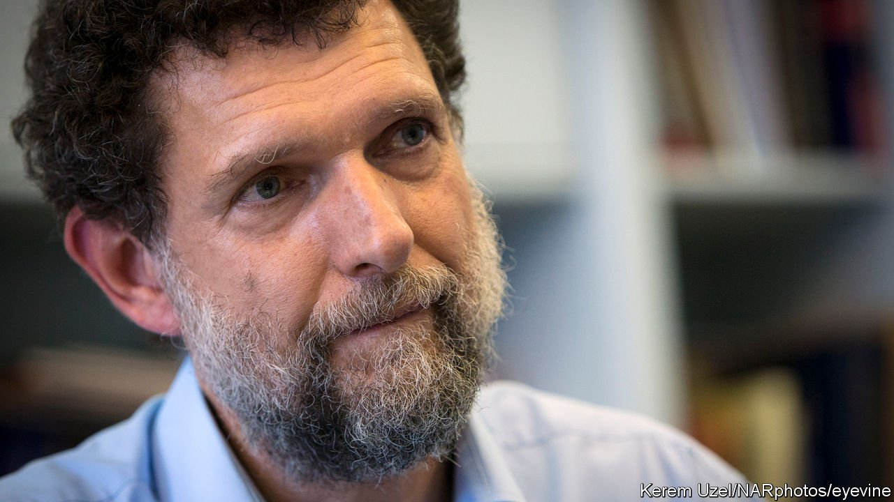

###### “Judicial assassination”

# A Turkish court sentences activist Osman Kavala to life in prison 

##### The European Court of Human Rights long ago ordered that he be released 

 

> Apr 30th 2022 

OVER THE course of the war in Ukraine, Turkey’s government has earned some goodwill in the West by publicly opposing Russia’s invasion and by providing Ukraine with armed drones. On April 25th a lot of that goodwill went up in smoke, when a court in Istanbul handed Osman Kavala, one of Turkey's most respected civil-society activists, a life sentence for “attempting to overthrow” the country’s government during protests almost a decade ago. Seven other defendants, accused of aiding Mr Kavala, were sentenced to 18 years each.

Two of those people, Can Atalay, a lawyer, and Mucella Yapici, an architect, stood inside the courtroom facing a crowd of shocked onlookers, some of them wiping away tears, moments after hearing the verdict. “They will now take us to Silivri,” Mr Atalay shouted, referring to a notorious prison on the outskirts of Istanbul. “But know that we will not bow to tyranny.” In his closing statement, Mr Kavala, speaking by video link, called the case a “judicial assassination”.


Even by the standards of Turkey’s judiciary, which tends to do the government’s bidding, the prosecution of Mr Kavala has been a farce. The evidence against him should have been laughed out of court. The prosecution depended not only on unsubstantiated speculation but also on a wilful blurring of protest with treacherous insurrection. Mr Kavala was first arrested in late 2017 for his involvement in the Gezi Park protests which had engulfed the country in 2013. He maintained that he had supported the protests (and attended them), but had no role in organising them, much less in trying to overthrow the government. Despite the authorities’ efforts to depict his gift of some pastries to the protesters as proof of his treasonous intentions, he was acquitted in 2020. But he was rearrested hours later on separate but equally preposterous charges related to a violent coup attempt against Turkey’s president, Recep Tayyip Erdogan, in 2016. An appeals court then overturned the acquittals in the Gezi Park case, paving the way for the retrial that has just concluded.

When the European Court of Human Rights (ECHR) ordered Mr Kavala’s release, Turkey’s government refused to comply even though its membership of the Council of Europe requires it to do so. When the American ambassador to Turkey and nine of his European colleagues urged the government to abide by the ECHR ruling, Mr Erdogan ordered them out of the country, though he later relented.

The verdict will damage relations between Turkey and its Western allies further. America’s response to the ruling, a statement calling Mr Kavala’s conviction “unjust” and an example of “judicial harassment of civil society”, was even more harshly phrased than the one that almost got its envoy kicked out last year. EU officials have also condemned the decision.

The verdict may be a preview of things to come. The case against Mr Kavala and his colleagues has less to do with the events of 2013 than with those of 2023, when Turkey will hold presidential and parliamentary elections. These are likely to be the toughest of Mr Erdogan’s career. Turkey’s strongman now trails his rivals in the polls, largely as a result of his eccentric economic policies, which have burdened Turkey with an inflation rate of over 60% and a collapsing lira. Rather than attempting to fix the economy, it very much looks as though Mr Erdogan has decided to step up his repression. ■

