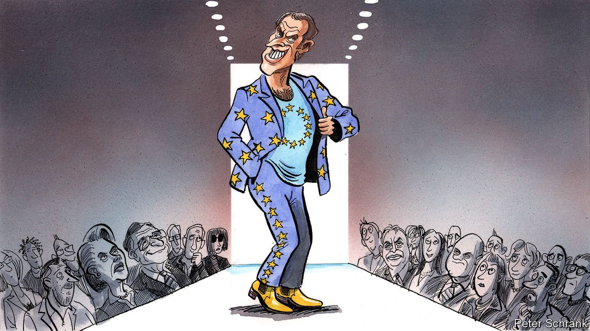

###### Charlemagne

# Emmanuel Macron is now Europe’s standard-bearer 

##### Triumphant at home, he will push for an even more French EU 

 

> Apr 30th 2022 

IN POLITICS, AS on the catwalk, fashions come and go. In Europe in the 1980s it was Britain that dazzled with its daring ideas, as Margaret Thatcher’s state-shrinking, red-tape-slashing policies inspired numerous imitators and even more furious protest songs. In the noughties came Germany’s turn. Sensible economic reforms helped firms there seize the new opportunities of globalisation, the better to sell unstructured Hugo Boss suits to upwardly mobile Russians and Chinese. Ideologically the 2020s belong to France. Its big idées—a scepticism of free markets, an acceptance of the state’s role in shaping everything from farming to culture, haughty declarations of independence from America—are vintage stuff. But like a Louis Vuitton clutch re-released to adoring fashionistas, this line of thinking is once again back in vogue.

Emmanuel Macron, France’s youthful and newly re-elected president, is the EU’s man of the moment. He triumphed in part by thumping rivals intent on derailing the European project. Marching to his victory rally on April 24th to the tune of the European anthem was a clear signal that Mr Macron sees his realm as extending beyond France. And well he might. For who else could serve as a standard-bearer for the EU today? Britain has left. Olaf Scholz, the newish chancellor in Berlin, is mired in an overhaul of German foreign policy (it turns out that trading suits and cars for Russian gas had geopolitical consequences). Mario Draghi, Italy’s prime minister, is respected but on his way out by next spring. Mr Macron, by contrast, will now be around for five more years.


But it is not merely by default that Mr Macron is now Europe’s most consequential figure. French thinking on how the club ought to be run has steadily gained ground in recent years. Mr Macron has long fretted that Europe might “no longer be in control of [its] destiny” as he put it to The Economist in 2019. The EU, he argued, had become dependent on others for too much—from its ability to innovate to military heft and even food. In a world led by unreliable folk like Donald Trump, Xi Jinping and Vladimir Putin, that set his nerves jangling. Europe, in Mr Macron’s jargon, needs “strategic autonomy”. That pitch for greater sovereignty encompasses everything from more defence spending to Europe coming up with its own tech giants and much else besides.

Those (such as the British) who saw the EU as merely a single market were wrong, in Mr Macron’s view. Being a community involves deeper integration, long a French priority. Critics dismiss his idea of strategic autonomy as vague. It has gained ground nonetheless. The European Commission in Brussels used to block member states from funnelling public money to “national champions”. Now it is busy co-ordinating subsidies to battery firms and other favoured sectors. The EU is far from having its own army, but national capitals have co-ordinated spending better of late, and were doing more of it even before Mr Putin invaded Ukraine.

Two crises since the start of the decade have brought home Mr Macron’s point. Covid-19 highlighted the fragility of globalisation and its complex supply chains for everything from paracetamol to microchips. France pushed for pandemic recovery funds to be raised in part by joint EU borrowing—the kind of pooling of debt that Germany had resisted for decades. The second crisis, in Ukraine, has shown that trade can indeed create ugly dependencies. Take energy. France, with its nuclear-power plants devised in an earlier spurt of strategic autonomy, is far less reliant on Mr Putin than is Germany, which built pipelines to Russia instead. And fewer people now rail against vast dollops of EU money going to farmers at a time of uncertain food supplies.

“We live in a French EU at the moment,” says Charles Grant of the Centre for European Reform, a think-tank based in London. The top of the Eurocracy, including Charles Michel at the European Council and Ursula von der Leyen at the commission, owe their jobs in no small part to backing from Mr Macron. His brand of political centrism is gaining ground, too: despite Viktor Orban’s recent victory in Hungary, other populists are getting thumped, most recently Janez Jansa, Slovenia’s prime minister, whose party lost an election on the same day that Mr Macron triumphed.

La République en vogue

Mr Macron has plenty of ideas for reshaping Europe left over from his first term. All French presidents have demanded that France act like, and be recognised as, a great power ; Mr Macron wants the same for Europe. Yet he has only a national mandate, not a continental one. He knows that no individual country, even France, can call the shots in the EU. Leaders must build and nurture alliances; Mr Macron visited all 26 of his EU neighbours during his first term. Still today none matters more than the Franco-German axis, Europe’s traditional motor, and even a powerful France cannot railroad the continent’s biggest country into changes that don’t suit it. Mr Macron repeating “I told you so” will probably not be enough to sway Mr Scholz. A confident Germany, brave enough to take the risks inherent in chasing France’s ambitions, would help Mr Macron a lot. That is still a work in progress.

Plenty within the EU will resist French grandstanding. Small countries suspect that airy talk of co-ordinating spending on defence or technology simply means funnelling cash to big French and German firms. Much of eastern Europe is wary of efforts to boost European military strength independent of NATO, since they see America as the indispensable guarantor of their security. French public finances border on the precarious. EU rules designed to constrain deficits were rightly suspended during covid-19. At some point they must come back—and Germany will once again take the lead.

All that will be for another season. The political influence needed to guide the EU comes and goes, as Mr Macron well knows. One day, his brand of thinking will again be considered passé. For now he is the king of Europe’s political catwalk. ■

Read more from Charlemagne, our columnist on European politics: (Apr 23rd) (Apr 16th) (Apr 9th)

For more coverage of the French election, visit our dedicated 

