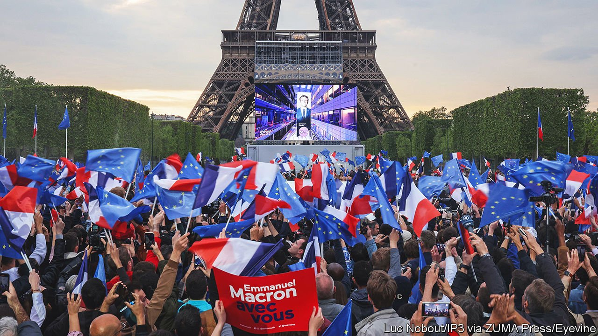
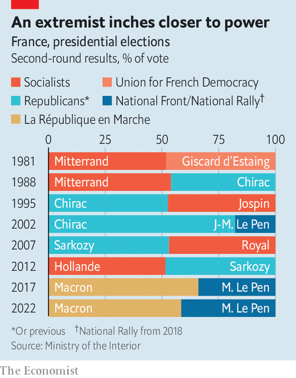

###### Macron rolls up his sleeves

# France’s re-elected president prepares for a tough second term 

##### A new government, and a new governing style 

 

> Apr 30th 2022 

STANDING BEFORE the illuminated backdrop of the Eiffel Tower on election night,  made history, and then a promise. In a run-off vote on April 24th that defied modern precedent, the 44-year-old centrist president was re-elected with 58.5% of the vote. He roundly defeated the nationalist-populist Marine Le Pen, who secured 41.5%. Mr Macron is now the only sitting president with a governing majority since the Fifth Republic was established in 1958 to  by direct universal suffrage.

It was a personal triumph for Mr Macron, who has run for election only twice: each time for the presidency, each time with success. His fledgling political party, now called La République en Marche (LREM), was set up just six years ago. The last time the French re-elected an incumbent—Jacques Chirac in 2002—Mr Macron was a student intern in Nigeria, studying at the Ecole Nationale d’Administration.


It was also, at least partially, a victory for centrist, broadly liberal, pro-European politics . Mr Macron framed the run-off vote as one for or against tolerance, freedom and the European Union. On election night, he emerged to the strains of the EU anthem, and his supporters waved the EU flag. Ms Le Pen called it a choice between the people and the “globalist” Parisian elite. In the end, 42% of the 7.7m voters who preferred the radical-left Jean-Luc Mélenchon in the first round backed Mr Macron in the second, according to an Ipsos poll; only 17% of them went for Ms Le Pen.

The result, though, also . In 2002 Ms Le Pen’s father, Jean-Marie Le Pen, scored a mere 18% in the presidential run-off. In 2017, when Mr Macron defeated Ms Le Pen for the first time, she nearly doubled that result, securing 34%. Now, even in defeat, she has never come so close to winning the highest office.

Indeed at Mr Macron’s victory rally the mood was one of relief, not euphoria. “I’m just so thankful it’s not Marine Le Pen,” said Léa, a 23-year-old student out celebrating with friends. “We were really worried she might win.” When Mr Macron took to the stage, he stressed the point: “I know that many citizens voted for me not in support of my ideas but to keep out those of the far right.” Hence the promise he made that night: of a “new era”, of “five better years” not just five more years, with a more inclusive and consultative governing style.

As he prepares for a second term, Mr Macron faces two challenges. First, second-round voting patterns reflected a deeply fractured France. Fully 85% of the electorate in Paris backed Mr Macron. In the village of Auchy-les-Mines, in the former mining basin of the north, 69% voted for Ms Le Pen. Thanks to campaign promises to ease the cost of living and stand up for the downtrodden, Ms Le Pen pushed out of the rustbelt of the north and east, and her party’s old stronghold in Provence and the Riviera, into many rural and semi-rural parts. Mr Macron will need to find a way to speak to the people of disaffected France, and show that he is governing for them too.

Second, ahead of legislative elections on June 12th and 19th, Mr Macron faces a virulently hostile opposition, which calls him a president “by default”. The moment the result was out, Mr Mélenchon declared him “the most poorly elected” modern president. This is on the grounds that turnout, at 72%, was three points below that in 2017 and the lowest since 1969—although still higher than at recent national elections in America and Britain. Moreover, argues Mr Mélenchon’s camp, since the left was “forced” to vote for Mr Macron, the president lacks a real mandate. To try to block him, Mr Mélenchon is calling for a “popular union” of the left for the legislative elections. His campaign poster says simply: “Mélenchon, prime minister”.

Winning in June will be crucial if Mr Macron is to shrug off such charges and press ahead with reform, such as his plan to raise the retirement age from 62 years to 64 or 65. Mr Macron’s LREM and allied parties currently hold 60% of the seats. Since France in 2000 shortened the presidential term to match the parliamentary one, voters have backed each president with a legislative majority. “The constitutional logic is for us to win another majority, but it will be really hard work, and we will have to fight constituency by constituency,” says Roland Lescure, an LREM deputy.

 


The toughest rival could well be Mr Mélenchon, but only if he manages to reach a deal with the Greens and Socialists. Given their differences over such things as the EU and arming Ukraine (he is sceptical about both), this is by no means guaranteed; the wounded Socialists seem keener than the Greens. Ms Le Pen, meanwhile, is expected to win a lot more than her current total of seven seats, although the two-round voting system does not favour her party. For their part, the Republicans stand to lose a chunk of their 101 seats. Their presidential candidate, Valérie Pécresse, came in a humiliating fifth place, and they have ruled out any electoral alliance with either the nationalists or LREM.

The most likely scenario, says Vincent Martigny, at Sciences Po university, is another majority coalition of LREM and allies. This would include a movement created by Edouard Philippe, Mr Macron’s ex-Republican former prime minister. Behind-the-scenes bargaining for constituencies is now under way. Mr Macron says he will shortly name a new prime minister, to replace Jean Castex. As ever, he has kept his choice secret, hinting only at his preference for someone with a record on green and social issues. Elisabeth Borne, his labour minister, is one name circulating.

Even so, the real opposition could emerge on the streets. That is why Mr Macron’s promise to govern differently could determine whether he can forge a consensus about change, rather than dictate it from on high. He has now defeated the forces of populism twice. For this, history will judge him well. But he will now have to fight his own instinct to take all decisions himself. And he has his work cut out if he is to renew the appeal of liberal politics, and reverse that of the extremes. ■

