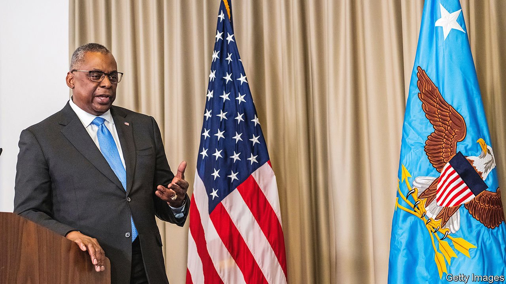

###### A little help from Kyiv’s friends

# The West pushes for “victory” against Russia in Ukraine 

##### America and Britain signal a new mindset, but the endgame is unclear 

 

> Apr 30th 2022 

“WE GOTTA MOVE at the speed of war,” declared Lloyd Austin, America’s defence secretary, as he signalled a new, more intense phase in the West’s effort to help Ukraine repel Russia’s invasion. It involves providing more and heavier weapons, sustaining the effort for months and, above all, embracing the belief that Ukraine can now “win”.

America’s novel sense of purpose was apparent after Mr Austin and Antony Blinken, the secretary of state, returned from a furtive visit to Kyiv on April 24th. The Ukrainians, Mr Austin said, “have the mindset that they want to win; we have the mindset that we want to help them win.” What is more, he said, “We want to see Russia weakened to the degree that it can’t do the kinds of things that it has done in invading Ukraine.”


This was a notable change of tone and ambition. In London on April 27th, Liz Truss, Britain’s combative foreign secretary, echoed the sentiment. “Ukraine’s victory is a strategic imperative for all of us,” she declared. The West had to be “prepared for the long haul”. And on April 28th President Joe Biden proposed a new law authorising the government to sell assets seized from Russian oligarchs under various sanctions and use the proceeds to help Ukraine. Despite serious worries about due process, this extraordinary measure seems likely to be supported by Congress after the House backed a similar, non-binding bill by 417 votes to 8.

To turn such talk into reality is harder. Mr Austin hosted a gathering in Germany on April 26th of some 40 countries to rally more military support for Ukraine. They included not just NATO allies but friends from Asia, the Middle East and Africa. It will meet monthly. Already there has been a shift in the weapons being given to Ukraine: not just portable anti-tank arms but now armoured vehicles, tanks and howitzers; not just Stinger shoulder-fired anti-aircraft missiles but also parts for fighter jets (and some talk of sending aircraft, too). Germany, reversing its refusal to provide heavy weapons, announced it would be sending 50 Gepard anti-aircraft armoured vehicles, which would be useful in shooting down low-flying aircraft and drones.

America says the heavier equipment is needed in the next stage of the war. Having given up on taking Kyiv, Russia has massed its troops in the south and east, where the terrain is more open. Ukraine thus needs “long-range fires” and the ability to manoeuvre. Ukrainian officials say they do not yet have enough to go on the offensive.

Russia has been making slow progress. It has taken over a succession of villages and has all but established an eastern land corridor between Crimea and Donbas (regions it conquered in 2014), although a pocket of Ukrainian soldiers is still holding out in the Azovstal steel plant in the devastated port city of Mariupol. Russia may be hoping to take enough land to declare success by May 9th, when Russia celebrates Victory Day, marking the Soviet Union’s defeat of Nazi Germany.

It may want to go further. Rustam Minnekayev, deputy commander of Russia’s central military district, recently said the aim is to take control of all of southern Ukraine. If so, Russia still intends to seize a western land corridor to link Crimea to the enclave of Transnistria, a Russian-backed separatist region of Moldova, on Ukraine’s western border. This seems a much taller order, requiring Russia to take Mykolaiv and Odessa, where Ukrainian defences have been strengthened.

That said, mysterious bombings in Transnistria, held by some 1,500 Russian soldiers, have caused jitters. Local authorities said two antennae broadcasting Russian radio were blown up on April 26th, a day after an attack on the region’s state security ministry. The pro- EU Moldovan government suspects these are false-flag incidents staged by Russia to destabilise it. In southern Russia, meanwhile, Ukraine has made little effort to disguise its role in “payback” attacks against fuel- and weapons-storage facilities—a move endorsed by a British junior defence minister.

For all the talk of winning, the West’s aims are unclear. Ms Truss speaks of “going further and faster to push Russia out of the whole of Ukraine”. Mr Blinken is more cautious. He has spoken of the need for a cease fire, and has said that “the end-state should be determined by the Ukrainians as a sovereign, independent country.”

The UN Secretary-General, António Guterres, visiting Kyiv after going to Moscow on April 26th, tweeted: “The sooner this war ends, the better—for the sake of Ukraine, Russia, and the world.” His spokesman said Russia had agreed in principle to let the UN help evacuate civilians from Mariupol. But his efforts have angered Ukraine, which says he should have gone first to Kyiv to see evidence of Russia’s atrocities. For its part, Russia is trying to divide the European allies through a combination of threats, such as warning of the danger of a nuclear exchange, and applying economic pressure by cutting off gas supplies to Poland and Bulgaria on April 27th.

Many experts now see parallels with the “winter war” of 1939-40, when Finland fought off the Soviet Union for months but was ultimately forced to cede territory and for decades afterwards had to maintain a precarious neutrality. “I used to think the winter war was the best that Ukraine could achieve. I now think it’s the best Russia can achieve,” says Dan Fried of the Atlantic Council, a think-tank in Washington. “Another scenario is possible: the defeat of Imperial Russia by the Japanese in 1905.” If there is a partition, he argues, it is unlikely to be a stable peace but, more probably, a dangerous armed truce. ■

Correction (April 26th 2022): António Guterres will visit Moscow on April 26th, not April 25th as we first wrote.

Read more of our recent coverage of the .

