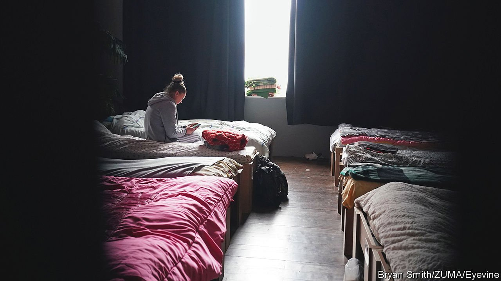

###### The mental scars of war

# Ukrainian refugees need mental-health care that their hosts lack 

##### The EU is trying to help 

 

> Apr 30th 2022 

YULIA MALINOVSKA looks from a window in a Warsaw office building where 400 Ukrainian women and children are being put up. As a plane crosses the sky she huddles over her eight-month-old daughter. Her eyes, fixed on the distance, turn to tears. “Every plane scares me now,” she sobs. She is safe, after escaping from a district of Kyiv that was hit by Russian planes, but her mind is still in turmoil. “The moment you accept your own death, something in you changes.”

More than 5m people have fled the Russian invasion, and many have carried with them trauma and loss. That has been compounded by the economic stress of living abroad, and by family separation—Ukrainian men aged 18-60 must stay and help defend their country. The World Health Organisation (WHO) estimated in March that at least half a million refugees were suffering from mental-health issues. That has overwhelmed the already inadequate mental-health infrastructure of their eastern European hosts.


Agnieszka Siwinska, who heads a clinic in Warsaw, says that she has seen an influx of 150 new patients, roughly a 25% increase. She enlisted psychology students who speak Ukrainian or Russian to help put the newcomers at ease. She has also distributed dozens of “sensory backpacks” with toys for shell-shocked children. The next challenge is to find specialists for long-term treatment. Psychological trauma specialists are so rare in Poland that one flew in from Britain to help out.

The problems are a result of a long-standing neglect of mental health in eastern Europe. Poland, the main destination for refugees and home to more than half of them, had a third the number of psychiatrists per person as Germany at the time of a comparison in 2016. The country spends only 3.4% of its health budget on mental health, the lowest level in the EU apart from Bulgaria. It takes on average three months to get a psychiatric appointment in next-door Slovakia.

To plug the gaps, the EU has suggested that countries recognise the qualifications of Ukrainian professionals to allow them to work with local services. It has also pledged €9m ($9.5m) in funding for NGOs that provide psychological relief. Gabriella Brent of Amna, a humanitarian group, says that much of “psychological first aid” comes down to harm reduction, and can be provided by trained volunteers. Understanding the patients’ language and context can render them more effective as initial responders than foreign professionals.

If the acute phase of the conflict subsides and people start to return home, the need for psychiatric support in Ukraine is likely to grow substantially. As other conflicts have shown, a drawn-out war of attrition could pile on mental casualties. Syria Relief, a charity, estimated last year that three-quarters of Syrian refugees in Turkey and Lebanon may have had serious mental-health symptoms. Ukraine already had the world’s highest prevalence of depression, at 6.3% of the population, according to a 2017 WHO study.

Since that report, Ukraine has made improvements. Just as it has trained its military muscles by fighting Russian-backed separatists in its east since 2014, it has developed its mental-health response, by catering to the needs of combatants and veterans. Marta Pyvovarenko is one of 40 psychologists and psychiatrists in the WHO’s Mental Health Gap Action Programme who since 2019 have trained more than 3,000 doctors in Ukraine to offer emergency mental-health aid in conditions of war.

Attitudes are changing. A tradition of tight-lipped stoicism is easing, as people learn to talk more openly about their problems. Suspicion of psychiatry, understandable given the old Soviet habit of declaring dissidents mentally ill and locking them up, is easing too. Charities campaign to reduce suicide, which is worryingly common. The government wants to shift from an archaic system of providing care in closed facilities towards looking after people at home and trying to reintegrate them into society. All this will help Ukraine cope with the mental scars of war, says Ms Pyvovarenko. As support increases, she says, “the stigma is decreasing.” ■

Read more of our recent coverage of the 

