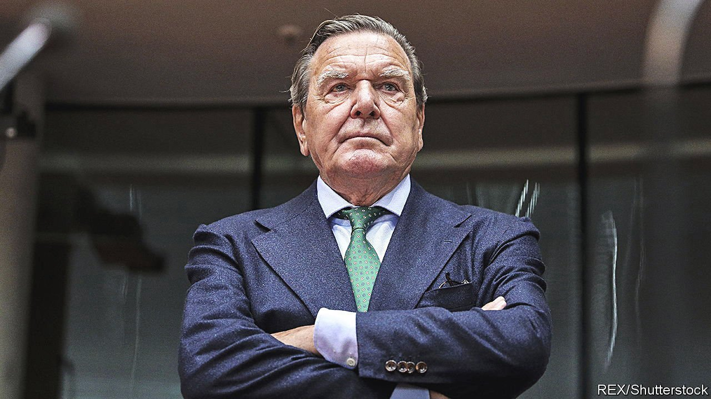

###### From chancellor to chancer

# Why Gerhard Schröder won’t unfriend Vladimir Putin 

##### Germany’s former leader shrugs off the invasion of Ukraine 

 

> Apr 28th 2022 

WHEN RUSSIA invaded Ukraine on February 24th, some former European heads of government hurried to erase their personal business links to the country. Esko Aho, Christian Kern and Matteo Renzi—one-time leaders of Finland, Austria and Italy respectively—quit prominent roles on the boards of big Russian firms. Not so Gerhard Schröder. Germany’s former chancellor has retained his seat as head of the supervisory board of Rosneft, a Russian oil giant. He is nominated to join the board of Gazprom, the state-controlled gas exporter. Since 2016 he has been chairman of Nord Stream 2, an $11bn gas pipeline that would have doubled the undersea flow of gas between Russia and Germany (Olaf Scholz, the current chancellor, pulled the plug on it in February).

Why has the once-respected leader stayed so close to Russia? Mr Schröder, a politician from the Social Democratic Party (SPD), achieved much for his country. A package of reforms implemented in the early 2000s transformed Germany from “the sick man of Europe” into its economic engine. He was also a vocal advocate of Ostpolitik, a longstanding policy of rapprochement with the eastern bloc dating back to the Soviet Union. One element of the idea, which survived the reunification of Germany in 1990, was to bind Russia in an energy partner ship of mutual dependence with Europe. For years German leaders across the spectrum believed in Wandel durch Handel, or political change through trade. Many German Russlandversteher (“Russia understanders”) recanted after Russia annexed Crimea in 2014—or at the very least after this year’s attack on Ukraine. Mr Schröder has not.


The high-living chancellor’s enduring links to Russia are about more than stubborn adherence to a flawed ideology. Mr Schröder has earned millions from his corporate positions. He has also forged a close friendship with Vladimir Putin, Russia’s German-speaking president. The pair celebrated Mr Schröder’s 60th and 70th birthdays, in Hanover and St Petersburg respectively.

Mr Schröder could have been remembered as one of the great chancellors. As it is, he will be known as Mr Putin’s lobbyist. Saskia Esken, the SPD’s co-leader, has called for him to quit the party, which has begun the slow process of revoking his membership. He resigned his honorary citizenship of Hanover, his home town, before the city could strip him of it. The official SPD shop in Berlin has even withdrawn its red Gerhard Schröder coffee mug from sale. None of this has pricked Mr Schröder’s conscience. Assuming that he has one.

