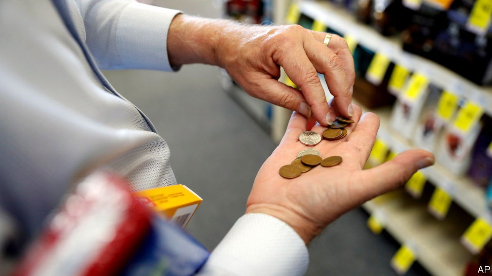

###### Surveying the coming wreckage

# A divergence in consumer surveys adds to recession worries for America 

##### A strong jobs market is not enough to negate the damage from soaring inflation 

 

> Apr 30th 2022 

AMERICANS HAVE much to like and much to dislike about the economy these days. Thanks to a , it is unusually easy both to find work and negotiate a pay increase. At the same time,  have taken a bite out of their earnings in real terms. To get a handle on how people perceive these opposing trends, analysts can look at surveys that measure consumers’ sentiment about the economy. There is, however, a problem at the moment. Like the contradictory trends, the two main surveys are presenting different pictures.

The first is a survey of consumers by the University of Michigan. Started in 1946, it is respected as a leading indicator of whether Americans are planning to spend money or tighten their belts. As such, it is looking grim. The preliminary reading for April was near its lowest point in more than a decade—and, crucially, was 26% lower than its level a year earlier. Falls this sharp are often associated with recessions.


The other survey is the Conference Board’s gauge of consumer confidence. Established in 1967, it is an equally respected snapshot of the American consumer. And it is markedly more upbeat. A sub-index measuring what consumers think about the present situation is near its highest level since the start of the pandemic, though a separate sub-index measuring their expectations is far more subdued.

The divergence between the two surveys can largely be explained by their different focuses. Both consist of five questions, but of a very different kind. Two of the questions in the Michigan survey ask respondents about their personal finances and one asks whether they think it a good time to make a big household purchase, such as a television. These questions are likely to pick up current concerns about inflation. The Michigan survey asks nothing about personal job prospects. By contrast, two of the five questions in the Conference Board survey are specifically about employment conditions. Its survey is, in other words, calibrated to pick up the current optimism about the labour market.

Unfortunately for the American economy, the rosier Conference Board survey does not simply cancel out the gloomier Michigan alternative. Such a big divergence is itself a signal. Economists at Deutsche Bank say that compared with the Michigan survey, the Conference Board measure tends to be dominated by lagging indicators that perform well late in the cycle, making the spread between the current-conditions gauge in the two surveys their favourite indicator of cyclical consumer sentiment. It is flashing red today, with the gap close to its widest in more than half a century. At such a level, it signals that the probability of a recession is around 50% over the next year—roughly twice as high as many economists currently estimate. Whatever the true figure is, it seems clear that consumers are feeling a pinch from inflation and are increasingly anxious about the near future, despite benefiting from a strong jobs market today.

Economists look at many other indicators beyond surveys of consumers, of course. Financial conditions, particularly the shrinking gap between yields on long-dated Treasuries and shorter-term bonds, are another portent of slower growth. Orders for durable goods, by contrast, point to resilience. Ultimately, all these indicators confirm what is all too evident from past precedents for such a hot economy: that the Federal Reserve will need ample skill and good fortune if it is to tame price pressures without inducing a recession. ■

For more expert analysis of the biggest stories in economics, business and markets, , our weekly newsletter.

