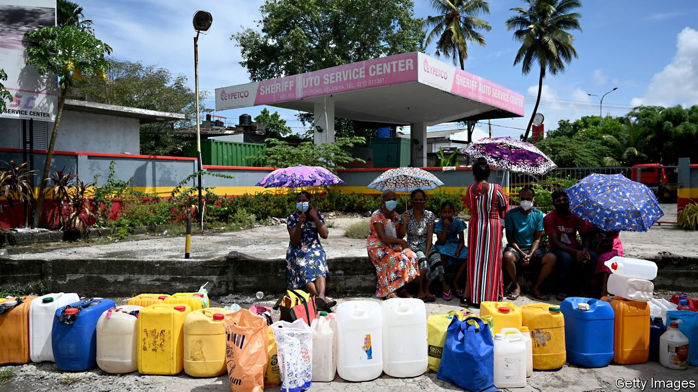
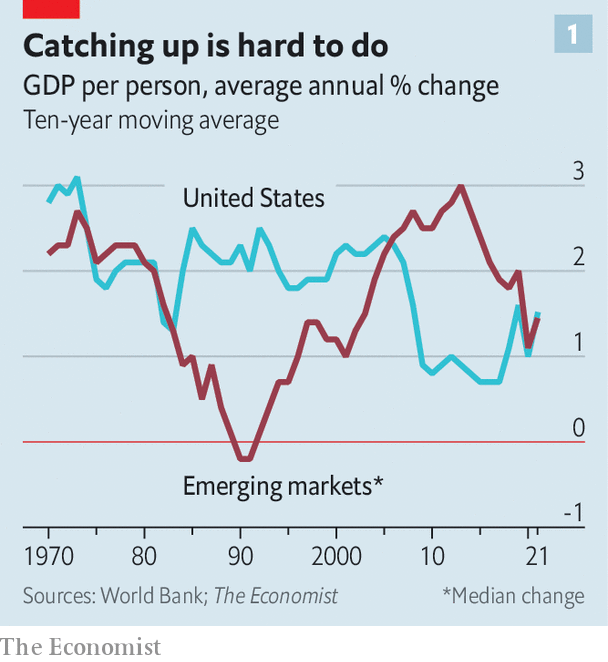
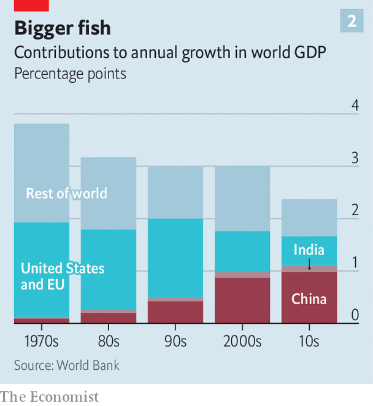
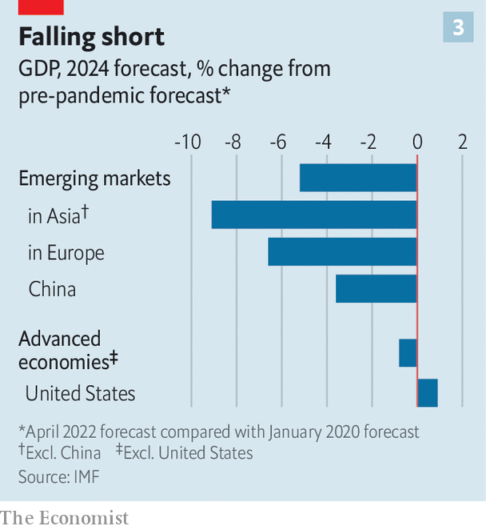

###### Running out of juice

# Are emerging economies on the verge of another “lost decade”? 

##### Rising interest rates, inflation and geopolitics are a toxic mix 

 

> Apr 30th 2022 

EMERGING ECONOMIES hoping to grow their way into the ranks of the rich have faced a seemingly never-ending series of setbacks in recent years.  have together dealt them serious blows. Over the past three years more than half the population of the emerging world lived in countries where income growth, in purchasing-power-parity terms, lagged behind that in America—the first such episode since the 1980s.

The IMF forecasts that economic output across emerging markets will expand by 3.8% this year and 4.4% in 2023. Both figures have been revised down sharply since last year and fall short of the 5% average annual rate in the decade before covid-19. As the contours of the post-pandemic landscape start to come into focus, a lost decade for the world’s poorer countries—a period of slow growth, recurring financial crises and social unrest—looks increasingly plausible.

 


Emerging economies have experienced many ups and downs before. In the 1960s and 1970s they enjoyed rapid growth, which fed optimism about the prospects for the world’s poor. But the good times were followed by what William Easterly of New York University described as the lost decades of the 1980s and 1990s. Over the ten years to 1990, annual growth in GDP per person in the median emerging economy fell below zero (see chart). From the late 1990s onwards a new boom began, which reset expectations about the economic potential of the developing world. More recently, though, the pendulum has swung back again, and growth has proved harder to come by. Emerging markets face structural impediments, such as tougher financial-market conditions and changing trade patterns, reminiscent of those that confronted them in the 1980s and 1990s.


Financial pressures pose the most acute threat. In the early 1980s the Federal Reserve raised interest rates dramatically as it sought to tame inflation. For poor economies that had borrowed heavily in the preceding years, the ensuing tightening in financial conditions and strengthening of the dollar were too much to bear. Waves of debt and banking crises followed.

Some of those conditions seem familiar today. Both public and private debt in the emerging world rose steadily as a share of GDP during the 2010s, and rocketed during the pandemic. Public-debt ratios across middle-income economies now stand at record highs, and indebtedness in the poorest countries has risen towards the debilitating levels of the 1990s. Of the world’s 70-odd low-income countries, more than 10%, including Chad and Somalia, already face unsustainable debt burdens. Another 50%, including Ethiopia and Laos, are at high risk of being in a similar position, according to the World Bank. A decade ago only about a third of poor countries were in, or at high risk of, debt distress.

Russia’s invasion of Ukraine has fuelled surges in food and energy costs. Wheat and oil are both about 50% more expensive than they were a year ago. For importing countries this increases the fiscal costs of food and energy subsidies, drains hard-currency reserves and weighs on economic growth. Rising prices also intensify pressure on central banks in the rich world to tighten monetary policy. Investors expect the Fed to raise its benchmark interest rate by nearly three percentage points in 2022; that would be the largest rate rise in a single year since the early 1990s. Add in the effect of a shrinking Fed balance-sheet, and the tightening this year could be the most dramatic since the 1980s.

Markets are already heaping pressure on vulnerable emerging economies. As capital flows to America to take advantage of higher rates, the dollar is strengthening: it is up by more than 10% over the past year. Funding costs in the emerging world are rising with it. The yield on the hard-currency debt of the median emerging economy has risen by more than a third since the summer. The share of issuers with bonds trading at distressed levels has more than doubled, to just over a fifth, according to the IMF. That includes Ukraine as well as Egypt and Ghana.

More countries will probably follow the lead of . Nonetheless, the systemic crises that were a feature of the previous lost decades may be avoided. Many middle-income economies have bolstered their financial defences since the 1980s, by beefing up foreign-exchange reserves, for instance. Investors have become more discerning, reducing the risk of wider contagion. The bigger worry instead is that debt loads will hit growth, by limiting governments’ room to cut taxes and invest in education and infrastructure. Local banks that have lent heavily to governments may find their capacity to lend to private borrowers impaired if the bonds they hold lose value. Home-country government debt now makes up about 17% of bank assets across emerging economies, up from 13% in the early 2010s and well above the 7.5% average in rich countries.

Another headwind comes from global trade. Developing economies’ fortunes have long risen and fallen in line with it. From 1960 to 1980, goods trade as a share of world GDP doubled from 9% to 18%; during the lost decades, by contrast, it stagnated. Trade then soared again as global supply chains expanded across East and South-East Asia in particular. But that interconnectedness is once more at risk. Geopolitical tensions, national campaigns for self-sufficiency and concerns about supply-chain reliability may weigh on trade, reducing poor economies’ opportunities to borrow technology and know-how from foreign firms, and sell to the rich world.

 


The global economy will also suffer from the sputtering of the largest emerging market of them all, and the world’s primary growth engine: China. Between 1970 and 2000 America and Europe accounted for nearly half of global GDP growth. The sharp and sustained slowdown in rich-world growth that began in the 1970s thus weighed heavily on the global economy and the prospects for the emerging world. Fortunes turned in the 2000s, however, as an explosive expansion in China led it to contribute more to global growth than America and Europe combined. A modest deceleration in China, to GDP growth rates of around 5%, would not doom the global economy to stagnation. Draconian covid lockdowns, a protracted property-market bust and the potential costs of geopolitical misadventures, however, .

 


Some emerging markets stand to benefit from an era of stagnation. Firms wary of dependence on China could move production to other low-cost places. Rich countries hoping to prevent poorer ones from drawing closer to Russia and China could lower trade barriers and increase investment abroad, boosting growth prospects in the process. High commodity prices, while they last, will buoy the fortunes of food, energy and metals exporters.

Overall, however, the higher debts and forgone investment in human and physical capital of the past few years will take a heavy toll. The IMF forecasts that GDP across the emerging world will remain some 5% below its pre-pandemic trend at the end of 2024. (By comparison, GDP in most of the rich world is expected to be less than 1% below trend.) Without bold initiatives to lower debt burdens, invest in public goods and expand trade, such mediocre performance might be just a taste of what is to come. ■

For more expert analysis of the biggest stories in economics, business and markets, , our weekly newsletter.

