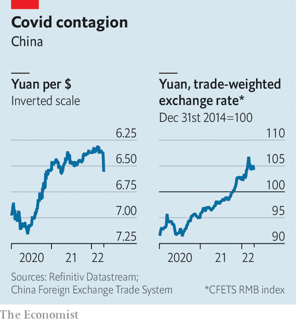

###### Fear of floundering

# China should worry less about its currency 

##### …and more about its economy 

 

> Apr 30th 2022 

IT IS EASY to forget that the world’s second-biggest economy is still an emerging market. China’s global clout, its technological prowess in certain fields, and even its low bond yields all distinguish it from the typical member of its asset class. But in at least one respect China resembles a classic emerging market: it retains a palpable fear of floating its currency. Instead China keeps a close eye on the yuan’s value against the dollar and a basket of its trading partners’ currencies, limiting any sharp movements.

For most of the past year, it worried that the yuan would float too high. China’s largely successful efforts to stamp out the early variants of covid-19 kept its factories open and its borders closed. That allowed its exports to boom, putting upward pressure on the yuan, even as outbound tourism and other services imports suffered, removing a source of downward pressure. The yuan rose sharply against the basket of trading partners’ currencies and gently against the dollar, which was itself strong.


Now China’s fight against the pandemic is instead contributing to the currency’s sudden weakness. Lockdowns stringent enough to hamper manufacturing have been imposed on Shanghai and other cities accounting for over 9% of GDP, according to Gavekal Dragonomics, a consultancy. China’s economic figures for April will “certainly be disastrous”, it says. The war in Ukraine has contributed to outflows from China’s bond and equity markets, as foreigners reassess the risks of investing in countries at geopolitical loggerheads with the West. And as America has lost its fear of the virus, its economy has overheated, forcing the Federal Reserve to raise interest rates. In April the nominal yield on ten-year Treasuries briefly exceeded that on Chinese bonds for the first time since 2010. (Real yields remain much higher in China, where consumer-price inflation is only 1.5%, compared with 8.5% in America’s larger, more “mature” economy.)

 


A weaker yuan is both a reflection of these challenges and one way to cope with them. It will in particular help to shore up China’s exports. But the central bank is not prepared to let the currency be dominated by market forces. It bears the scars of past falls in the yuan, which took on a momentum of their own. On April 25th it said it would cut the amount of reserves banks are required to hold from 9% of their foreign-exchange deposits to 8%. That will release some dollars to the market, alleviating pressure on the yuan. The move also signals the central bank’s displeasure at the speed of its currency’s descent.

China’s currency worries may deter the central bank from cutting interest rates to revive growth. That will leave its economy more dependent than ever on fiscal stimulus. At a meeting of the powerful Central Committee for Financial and Economic Affairs on April 26th, Xi Jinping, China’s president, called for more investment in infrastructure, from rural roads and urban drains to smart electricity grids and artificial-intelligence platforms. Citigroup, a bank, forecasts that infrastructure spending could grow by 8% this year. But according to Natixis, another bank, China will not meet its (increasingly forlorn) growth target of around 5.5% unless infrastructure investment grows by almost 18%. Even a conventional emerging market with vast infrastructure needs would struggle to boost spending by that much. China’s fear of floating has inhibited its monetary response to its economic woes. And that has raised fears of its floundering. ■

For more expert analysis of the biggest stories in economics, business and markets, , our weekly newsletter.

