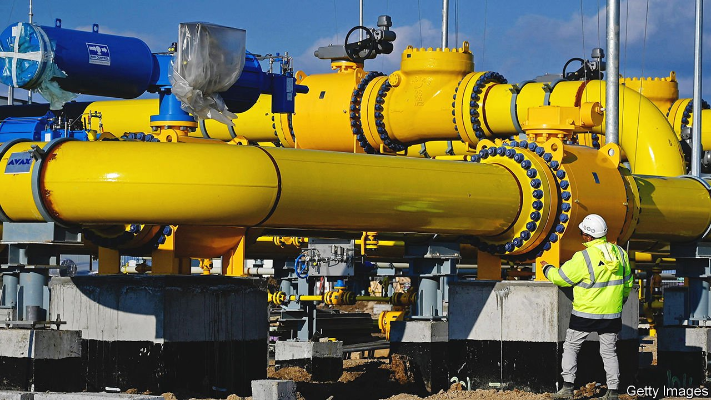
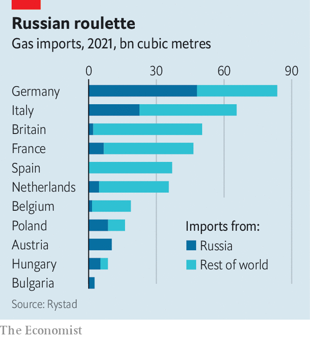

###### Tit for taps

# Russia cuts off gas to two European countries. Who’s next? 

##### The game of energy poker is getting scarier 

 

> Apr 30th 2022 

NOT LONG ago it seemed that the game of energy poker being played by Europe and Russia, though dangerous, was under control. Oil and gas was one of the few sectors Europe had not targeted with sanctions. Russia had kept supplies flowing. Yes, Europe was mulling a ban on energy imports, and Russia demanded in late March that “unfriendly” countries pay for their next gas deliveries in roubles (rather than euros or dollars), or be cut off. But each side thought the other lacked the guts to go all in. After all, Europe imports 40% of its gas from Russia, which in turn makes about €400m ($422m) a day from its sales.

On April 27th, however, Russia upped the ante. Gazprom, a state-owned energy giant, stopped sending gas to Bulgaria and Poland after they missed the deadlines that Russia had set for paying in roubles. The EU is scrambling to respond; European gas prices jumped by a fifth on the news (though they have since fallen a little).


The immediate effect of Russia’s latest move, which the EU has described as being a breach of contract, is limited in scope. Poland’s imports, of 10 billion cubic metres (bcm) a year, and Bulgaria’s, of 3 bcm, together account for just 8% of total EU imports. Poland’s contract with Russia was due to expire in December anyway, so the revenue Russia loses from breaching it is small. And although Bulgaria and Poland both relied on Russia for most of their gas imports, they may be able to cope without, says Xi Nan of Rystad Energy, a consultancy. Poland should start receiving gas from Norway in October. Nearby regasification terminals could help it . Bulgaria is expected to start importing Azeri gas via Greece later this year.

 


Exactly who might be cut off next is not clear. Russia’s deadlines for paying in roubles partly reflect the details of contracts that are not public. But sources canvassed by The Economist think they will fall in May. The stakes are high. It is not that Europe needs the gas now: as temperatures rise, consumption is ebbing. But the bloc’s stocks are only at 33% of storage capacity. The European Commission has urged member states to ensure that their facilities are 80% full by November, implying a spike in demand to come.

Still, if Russia were to cut off big importers, it would deprive itself of some of the cash it needs to fund a costly and protracted war. So who will fold first? Most European buyers have already ruled out paying directly in roubles. But Moscow is offering a compromise. Buyers would open two accounts with Gazprombank (a lender that is not under sanctions). They would pay euros into the first, and ask the bank to convert the sum into roubles and deposit the money into the second account, which would then be wired to Gazprom.

Many European countries dislike the plan, which would look as though they were giving in to Russian bullying and risks creating legal headaches. They will fall into three groups. One, which includes Belgium, Britain and Spain, imports little or no gas directly from Russia, and may refuse to compromise. Another group includes big buyers such as Germany and Italy, which will struggle to replace imports quickly; they may take the deal. A third set of waverers includes countries that are only partially dependent on Russia, and may also have contracts that are soon to expire.

Even this situation would create uncertainty. One country being cut off could have knock-on effects on others, for instance if gas transits through it to other places. Nor is it clear who will take the Russian compromise, or whether Russia might eventually turn the taps off anyway.

If Germany, say, were cut off, gas markets would go haywire. European prices are already six times higher than they were a year ago. They would soar to new peaks, luring more LNG from the rest of the world and causing prices elsewhere to rise in turn. Jack Sharples of the Oxford Institute for Energy Studies, a think-tank, reckons a full shutdown of Russian gas to Europe may well cause a global recession. Russia’s game of poker is getting scarier—and those losing their shirts could include bystanders, too. ■

For more expert analysis of the biggest stories in economics, business and markets, , our weekly newsletter.


