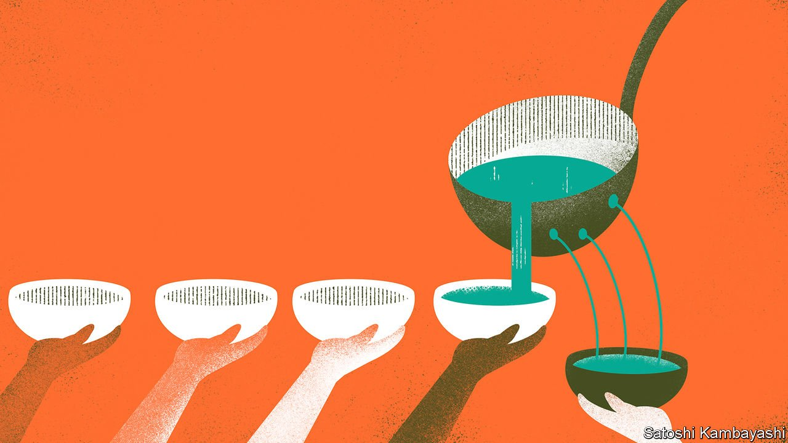

###### Ill-gotten gains

# Vast sums of money have gone missing from pandemic stimulus programmes 

##### The counts will continue to grow 

 

> Apr 30th 2022 

IT WAS A criminal’s paradise. In June 2020 a firm in Milan secured a €60,000 ($63,300) government loan to cope with the pandemic-induced downturn. But the business did not exist. The Italian government had in fact sent cash to the ’Ndrangheta Mafia of Calabria. The same month six French citizens swindled €12m in unemployment benefits by claiming funds for employees at 3,600 shell companies. A Texan man filed loan applications for 15 made-up firms and pocketed $24.8m in government support.

As countries scale back unparalleled emergency-relief programmes there is growing interest in where the funds went. The IMF estimates that since January 2020 governments have doled out $15.5trn in non-health-care spending and loans in response to the covid-19 pandemic. The rush to support households and firms led to poor procurement, messy programmes and inadequate oversight. The best estimates of fraud, so far, are from Britain and America; other countries, where wrong doing may well have been more prevalent, lack audits tracing where the money went. In America at least 4.5% of funding under the CARES Act, the largest pandemic-stimulus bill, went to cheats. Applying that figure globally suggests that nearly $700bn could have ended up in the wrong hands.


In Britain fraud and error—losses due to crime and mistaken payments—across five economic-relief schemes exceed £16bn ($21bn), roughly a tenth of the £166bn spent, according to official reports. That tally could well rise: the National Audit Office calculates that fraud and credit losses from just one of the programmes, the Bounce Back Loan Scheme—whose reported losses account for a quarter of the sum—could reach £26bn, 55% of its total spending, when investigations come to a close.

Spending in America was larger—and so was the waste. The Secret Service reckons $100bn has been stolen from the $2.2trn CARES Act. If pre-pandemic fraud levels were sustained, at least $87bn in unemployment insurance—which got a budgetary bump during the pandemic—would have been captured by crooks. Auditors reckon the true fraud rate is much higher.

Scams and mismanagement are inevitable in programmes of such a scale. But past stimulus efforts were cleaner. In the decade since the financial crisis, investigators recovered only $57m in fraudulent funds from the American Recovery and Reinvestment Act of 2009, an $840bn stimulus package. Cheats continue to be exposed over time, but even if all cases still being audited are confirmed as criminal, the programme’s fraud rate will reach only 0.6%. Other government schemes lose less, too. The rate of total health-care fraud in America hovers at around 3%. Britain mistakenly overpaid around 1.5% of work and pension benefits a year in the decade to 2019.

The covid-19 stimulus waste estimates, by contrast, are alarming—especially as the true extent of fraud could take years to uncover. But some misspending may have been unavoidable. When crisis struck economists urged governments to do whatever it took to avoid colossal damage. Speedy action did just that. America distributed stimulus cheques to 90m people in less than a month. In rich countries real disposable income per person rose by 3% in 2020. That kind of offset might not have been possible with slower, more carefully crafted policies.

More scrutiny is coming. In March three dozen Republican senators demanded more transparency about how funds were spent before signing up to more pandemic-related funding. Joe Biden has appointed a chief prosecutor to take down criminals who tried to profit from the pandemic. And some justice is already being served. The French fraudsters were arrested and the Texan creator of fictional firms pleaded guilty to money-laundering. As for the Mafia in Milan? The Italian government caught on and froze their assets. ■

For more expert analysis of the biggest stories in economics, business and markets, , our weekly newsletter.

