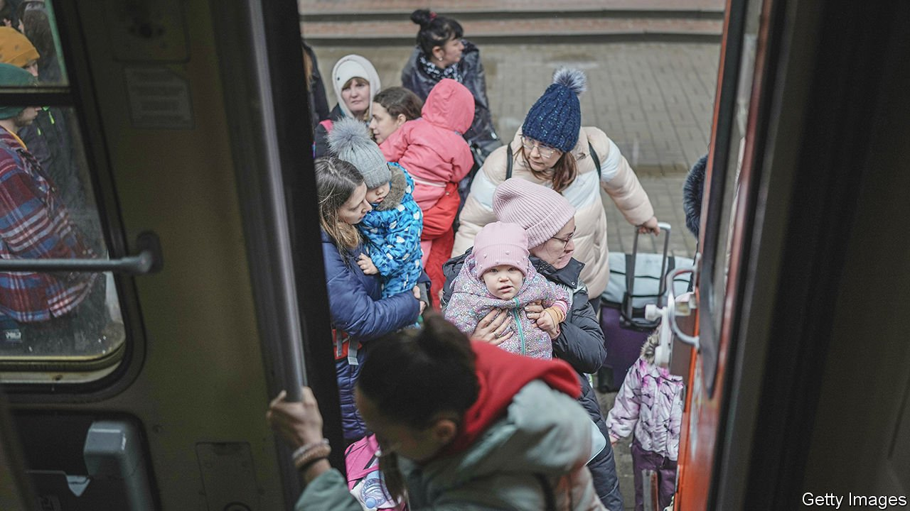
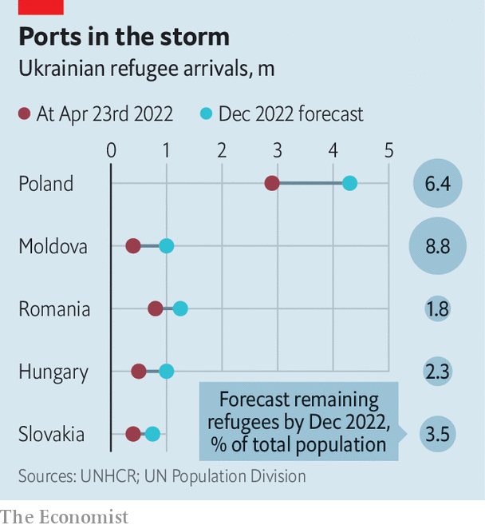
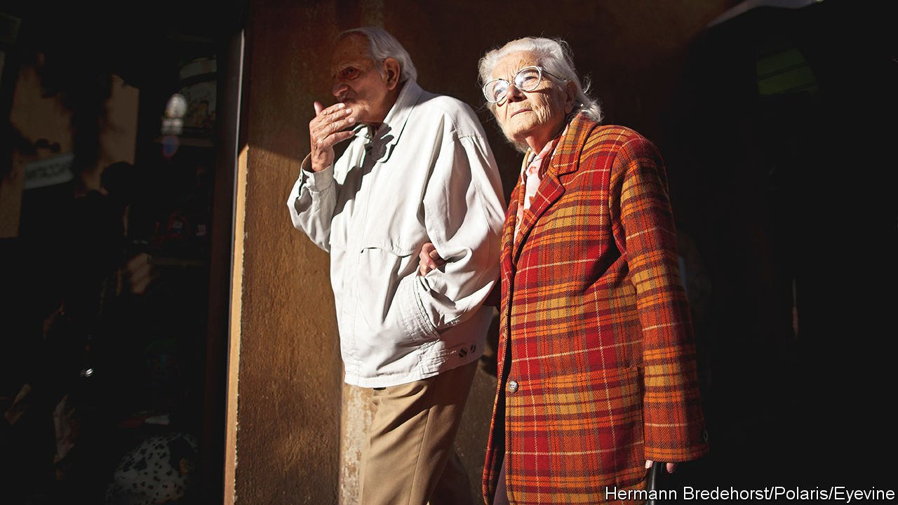

###### At home abroad

# How the war in Ukraine is changing Europe’s demography 

##### Some countries may benefit from an influx of immigrants, but the region will probably grow ever greyer 

 

> Apr 30th 2022 

BEFORE VLADIMIR PUTIN invaded Ukraine on February 24th, many Europeans fretted that their region was getting older and that more people were dying than being born. Europe’s median age of 43 is nearly four years older than that of North America, the next-greyest region. The population of the European Union is expected to peak at just shy of 450m within the next few years, then dip below 424m by 2070. The prospect of dwindling numbers frightens many. It has been especially scary for the formerly communist countries of eastern Europe, where outmigration has compounded the effects of below-replacement birth rates. Andrej Plenkovic, Croatia’s prime minister, called declining population “an almost existential problem for some nations”. Demographic change is Europe’s “third key transition”, alongside the green and digital ones, says Dubravka Suica, the vice-president of the European Commission for demography and democracy, a post created in 2019.

Among its many shocks, Mr Putin’s war has delivered one of a particular kind to demographers, who tend to see the phenomenon they study as slow-moving. Some 5.3m people—the bulk of them women and children—have fled Ukraine since the war began, the vast majority to countries bordering Ukraine on the west. Poland, which until recently exported more people than it received, has taken in more than half of these. The population of Warsaw, the capital, expanded by 17% in weeks. Hungary, whose population had shrunk from 10.7m in the mid-1980s to 9.8m in 2020, has received more than 500,000 Ukrainians.


Numbers that big can change demographic destinies. For countries such as Poland, the Czech Republic, Slovakia, Hungary and possibly the Baltic states “this crisis is a watershed moment, shifting them quickly to becoming immigration countries rather than outmigration countries,” says Tomas Sobotka of the Wittgenstein Centre for Demography and Global Human Capital in Vienna. The EU has extended a uniquely generous offer to Ukrainians, giving them the right to live, work and study in a host country for three years, privileges that refugees often struggle for years to attain. That suggests Ukrainians will have the chance to root themselves quickly in new communities. If the refugees choose to remain, they will lower the average age of their host countries, provide a needed infusion of relatively skilled labour and tilt the sex ratio towards women.

That may look like a silver lining to a terrible tragedy, but the future of this demographic disruption is unpredictable. If the war is short women and children will probably return quickly to Ukraine to reunite with husbands and fathers, who, like all Ukrainian men, are compelled by the government to remain in the country if they are between 18 and 60. Any demographic dividend, if there is one, will be distributed unevenly among European countries. And it will probably be diminished by a decline in baby-making as a result of the economic uncertainty caused by the war. With just 1.6 babies per woman on average, Europeans, before the war began, were already among the world’s most reluctant breeders.

For Ukraine itself the war is a demographic disaster. Its population had shrunk sharply because of emigration and few births, though before the invasion people had begun to return because the economy had improved. Since February more than a quarter of the population has been forced to move, including 7.7m people displaced within the country. The birth rate is bound to plunge still further. Life expectancy will probably fall “massively”, says Mr Sobotka. He points out that the brief war between Azerbaijan and Armenia in 2020 was largely responsible for a decline in life expectancy among males of three to four years.

Russia, too, is certain to suffer. Thousands of well-educated Russians have left a country which they now believe offers them no future. Fewer migrants may choose to come to Russia from former members of the Soviet Union to take up jobs requiring few skills. For the first time in decades, Russia’s migration balance may turn negative. To Mr Putin’s dismay births will probably fall. Like his friend Viktor Orban, Hungary’s authoritarian leader, Mr Putin has been splashing out cash to encourage women to have babies. In 2020 he extended a one-time “maternity capital” payment worth $7,600 to families when they have their first baby; before, it was available only to those who already had a child. Mr Putin hoped to boost the fertility rate from 1.5 to 1.7. The tumult caused by his war will probably push it in the opposite direction.

The Pole position

Countries to the west of Ukraine look like demographic gainers, although the influx is putting a strain on some, especially tiny Moldova, which has received more than 400,000 refugees—equivalent to 15% of its population. For Poland, where some 1.4m Ukrainians lived and worked in 2020, the arrival of millions more turns the demographic clock back to before the second world war, when the country had a large Ukrainian minority. Inter-ethnic animosity, which culminated in a post-war forced population exchange between Poland and the Soviet Union, has diminished.

In theory, the newcomers should give Poland a boost. The ruling Law and Justice Party has been keen to increase the number of Poles. In 2016 it sought to raise the birth rate by giving families 500 zlotys ($115) a month for every child after the first. The effect was mainly to encourage women already planning to have children to have them earlier lest the benefit be withdrawn. The number of births rose in the scheme’s first two years, but dropped in 2020 to the lowest level since 2003. The Ukraine war has added more than a million children to Poland’s population, at least temporarily.

 


Other European countries, especially those with large Ukrainian diasporas, stand to gain. Perhaps 1.5m refugees have moved on to countries farther west, including Germany, Italy and France, according to an estimate by Gillian Triggs of the United Nations refugee agency. Before the war, about 250,000 Ukrainians lived and worked in Italy, where the median age is four years higher than in Europe overall and the fertility rate is among the lowest. In the first three months of this year Austria’s population increased by half a percentage point to more than 9m; 83% of that growth was from Ukrainian immigration.

For a region worried about demographic decline, the youthful infusion from Ukraine can look like a blessing, although it is the consequence of horror. Businesses are reporting labour shortages. In January a lack of workers constrained output at a quarter of manufacturing and service enterprises in the euro zone, according to a survey by the European Commission. Governments lament that a shrinking workforce will have to support an ever greater number of pensioners. The ratio of working-age Europeans (aged 20-64) to those older than 65 is expected to drop from three to one to less than two to one by 2070. That is the sort of problem that can be relieved at least for a while by the arrival of able-brained and -bodied Ukrainians.

But how long will they stay? And will they be joined by their male family members? That depends on how long the war lasts, and on how much damage is inflicted on their home country. In the Kosovo war of 1999, when NATO bombed Yugoslavia to prevent the brutalisation of ethnic Albanians who make up Kosovo’s majority, hundreds of thousands fled, or were forcibly moved, to neighbouring Albania and Macedonia. But this period of the war lasted 78 days, after which the Kosovars quickly returned. By contrast the Bosnian war, which lasted from 1992 to 1995, sent some 700,000 refugees fleeing to western Europe and beyond, and far fewer returned. That is one reason why today there are thought to be 3.2m people or fewer in Bosnia. Before the war there were 4m.

 


For now, Ukrainians remain eager to return home. Indeed, on some recent days the number returning across the Polish border, presumably to relatively secure places such as Kyiv, Ukraine’s capital, has exceeded the number going the other way. And some industries have lost workers as young Ukrainian men return home to fight the Russian invaders. The growth of Slovakia’s construction sector, for example, has been weakened by an exodus of workers.

But if the war drags on, and children grow accustomed to their new schools, mothers may become more reluctant to head back to their former homes. That will be all the truer if Ukraine’s economy does not recover, encouraging men to head west, some to rejoin their wives. In that case, the unsought addition to Europe’s population west of Ukraine may become long-lasting. And, if governments are successful in encouraging newcomers to find jobs that suit their skills, they will contribute to the prosperity of their hosts.

Plenty of countries will miss out. Croatia, whose population has dropped by 600,000 since 1991 to 3.9m, according to its latest census, is unlikely to attract many Ukrainians. Roughly 11,000 had arrived by early April. Russophile Serbia, whose population has slumped by a tenth since the mid-1990s to 6.9m, is also unlikely to appeal to Ukrainians in large numbers.

The gains from the influx, where they happen, may not be long-lasting. The biggest influence on families’ willingness to have children is their confidence in the economy. Births in Europe plummeted after the onset of the pandemic but recovered as governments lifted lockdowns and pumped money into their economies. Mr Putin’s aggression, and the rise in inflation to which it has contributed, has delivered a fresh blow to people’s confidence.

In March economic uncertainty among consumers reached its highest level on record, according to the European Commission. Few people may be inclined for their families to grow. None may be more reluctant than Ukrainian women, among whom birth rates were already low, who have been separated from their husbands and driven from their homes. The Balkan wars robbed the region of some of the best and brightest of a generation, and their descendants. Ukraine may face a similar fate. ■

Read more of our recent coverage of the 

