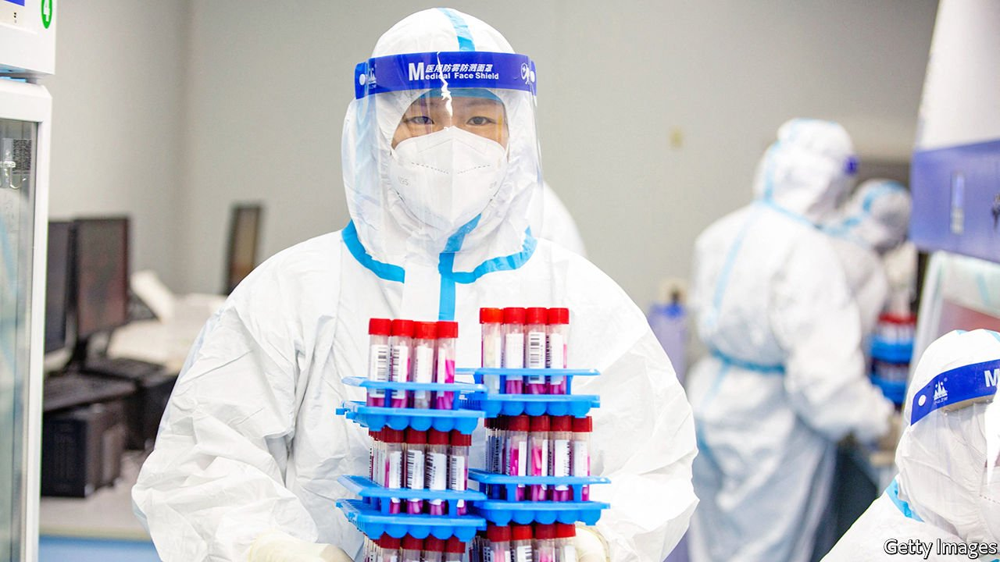

###### The forever war

# China’s martial rhetoric will not help it defeat covid 

##### Victory, as Xi Jinping defines it, is an elusive goal 

 

> Apr 30th 2022 

IN THE EARLY days of the pandemic Xi Jinping, China’s leader, suggested that the country was under attack. He spoke of a “people’s war” against an “invisible enemy”. Visiting Wuhan, the city where it started, he all but promised victory. Fang Fang, a local diarist, retorted: “Remember, there is no win, only an end.”

Most countries have accepted that covid cannot be eradicated. Helped by vaccines and treatments, they have decided to live with the virus. China, however, is still determined to defeat or at least contain it. The discovery of  has led to mass-testing (see China section). Individual neighbourhoods are being locked down. This is less harsh than the medicine applied to poorer cities, dozens of which have been entirely sealed off. Still, Beijing could be next.


Mr Xi seems to relish keeping his country on a war footing. “Perseverance is victory,” he says of his “dynamic zero-covid” strategy. That may be a stirring phrase for rallying China’s legions of weary health workers; but though battles against individual outbreaks may be won, the country has no viable path towards overall victory and eventual peace. That will have to involve treating covid as a manageable, endemic disease.

China is hardly the only country to have declared war on covid. And it has fought the virus better than most. Millions of Chinese have been enlisted as foot soldiers, with orders to test and trace people—and to send the infected to quarantine sites. This has resulted in the lowest death toll of any big country and, until now, a covid-free existence for a large majority of its citizens.

The Communist Party thinks its approach superior to democracies’ trade-off between liberty and public health. China puts “lives above all else”, says Mr Xi. But his war has costs, too. Most of Shanghai’s 25m residents have been locked down for weeks. Many woke the other day sealed inside their compounds behind green fences. Not a single case can slip through. With the zero-covid strategy, , not a bug.

China may be willing to bear those costs to keep life safe for the majority. But other concerns are affecting the party’s calculus. Mr Xi has turned the war on covid into an ideological struggle. An old idea has taken hold among apparatchiks: that red fervour will get you further than expertise. Officials in Beijing believe it will fare better than Shanghai, which they say pandered to Western ideas about how to confront the virus.

Beijing may yet turn out better. But making public health a test of ideological fitness leads to rigid thinking. Many local officials, fearing the sack, have escalated their covid-control measures to cruel and irrational levels. Yet at the same time many have balked at forcing the old and vulnerable to get jabbed, for fear of being blamed if they subsequently fall ill.

Meanwhile, staff allocated for the much-needed booster campaign have been redirected to do mass testing. Because too few of China’s over-80s have been fully vaccinated, re-opening risks a wave of deaths. Pity those who suggest that the zero-covid policy could be relaxed if jab rates were higher. Online nationalists assail them as disloyal. To say China’s covid policies need to evolve is to suggest Mr Xi is fallible. In a war, orders are to be obeyed, not debated.

Pandemics are not wars, but a global public-health challenge. Yet China’s government refuses to approve foreign vaccines, though they are more effective. It often treats pandemic data as state secrets. And it is reluctant to learn from other places, including ideologically impure Taiwan, which have charted paths out of zero-covid by reallocating resources and vaccinating the elderly. Treating covid as conflict may suit Mr Xi. But as a shrewd general once said of a different war: “Tell me how this ends.” ■

Dig deeper

All our stories relating to the pandemic can be found on our . You can also find trackers showing ,  and the virus’s spread across .

