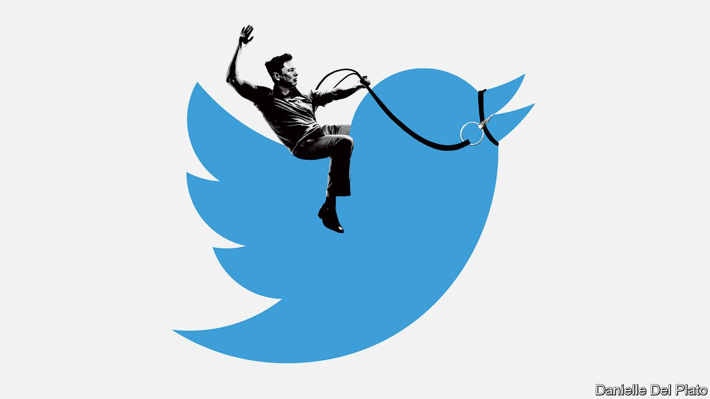

###### The techno-king of Twitter

# Elon Musk wants to re-engineer the “public square” 

##### The world’s best-known engineer gives himself another grand problem to solve 

 

> Apr 30th 2022 

SWEEPING STATEMENTS about the future of humanity do not usually feature in discussions about leveraged buy-outs. But Elon Musk has never felt bound by convention. Asked about his plans to buy Twitter, a social network, and take it private—which were approved by the firm's board on April 25th—he went straight for the big idea. “My strong intuitive sense is that having a public platform that is maximally trusted and broadly inclusive is extremely important to the future of civilisation. I don’t care about the economics at all.”

Compared with its rivals—Facebook, Instagram and TikTok—Twitter is a minnow. But the deal matters. One reason is that Twitter’s size belies its importance. As a haunt of politicians, pundits and wonks, it does much to set the political weather—a digital “public square”, as Mr Musk put it.


Another is that Mr Musk made his name and his fortune by upending industries. This time, he will be grappling with a knotty problem of keen interest to governments around the world—how to regulate speech online. Most prescribe ever more rules. But Mr Musk wants to go the other way, removing restrictions instead of imposing new ones. The operators of other big social networks will be watching the experiment with interest.

At first blush, Mr Musk—best known for electric cars and reusable rockets—seems an unlikely social-media mogul. But a closer look suggests his acquisition of Twitter fits his approach to business. Mr Musk, a passionate engineer, likes to take poorly performing technologies and improve them. Tesla tore up the car industry’s rule book by replacing petrol with electricity, ditching dealerships and treating cars as computers. SpaceX proved that a hungry, move-fast-and-break-things startup run on a relative shoestring could outperform aerospace giants grown cautious and fat on the back of generous government contracts. Both firms were dismissed by bigger incumbents—until one day they weren’t.

All that engineering and disruption is animated by Mr Musk’s own, sometimes idiosyncratic conception of the social good. Tesla’s purpose is to prod the world more quickly towards a carbon-free economy (a goal vindicated by the speed at which other carmakers are now pivoting to electric vehicles). SpaceX’s ambition is so grandiose some commentators struggle to believe that Mr Musk is sincere: to establish a human presence on Mars, something that, were a catastrophe to befall Earth, might one day prove to have been an insurance policy for civilisation.

Assume that Mr Musk really is ready to spend billions of dollars of his own money to secure the “future of civilisation” (though he has a break clause should he get cold feet). The question is whether his vision of free speech on Twitter is sensible.

Twitter fits the pattern of Tesla and SpaceX, offering Mr Musk another complex engineering system to tinker with, and a grand reason for doing so. Social media deploy algorithms to highlight “engaging” content, using a thicket of rules that try to mitigate the worst side-effects, the better to sell users to advertisers. It is a business model full of inconsistencies and unexamined trade-offs that looks ripe for disruption. That Mr Musk wants to be its agent is perhaps no surprise, for he cut his entrepreneurial teeth in the 1990s, when techno-libertarianism and anti-censorship were the internet’s animating ideas.

The fact that Mr Musk is a billionaire should not disqualify him from owning an important media firm. He has already set out some ideas for Twitter, many of them cautious and sensible. The resulting fuss shows how illiberal much online opinion has become. He wants fewer outright bans and more temporary suspensions. Users should prove they are not bots. When in doubt, err on the side of leaving tweets up, not taking them down.

More significant, he thinks the cogs and ratchets of Twitter’s recommendation algorithm, which decides which tweets a user sees, should be public. Researchers could examine it; other programmers could tweak it. A version less prone to pushing “engaging” content—which, in practice, often means tweets that are enraging, controversial or plain daft—could lower the temperature of the entire platform, making the job of moderation easier and possibly leading to debate that is more thoughtful. Or perhaps Twitter could become an open platform, where different users may choose one of many different third-party algorithms—or none at all—according to their taste. Content moderation is the messy product of political and social pressures. It will be fascinating to see how easily it succumbs to engineering.

Mr Musk will not have an entirely free hand. Australia, Britain, the EU and India, have all been working on tech-regulation. Thierry Breton, a senior EU official, noted that “It’s not [Mr Musk’s] rules that will apply here.” Mr Musk’s other investors are nervous. The more time he devotes to Twitter, the less he will have for his other ventures. Shares in Tesla fell by 12% after news of the Twitter deal.

Mr Musk’s personality poses a big risk. He is clever, driven and ferociously hard-working. He can also be puerile and vindictive, traits on display in 2018 when he accused a British cave-rescue expert, with no evidence, of being a “pedo guy”. Such outbursts are one thing coming from a Twitter user with a big following. But when he is the owner, they will raise questions about whether he will be able to resist the temptation to exploit his new position to pursue his own obsessions and vendettas.

The bird and the oak tree

This newspaper shares Mr Musk’s free-speech convictions. Nobody has a monopoly on wisdom. Experts are sometimes wrong and blowhards sometimes right. Even in the internet age, the best response to a bad argument is a better one. Moderation on many platforms has become heavy-handed and arbitrarily enforced. If Mr Musk’s talent for shaking up industries can help cut the Gordian knot of online speech, everyone will benefit.

But we are also keen on another liberal principle, that institutions should be bigger than the person running them. Mr Musk can set new rules, but he should be seen to play no role in enforcing them. If he really wants to convince users that he will be an impartial guardian of his “digital public square”, he could implement his reforms—and then freeze his own account. ■

