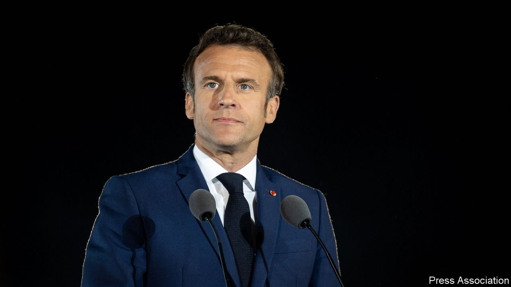

###### The centre holds

# Emmanuel Macron’s triumph, and the challenges he now faces 

##### The anger that buoyed Marine Le Pen will not go away 

 

> Apr 30th 2022 

IN THE END, it wasn’t close.  as France’s president, trouncing his nationalist-populist rival Marine Le Pen by  on April 24th. Gloomy liberals noted that her vote share rose by eight points since their previous encounter in 2017. Nonetheless, despite pandemic, war and inflation, Mr Macron has achieved something no French president has managed for 57 years. He won re-election while also controlling a majority in the national legislature (so disgruntled voters had no one else to blame). France and Europe have dodged a calamity. Had Ms Le Pen won, she would have undermined NATO, appeased Vladimir Putin, challenged the legal foundations of the EU and stoked racial tension at home. 

Mr Macron tried to sound humble in victory. Standing before the Eiffel Tower, he admitted that: “Our country is beset by doubts and divisions.” He added: “Today’s vote requires us to consider all of the hardships of people’s lives and to respond effectively to them and to the anger expressed.” Ms Le Pen articulated , which is one reason why she did as well as she did, though she offered few coherent remedies. The quality of Mr Macron’s response will determine whether his second term is a success or a failure. 


First, he will need to keep his majority when the French choose a new parliament in June. His party, La République en Marche (LREM, note the last two initials), and its allies currently hold 60% of seats. French legislative elections are unpredictable, but there is a good chance he will retain his grip.

What, though, should Mr Macron do with his fresh mandate, and the freedom that comes from not now being eligible to seek re-election? One of his main bits of unfinished business is to tackle a pension system that France’s rickety finances can ill afford. He has promised to raise the retirement age from 62 to 65. The snag is, that will be deeply unpopular, and he has already hinted that he might settle on 64. Is he ready to face down furious protests by workers yearning for early retirement? Or will he cave, as he did to the gilets jaunes and their fuel-tax protests in 2018? His plan to pay teachers more if they take on more tasks will upset teachers’ unions. His campaign against red tape has far to go. He seems to have given up on making French labour markets any more flexible. He needs to be tough. 

At the same time, he must find ways to tackle the inequality that fuels support for the radical left of Jean-Luc Mélenchon, who ran a strong third in the first round of the presidential race, as well as for Ms Le Pen. France’s big cities hum with tech startups, global-minded financiers, swanky shops and restaurants. In the crime-ridden banlieues around them, and in the smaller towns, the grimy post-industrial north and the beautiful but economically stunted south, it is a different story. , forgotten France, call it what you will—it is there, and it does not vote for centrists like Mr Macron, whom Mr Mélenchon and Ms Le Pen call le président des riches.

Mr Macron has a good plan, revolving around lots more education and training; but such things take time and money, and the centrists may not have enough of either. Mr Macron must surely care about his legacy. If the march of the radicals continues, perhaps under the leadership of Marion Maréchal, Ms Le Pen’s slightly less polarising but no less nationalist niece, the election in 2027 will be perilous. Mr Macron’s great success has been to dominate the centre ground of French politics. Alas, this means the only serious opposition to him now comes from the expanding extremes of right and left. That is not a comfortable prospect. 

Nor will Mr Macron’s challenges stop at France’s borders. One cannot doubt his ambition: he wants to rebuild Europe, not just his own country. Having fought off the populist dragon not once but twice, and with a solid record of economic stewardship that has given France the second-highest growth rate in the G7, he looks, for the time being, like Europe’s natural leader. Germany’s Olaf Scholz is floundering, his party and coalition bickering endlessly over Ukraine. Britain has marginalised itself, and Italy’s Mario Draghi is on the way out; an election due in the next year threatens to bring Italian nationalist-populists to power. And Mr Macron’s views have a lot of support in Europe. The EU has become more economically interventionist, less fiscally restrictive and more inclined to beef up its own defences: more French, in other words.

But progress will be hard. Big changes in Europe require consensus, and in each area where Mr Macron has big plans, he will face rigid opposition. The Poles and other central Europeans are wary of anything that might challenge the primacy of NATO; the “frugals”, a group of flinty northern countries, do not want to pay for another round of EU largesse. Beleaguered at home, Mr Scholz may not be the helpful partner that Mr Macron will need. Winning elections is hard: securing a legacy yet harder.

For more coverage of the French election, visit our dedicated 

