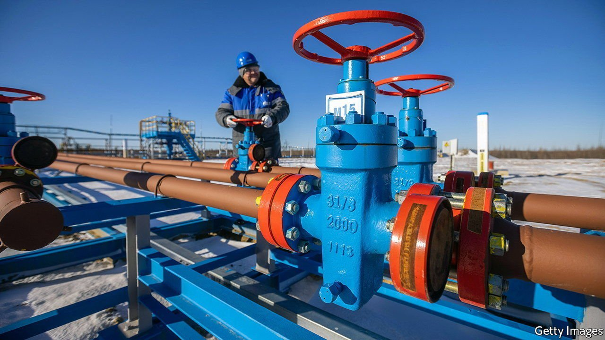
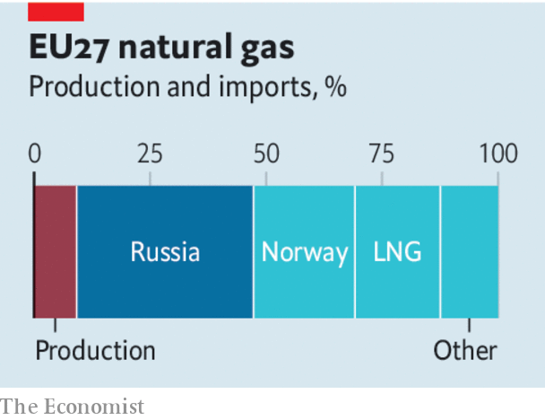

###### The case for energy sanctions

# Europe should levy a high tariff on Russian energy 

##### Imposing sanctions on oil and gas is worth the economic costs 

 

> Apr 30th 2022 

EVEN AS RUSSIA has invaded Ukraine, terrorised civilians and flattened Mariupol, the European Union has spent €44bn ($46bn) buying its oil and gas. That could be about to change. On April 27th Russia announced that it had stopped supplying gas to Bulgaria and Poland, which had refused its demand to pay in roubles. Because the EU can easily buy oil, but not gas, from elsewhere, Russia is attempting to exploit its point of vulnerability.

Europe is considering how to respond. Already it was entertaining the possibility of sanctions on Russian oil. But it fears that it has the weaker hand. Olaf Scholz, Germany’s chancellor, has said that an embargo would plunge Europe into recession without doing much to hurt Vladimir Putin and his war effort. Russia’s gas is used both to heat homes and to power factories, and among Europe’s big economies Germany and Italy are especially dependent on it. Predicting what would happen without Russian gas is hard, because it depends on how quickly supply chains . Optimistic academics say the initial cost to Germany’s economy of a full energy embargo could be just 0.5% of lost GDP; Germany’s central bank puts the bill at 5% of GDP.

 


Although Mr Scholz is right that energy sanctions would be costly, he underestimates the harm they would do to the Kremlin. He says that Russia probably cannot spend the foreign exchange it earns from oil and gas sales, because its financial system has been cut off from much of the world. There is some evidence for this. South Korea has timely trade data and participates in sanctions: in March its exports to Russia fell by 63%. With its central bank’s foreign-exchange reserves frozen, Russia has had to enforce capital controls and raise interest rates in order to support the rouble.


Yet swathes of the global economy, including China, India and most of the Middle East and Africa, continue to trade freely with Russia. Secondary sanctions, which would punish anyone transacting with Russia, are not in place. Some Russian banks can still interact with the West. As a result, even with its central bank under sanctions, it is likely that Russia is making creative use of freshly acquired hard currency from selling energy, including to buy arms. It need put only enough financial intermediaries between its transactions and those taking place in New York or Frankfurt.

The case for reducing the flow of cash into Mr Putin’s coffers therefore stands. And it is sufficient to justify the economic pain involved. In 2020 EU member states implemented lockdowns which caused annual GDP to shrink by almost 6% in order to slow the spread of covid-19. Cutting off funding to an invader that would threaten to convert putative success in Ukraine into aggression against other European countries is both morally sound and strategically desirable.

What is more, the design of sanctions could lower their economic cost. One idea is to levy a high tariff on Russian energy, rather than ban it altogether. To keep selling, Russia would probably need to cut prices so that its oil remained competitive with other countries’. (Redirecting all its oil elsewhere would be an enormous logistical challenge.) A high tariff could in effect seize some of Russia’s oil profits without disrupting supply. The consequences for gas prices are harder to predict. But because Russia cannot move gas pipelines any more easily than Europe can find alternative suppliers, it would probably absorb at least part of a tariff.

In either case, taking action may provoke Mr Putin to cut supplies further. If a tariff morphs into an embargo, so be it. Russia’s war would become harder to sustain—and in the decades to come Europe would be more secure. ■

Read more of our recent coverage of the 

