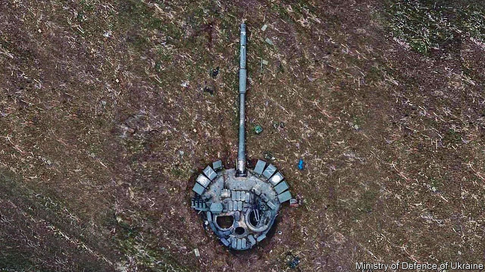

###### The botched invasion of Ukraine

# How rotten is Russia’s army? 

##### Vladimir Putin uses warfare to make up for Russia’s weaknesses. That is why he is so dangerous 

 

> Apr 30th 2022 

THE MIGHT of the modern Russian army was supposed to show the world that President Vladimir Putin had restored his country to greatness after the humiliation of the Soviet collapse. Instead, poor progress and  in Ukraine have exposed  within Russia. For those threatened by Mr Putin’s aggression, a diminished army is a relief. Unfortunately, it also leaves a nuclear-armed power with a point to prove.

So far, the invasion of Ukraine has been a . About 15,000 troops have been killed in two months of fighting, according to Britain’s government. At least 1,600 armoured vehicles have been destroyed, along with dozens of aircraft and the flagship of the Black Sea fleet. The assault on the capital, Kyiv, was a chaotic failure.


Leon Trotsky wrote that “the army is a copy of society and suffers from all its diseases, usually at a higher temperature”. Fighting in the east and the south of Ukraine over the next few weeks will not only determine the course of the war, but it will also determine how much the Russian army can salvage its reputation—and the reputation of the society it embodies.

Our  this week sets out just how rotten the army has been. Russia’s defence budget, of over $250bn at purchasing power, is about three times that of Britain or France, but much of it is squandered or stolen. Mr Putin and his top commanders kept their invasion plans from senior officers, reflecting a crippling lack of trust. , fed on out-of-date rations, have deserted their vehicles. Units have tortured, raped and murdered only to be honoured by the Kremlin. Russia has failed to win control of the skies or combine air power with tanks, artillery and infantry. Wallowing in corruption, unable to foster initiative or learn from their mistakes, its frustrated generals abandoned advanced military doctrine and fell back on flattening cities and terrorising civilians.

Ukraine’s highly motivated forces are a rebuke to these Russian failings. Despite being less numerous and less well armed, they resisted the invading army by passing decision-making to small, adaptable local units given up-to-the-minute intelligence. Even if the Russian campaign, now under a single commander, makes gains in Donbas, it will do so chiefly thanks to its sheer mass. Its claim to be a sophisticated modern force is as convincing as a tank turret rusting in a Ukrainian field.

For Mr Putin this is a crushing setback. That is partly because, although he controls a formidable propaganda machine to help drown out his critics, the loss of face threatens his standing at home. It is mostly because the use of military force is central to his strategy for making Russia count in the world.

Russia may be vast, but it is a medium-sized polity that still yearns to be a superpower. Its population ranks between Bangladesh and Mexico, its economy between Brazil and South Korea and its share of global exports between Taiwan and Switzerland. Although Russia enjoys some sympathy in non-aligned countries like South Africa and India, its soft power is ebbing—hastened by its display of incompetence and brutality in Ukraine.

To fill the gap between its power and aspirations—and to resist what he sees as America’s encroachment—Mr Putin has repeatedly turned to the only sphere where Russia can still purport to be world-class: military force. In the past 14 years he has invaded Georgia and Ukraine (twice) and fought in Syria. His  have deployed to Libya, the Central African Republic, Sudan and now Ukraine. Mr Putin is a global bully obsessed with his country’s inadequacies. Contrast that with China, which also has ambitions, but has so far been able to get results using its growing economic and diplomatic heft.

Humiliation in Ukraine weakens Russia’s last claim to superpower status. The war may yet drag on, and while it does Russia will not be able to mount big operations elsewhere. Equipment, ammunition and manpower are being used up fast. Restoring Russia’s forces to full strength and training them to avoid the mistakes in Ukraine could take years. Should sanctions remain because Mr Putin is still in power, the task will require even longer. Russian missiles are chock-full of Western components. The flight of talented, outward-looking Russians will weigh on the economy. All the while, the less that Russia can project military power, the less it will be able to disrupt the rest of the world.


That will be welcome. Yet, the invasion of Ukraine also holds lessons that are less comforting. For one thing, it shows that in pursuit of this strategy Mr Putin is willing to take risks that to many others—including many Russians—make no sense. Further decline in Russian power could lead to still more reckless aggression.

Ukraine also shows that in future wars if Russian forces cannot prevail on the battlefield, they will . A weaker Russian army could be an even more brutal one. For those around the world facing Russian aggression, that is a terrible prospect.

Ultimately, weakness may lead Russia to the last arena where it is still indisputably a superpower: chemical, biological and nuclear weapons. From the start of this war, Mr Putin and his government have repeatedly brandished the threat of weapons of mass destruction. Mr Putin is rational, in that he wants his regime to survive, so the chances of their use probably remain slim. But as Russia’s armed forces run out of conventional options, the temptation to escalate will surely grow.

The message for the wider world is that Mr Putin’s military opportunism in Ukraine must be seen to fail by his own officers and strategists, who may then temper his next headstrong scheme. A stalemate in Donbas would merely set up the next fight and it could be even more threatening than today’s.

Yet, even if Mr Putin is defeated, he will remain dangerous. The message for NATO is that it needs to update its tripwire defence. This rests on the idea that a Russian attempt to take a bite out of, say, the Baltic states may succeed at first, but would trigger a wider war which NATO would eventually win. That defence involves the risk of miscalculation and escalation, which are more fraught than ever if Russia’s conventional forces are weak. Better to have a large forward force that Russia would find hard to defeat from the very start. The best way to be safe from Mr Putin and his rotten army is to deter him from fighting at all. ■

For subscribers only: to see how we design each week’s cover, sign up to our weekly 

Read more of our recent coverage of the 

