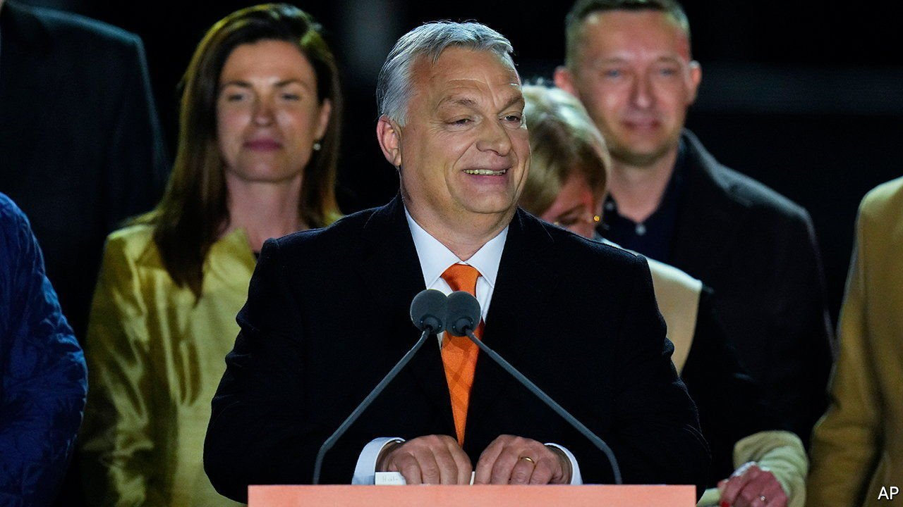

###### Europe’s unicorns, China and Taiwan, electoral systems, petrol stations, English prefixes, time

# Letters to the editor 

##### A selection of correspondence 

 

> Apr 30th 2022 


The plurality of Silicon Valleys

It is a long overdue develop ment that Silicon Valley is now a global state of mind (”, April 16th). As your article correctly noted, we are seeing an abundance of innovation around the world, resulting in many clusters from São Paulo to Bengaluru to Estonia. Having been closely involved in the growth of the Estonian and London ecosystems I can’t wait to see many more come about. Often their development is accelerated by having early big successes that act as an inspiration for the next generation of entrepreneurs.


However, when ranking the clusters we should take care not to forget that the smallest can often be the mightiest examples. Estonia has a population of 1.3m, but has given birth to ten unicorns, firms with a value of at least $1bn. Or zooming out from Estonia, the region known as the New Nordics (the Nordic and Baltic countries) has a combined population of more than 30m people and has created a similar number of unicorns. As the same population to unicorn ratio spreads over Europe we will soon take the lead over America.

TAAVET HINRIKUS

Technology founder and investor

Tallinn, Estonia

 


China and Taiwan

You once again made a comparison between the Taiwan issue and Ukraine (“”, April 23rd). You incited Taiwan to increase its military budget and strengthen its defence capability in order to resist a so-called invasion from China, and even advocated that America upgrade its political and military links with Taiwan and provide it with more weapons. Those statements are seriously wrong and we strongly condemn them.

The issue of Ukraine is an international dispute between two sovereign nations. The issue of Taiwan is purely an internal affair of China and is completely different in nature. There is only one China. Taiwan is an inseparable part of China’s territory, and the government of the People’s Republic of China is the only legitimate government representing the whole of China. The one-China principle is the extensive consensus of the international community.

The Taiwan issue bears on China’s core interests and we will brook no external interference. Resolving the Taiwan issue and achieving the complete reunification of China is the common wish and firm will of all Chinese people and is a historical trend that no one can stop. China will do its utmost to promote the peaceful reunification of the motherland but will never allow anyone to split Taiwan from China in any way. No one should underestimate the strong resolve and capability of the Chinese people in safeguarding the nation’s sovereignty and territorial integrity.

ZENG RONG

Spokesperson of the Chinese Embassy

London

 


Big majorities are a problem

Presumably many Conservative voters now recognise that the good-chap approach to governance has ceased to be effective, if it ever were (“”, April 16th). As long as a government can obtain a majority of 80 seats on 44% of the vote, any prime minister can change any governance rule they like. After Boris Johnson’s historic lawbreaking, will defenders of the status quo still argue that the first-past-the-post voting system brings stability and strong government? Or will One Nation Tories realise that the democratic values and the rule of law they claim to value would benefit from a more representative voting system with better accountability?

KATHRINE SANTOS

Executive member

Liberal Democrats for Electoral Reform

London

 


Viktor Orban won an election with roughly half the vote, you say, but, “thanks to gerrymandering”, two-thirds of the parliamentary seats (“”, April 9th). In the British election of 2019 the Tories won 44% of the vote and 56% of the seats, and in 1983 42% of the vote and 61% of the seats. Clearly Britain’s electoral system is more unfit for purpose than Hungary’s, even without gerrymandering.

MICHAEL SHIPMAN

London

 


Help yourselves

The transition to self-service in retailing, of all kinds, not just for petrol, was one of the great wealth-creating engines of the 20th century. Walmart and IKEA owe their fortunes to the phenomenon of replacing paid shopworkers with customers whose labour (selecting and picking goods) in their stores is free. This enhances their economies of scale.

For those who study or obsess about fuel retailing (and there are thankfully, just a few of us), New Jersey’s ban on motorists pumping their own gas has always been a charming fossil (“”, April 16th). Smaller stations persist because, with smaller economies of scale, it makes sense for retailers to maintain more numerous smaller outlets rather than fewer, larger ones. Think of hairdressers. The same logic explains why there is no such thing as a vast “Hair Cuts R Us” outlet on the edge of town.

The move to self-service petrol has been accompanied by a drastic reduction in the number of fuel courts in America. In the 1960s there were around 450,000 gas stations, nearly all full-serve. Today there are around 125,000 despite the bigger fuel market.

NICHOLAS HODSON

Partner, PWC (retired, mostly)

Salt Lake City

Your correspondent really had to go there and mention pork rolls. Just to be clear, nothing can start a fight in New Jersey sooner than the mention of my state’s pork-product naming convention. It is called pork roll in south Jersey and Taylor ham in north Jersey. Our delicious ham, egg and cheese on a roll or bagel can’t be found anywhere else in America.

TIM O’KEEFE

Long Branch, New Jersey

 


Manifold prefixes

’s column on prefixes, such as tera- and nano-, mentioned that some people object to words that combine elements from different languages (April 9th). We could tackle this objection by matching Old English prefixes with units that have English roots.

For mega- and micro- there are the nicely matched words for large and small, mycel- and lytel-, as in mycelwatt and lytelfoot.

As for giga- and tera-, the Anglo-Saxons seem to have been fascinated by giants and monsters. I recommend ent- and aglac-, as in entapound and aglacyard. Ents were said to be giants, credited with building impressive Roman ruins. And Grendel’s mother in “Beowulf” is described, rather gallantly, as “ides aglacwif”, lady monster-woman.

ROY WHITE

St Paul, Minnesota

 


Time is an illusion

The gulf between Henri Bergson’s and Albert Einstein’s theories of time can be reconciled by the thinking of yet another 20th-century genius (“”, April 9th). Douglas Adams concocted the hitch-hiking “wave harmonic theory of historical perception”. It states that “history is an illusion caused by the passage of time, and that time is an illusion caused by the passage of history.”

SIMON GOLDMAN

Cambridge, Cambridgeshire

