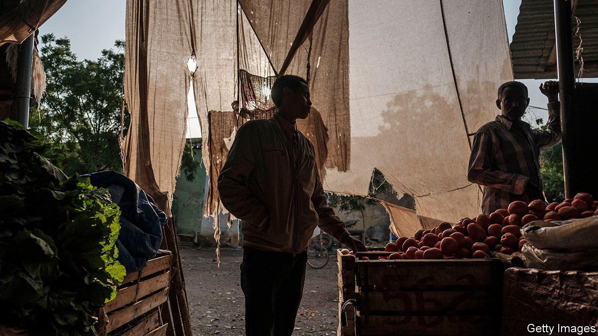
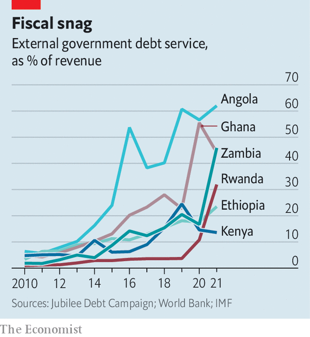

###### Trouble looms

# Debt repayment costs are rising fast for many African countries 

##### They are unlikely to default this year, but face trouble by 2024 

 

> Apr 30th 2022 

AFRICAN FINANCE ministers trying to manage debt must be cursing their luck. First the pandemic slammed their finances. In December a pandemic-inspired scheme to suspend interest payments to bilateral creditors ended. It had delayed debt problems but did not fix them. In February Russian tanks rolled into Ukraine and jumpy investors began to ditch African government bonds. In March the Federal Reserve began to raise interest rates, which will make financing pricier everywhere. Meanwhile, China, a big economic partner for the continent, is struggling because of a rumbling property-debt problem of its own and lockdowns to slow covid-19.

All this has taken a toll. In 2015 the IMF judged that eight countries in sub-Saharan Africa were in debt distress or at high risk of it. Zambia defaulted in 2020. By March the IMF’s list had grown to 23 countries. African governments owe money not only to rich countries and multilateral banks but also to China and bondholders.


The good news is that few countries in sub-Saharan Africa need to make big principal repayments to private creditors this year. It is therefore unlikely that there will be bond defaults in sub-Saharan Africa in 2022, even as countries elsewhere miss payments, says Gregory Smith, an economist and fund manager. In Sri Lanka, for example, protesters are  to the president’s office and the government has cancelled exams for millions of schoolchildren because it could not afford the paper to print them on. The bad news is that African countries have some of the world’s highest interest bills relative to revenues. That leaves less for spending on education and health. It could also foreshadow bigger trouble in 2024, when big loan payments are due.

In 2010, amid a commodity boom and after a big debt write-off for many poor countries, African governments were on average spending less than 5% of revenues servicing foreign loans. By 2021 this had jumped to 16.5%, says the Jubilee Debt Campaign, an NGO. This is higher than the 12.5% average of other emerging markets. In Ghana external debt costs consume 44% of government revenues, reckons the IMF. Cameroon, Ethiopia and Malawi all shelled out about a quarter of revenues.

For oil exporters such as Angola and Gabon, higher crude prices help. In Angola the local currency has soared along with oil. Nigeria, paradoxically, may find itself in deeper trouble as oil prices rise. Although it exports the stuff, it also burns cash on fuel subsidies, which increase as the oil price does. It issued a $1.25bn seven-year bond in March, though at an expensive interest rate of 8.4%.

The war in Ukraine has jolted metal and mineral prices upwards, helping exporters. Yet this will be offset if dearer fuel drains their currency reserves, which are scant for many. On average about 60% of debt owed by sub-Saharan countries is in foreign currencies. Mozambique’s foreign-currency borrowing stands at 113% of GDP. There and in Angola, Rwanda and Zambia every 10% fall in their currency increases debt-to-GDP by six to 11 points, says Capital Economics, a consultancy.

 


These problems stem from a stubborn fact. Debt-funded spending by African governments has not generated enough economic growth, tax revenue or export earnings to pay back the debt comfortably. The pandemic bears much of the blame but plenty of spending was inefficient. In Ghana, for example, it soars in election years and much goes on salaries and handouts.

Few remedies appeal. Egypt, Ghana and Tunisia may need IMF bail-outs. These are unpopular, especially in Ghana, where the government has staked its reputation on sound financial management.

Governments could try to restructure their debts. When Africa’s debt costs were previously this high, rich countries agreed to big write-offs. Last year the G20, a group of large economies, set up the Common Framework to help countries at risk of default. In theory the scheme requires private creditors to take the same hit as government lenders, which may explain why they want nothing to do with it. The result is stasis. Only Chad, Ethiopia and Zambia have applied—and none has got beyond talks. Ethiopia had its credit rating cut after applying, putting others off trying.

Some hope to fix their problems without outside help. That will be painful. To stabilise its debt Ghana needs to find savings or taxes worth 6% of GDP, reckons Capital Economics. Ghana has promised to slash discretionary spending by almost a third and has ignored street protests to ram through a tax on electronic payments. The cedi, the local currency, has fallen by about a fifth against the dollar this year. To try to stop the slide the central bank recently raised interest rates by 2.5 percentage points to 17%, its biggest-ever jump. Most countries in sub-Saharan Africa need to cut spending or raise more taxes to avoid debt trouble, says the IMF.

Many governments would rather bet on economic growth and the debt-fuelled spending they hope would spur it. Yet if that does not work, the fallout will be brutal. Just ask Sri Lankans. ■

