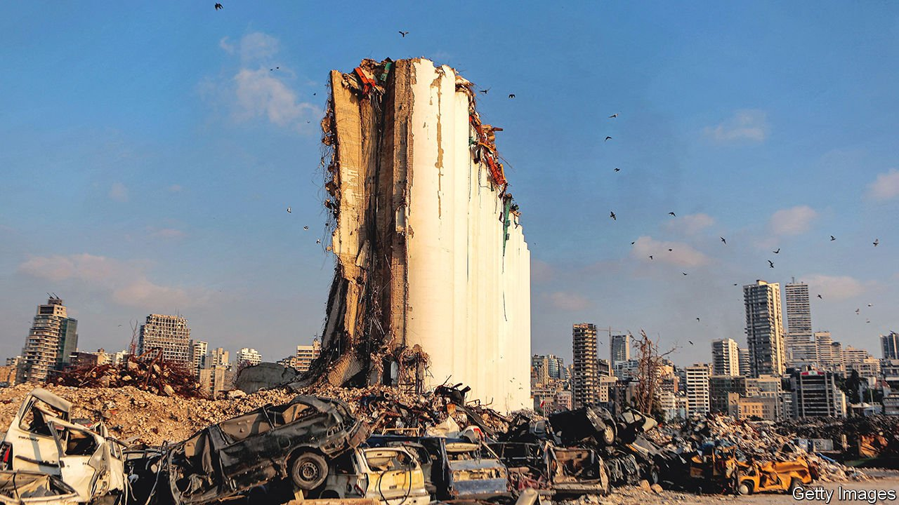

###### Same old rotten lot

# Lebanon goes to the polls amid its worst-ever financial crisis 

##### The system is still rigged in favour of corrupt incumbents against a divided opposition 

 

> Apr 28th 2022 

ONE WAY to predict the future in Lebanon is to look at election billboards and imagine the opposite. The last time voters chose a parliament, in 2018, roads across the country were lined with cheery messages. “Our port will come”, read one, referring to a tourist harbour that would woo cruise ships and boost the economy. Another hailed Lebanon’s financial stability: “Currencies around us are collapsing, but our lira is firm.” In the years that followed, Lebanon’s main port was wrecked by one of the largest non-nuclear explosions ever seen (pictured above), and the lira lost more than 94% of its value.

The same pattern may apply this year. Lebanon will hold legislative elections on May 15th. Nattily dressed candidates grin from ubiquitous billboards. The most common word on them seems to be “change”. Everyone promises reform. Yet the most likely result is more of the same.

 


If ever there was a moment for a throw-out-the-bums vote, this should be it. Lebanon is in one of the worst economic crises in modern history. GDP has shrunk by 58% since 2019 (see chart). Annual inflation is above 200%. The minimum wage is worth about $1 a day. The UN counts three in four Lebanese as poor.

In a once-vibrant bit of the capital, young men dive into skips at dawn, looking for something to sell. At dusk pensioners come out to beg for spare change. Nightfall brings an eerie darkness: most streetlights and traffic signals no longer work. The faces on the billboards seem to be the only ones smiling.

The rough cause of all this was the unravelling in 2019 of a state-run Ponzi scheme to support a currency peg and pay for yawning fiscal and trade deficits. But the crisis’s origins go back much further.

The political class that carved up power after Lebanon’s civil war ended in 1990 built a corrupt, inept order. They stole billions through dodgy contracts and bribes, spending $40bn subsidising a state-run power utility that never provided 24-hour electricity. “The government, the MPs, the ministries, they are a single entity, jointly liable,” says Roy Badaro, an economist. “The system is totally locked by these people, even if they’re enemies politically.”

A record 1,043 candidates registered to run for 128 seats in the May election (42 later withdrew). Sawti (“My Voice”), an activist group, describes 212 as “alternative” candidates with no links to the ruling elite. In the Metn district outside Beirut, for example, campaigners hope to sink Ibrahim Kanaan, an MP who has worked closely with banks to obstruct a financial-recovery plan. His main challenger is Jad Ghosn, an independent journalist known for reporting on political and economic woes.

Beirut Madinati (“Beirut, My City”), a technocratic group, is fielding 11 candidates in the capital, hoping to capitalise on anger over the port explosion of 2020. Caused by thousands of tonnes of ammonium nitrate stored improperly for years, the blast killed at least 218 people, gutting much of the city centre. No one in power was punished. Politicians have worked to obstruct the official investigation.

But translating anger into votes will be hard. Campaign-finance laws are weak and favour deep-pocketed incumbents. Billboards alone cost as much as $8,500—beyond the reach of a grassroots campaign. Independents have tried to spread their messages on social media instead. Vote-buying is legal. With so much of the population in desperate circumstances, it may be easier for party bosses to buy support.

Some 244,000 expats have registered to vote, three times as many as in 2018. Some activists hope the diaspora will be less likely to back sectarian parties. But many expats have still not got instructions on how to vote. Embassy budgets have shrunk amid the crisis (diplomats have been told to watch their toilet-roll consumption).

With widespread blackouts due to fuel shortages, ballots may literally be counted in the dark. Bassam Mawlawi, the interior minister, says the electricity firm asked for $16m to power polling places, more than the entire election budget. In the past votes have been counted fairly; some fear that will not be the case this time.

The opposition has also made missteps, chiefly its failure to run a unified slate. Charbel Nahas, a leftist former minister, has backed scores of candidates. In most areas, though, they are competing against one or two other “alternative” lists, as well as the old established parties.

Lebanon’s complex electoral law, which even many voters do not understand, mixes sectarian quotas with a proportional-list system. But parties that fail to meet a minimum threshold win no seats. The competing lists will split the opposition vote.

Some reformers want to make the election a referendum on Hizbullah, the Shia militia-cum-political party that is a powerful defender of the sectarian system. That has led to dalliances with figures from the old guard, such as Samy Gemayel, the boss of Kataeb, a Christian party with paramilitary links. Others refuse to co-operate with parties of the old era.

Expectations are low. Some campaigners say four or five independent MPs would count as a victory. Hizbullah retains deep support among its co-religionists and remains the strongest armed force in Lebanon; it will not be voted into irrelevance.

Election night is an anticlimax, as the work of forming a government invariably drags on long after. The last election was followed by nine months of horse-trading.

Under Lebanon’s sectarian power-sharing system, the prime minister must be a Sunni Muslim. Yet it is unclear who will lead that community after the election. Najib Mikati, the prime minister since September, is not on the ballot. Nor is Saad Hariri, who spent two terms in the post: his Future Movement is not fielding any candidates. By October parliament must also pick a president to replace Michel Aoun, whose six-year term is ending. With so much uncertainty around two of the top three jobs, it may take months to reach consensus on a new government.

Lebanon has no time to waste. On April 7th the IMF signed a tentative agreement which could include a $3bn loan. To unlock that money, however, Lebanon will have to start restructuring the banks. Parliament has yet to pass a capital-controls law or overhaul bank-secrecy regulations, among many other unfinished tasks.

It is hard to be optimistic about the vote. Many Lebanese with money or foreign passports have left. Many less fortunate are trying to follow. On April 23rd a boat carrying migrants illegally towards Cyprus capsized. At least seven people died and dozens more are missing. A survey by Arab Barometer, a pollster, found that 48% of Lebanese (and 63% of young ones) want to emigrate. Whatever happens at polling stations in May, many Lebanese will continue to vote with their feet. ■

