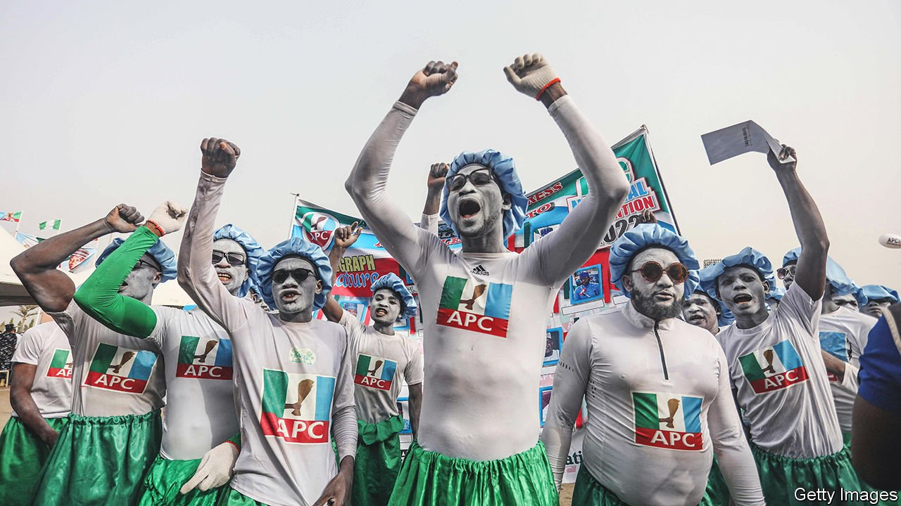

###### Past masters

# Old hopefuls are jostling to succeed Nigeria’s President Buhari 

##### Most Nigerians are younger than 19. Their main candidates are over 70 

 

> Apr 28th 2022 

IN MOST PLACES, elections are about the future. In Nigeria, oddly, they start with a bow to a coup-ridden past. Every four years wannabe presidents stream to a sprawling hilltop villa, where they try to win the favour of Ibrahim Babangida, a former military dictator. The next big stop on this pilgrimage is the farmhouse of Olusegun Obasanjo, who also was head of a military government (and was later an elected president). The ambitious also visit the palaces of local chiefs and religious leaders.

This year is no different, as rivals jostle to replace Muhammadu Buhari, another former military ruler, whose second and final term as an elected president ends next year. The contest is perhaps the most important since the end of military rule in 1999. At stake is whether Africa’s most populous nation will continue its slide into economic stagnation and ungovernability.


Instead of offering new ideas, the main contenders are engrossed in a complex game of strategy. They are forging fragile alliances and courting power-brokers and money men. One of the rules of the game is that big jobs are to be shared out among Nigeria’s six regions (containing more than 250 squabbling ethnic groups), which are nearly equally split between Muslims and Christians. Another is that the presidency should rotate between the mostly Muslim north and the mostly Christian south.

Start with the battle for the nomination of the ruling All Progressives Congress (APC) in primaries next month. Bola Tinubu, perhaps the most powerful politician in the Yoruba-speaking south-west, thinks he ought to get it as a reward for assembling the broad opposition alliance that took power in 2015. He wanted to be on the ballot then as vice-president, with a view to running for the top job later. But those elections were balanced on a knife-edge amid religious and regional tensions, and it would have been politically toxic to have Mr Tinubu, a Yoruba Muslim, running alongside Mr Buhari, a Muslim from the north. So Mr Tinubu held back and nominated Yemi Osinbajo, a lawyer and megachurch pastor.

Mr Osinbajo has since proved a quick study in the third rule of the game: treachery. In April he threw his patron under a bus and said he would run against him for the nomination. He may have been encouraged by Mr Buhari’s reluctance to support the 70-year-old Mr Tinubu (the president is thought to favour Godwin Emefiele, his pliant central-bank governor) and by the expectation that it is the turn of a southern Christian to be president.

Although more competent than his boss, Mr Osinbajo promises to continue Mr Buhari’s policies of building infrastructure, mostly with Chinese loans, and of meddling in the economy in the hope of diversifying away from oil. Given Nigeria’s sorry state, it is baffling why he is presenting himself as a continuity candidate. In any case, he does not have Mr Tinubu’s deep pockets to fund a costly campaign.

An equally skilful game is being played in the opposition People’s Democratic Party (PDP), which ruled from 1999 to 2015. Atiku Abubakar, a former vice-president, fancies another shot after five failed ones. He is 75, so it may be his last. Mr Abubakar, a northern Muslim, will see the populous north as his base, particularly if the APC fields a southerner. He too has deep pockets—and convictions. Voters have repeatedly turned up their noses at his plans to privatise state-owned assets, perhaps for fear that corruption might infect the process, but he has stuck to his guns.

Still, Mr Abubakar is not a shoo-in for the PDP. Edwin Clark, a 94-year-old party elder, says it should choose a candidate for the first time from among the Igbos, the smallest of Nigeria’s three main groups and one with a history of separatism.

Messrs Abubakar and Tinubu hold little appeal for the half of Nigerians who are aged 19 or younger and who see politics as a stitch-up by septuagenarians. That may explain why little more than a third of voters bothered to turn out in 2019. Yet the country sorely needs new ideas—and vim—in Aso Villa, the president’s compound. “The old faces contesting for the presidency”, says Ayisha Osori of the Open Society Initiative For West Africa, an advocacy and philanthropy group, “indicate a tone-deafness and inability to conceive of a Nigeria that can be and needs to be different.” ■

