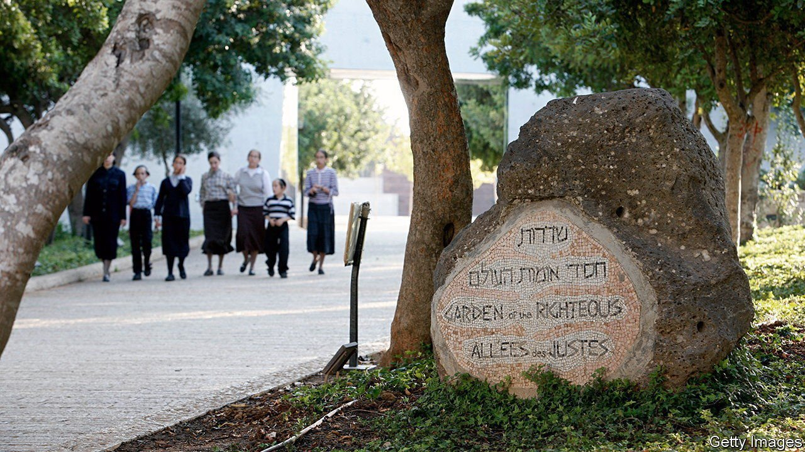

###### The Holocaust’s awkward narratives

# The war in Ukraine has stirred old arguments over history 

##### Israel is entangled with politicised distortions of the Holocaust 

 

> Apr 30th 2022 

MOUNT OF REMEMBRANCE on the western edge of Jerusalem is encircled by thousands of trees, many with a sign naming a person and a country. The Avenue of the Righteous among the Nations, a project begun in 1962 by Yad Vashem, Israel’s national authority for Holocaust remembrance, links to the museum and monuments commemorating the extermination of Europe’s Jews, many of them in Ukraine.

Recognition as a Righteous Gentile, a great honour, granted mainly posthumously, to non-Jews who risked their lives to try to save Jews from deportation and murder during the Holocaust, is a laborious procedure. Each case is carefully vetted by a committee of historians chaired by a judge on Israel’s Supreme Court. But in recent years the process has become more controversial and political, as various governments seek to build self-serving national narratives. Some highlight their citizens who saved Jews, but ignore or even deny the many cases of those who collaborated with the Nazis.


“Holocaust denial is less common today, yet Holocaust distortion with its various faces is alarming,” says Havi Dreifuss, a historian at Yad Vashem. “One of its expressions is the attempt by some countries to artificially increase their number of Righteous among the Nations and claim that these noble exceptions reflect their entire national story during the Holocaust.” Yad Vashem stresses that the number of Righteous Gentiles from any country does not necessarily reflect an entire society’s conduct during the Holocaust.

 


Poland has the most (see chart). This is to be expected, as the German death camps were in its occupied territory and Poland had the largest Jewish population in Europe when the second world war began. Members of its current nationalist government have sought to use this statistic to justify a law passed in 2018 criminalising any accusation that many Poles collaborated with the Nazis. Yet many did; there were Polish villains as well as victims.

More recently Ukraine’s Jewish president, Volodymyr Zelensky, was rebuked in Israel after his speech to its parliament. Calling for Israel to back his country against Russia, he emphasised Ukrainians who saved Jews in the Holocaust but ignored those who co-operated with Hitler. After Vladimir Putin invaded Ukraine in February on the pretext of “denazifying” its government, Yad Vashem condemned Russia for “trivialising and distorting the historical facts of the Holocaust”.

Some Israeli politicians have also sought to use the Holocaust for their own cause. When he was prime minister, Binyamin Netanyahu would use Holocaust Martyrs’ and Heroes’ Remembrance Day, marked every year after Passover, to inveigh against threats to Jews from Iran and radical Islam. In one of his own speeches at Yad Vashem, President Reuven Rivlin warned against the notion that “every threat to Israel is existential and every Israel-hating leader is Hitler”. This was taken as a rebuke to Mr Netanyahu. Mr Zelensky will not be the last European or Israeli leader to fall foul of Holocaust historians. ■

Read more of our recent coverage of the 

