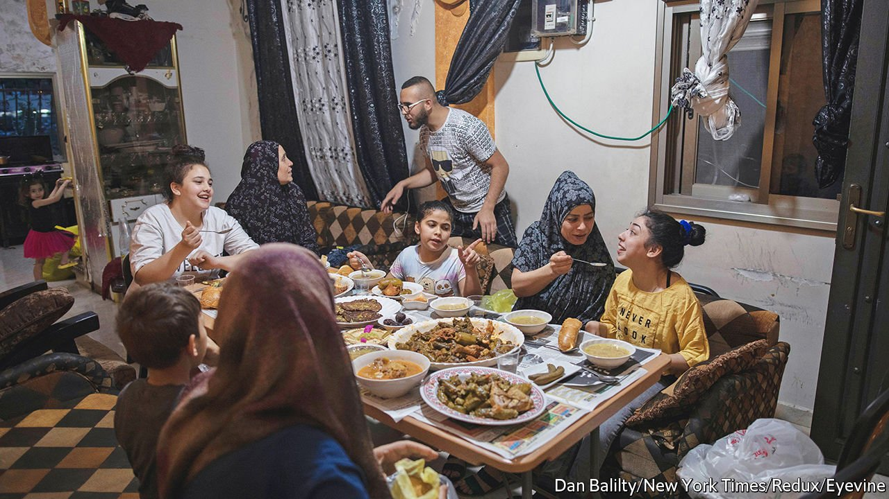

###### The breakfast club

# Why more Arab Muslims are ignoring the Ramadan fast 

##### State enforcement of the rules is becoming softer too 

 

> Apr 30th 2022 

DOWNING WHISKY sours at sunset in the bars of Jordan’s capital, Amman. Puffing a cigarette in the rush-hour traffic in Iran’s capital, Tehran. Raunchy massages in Morocco’s Marrakech. Such are the goings-on in the holy month of Ramadan, when Muslims are meant to abstain from food, drink and sex—from dawn to dusk. Some residents of the United Arab Emirates’ fleshpot of Dubai now mockingly dub the month Haramadan, after the Arabic word haram, meaning things that are forbidden.

Most Middle Eastern states still criminalise public violation of the Ramadan fast. But the fines imposed decades ago are now lower than those for parking. Jordan has a maximum penalty of 25 dinars (about $35). Oman’s is a riyal ($3). The authorities mostly turn a blind eye. “They are too frightened of the social-media outcry to act,” says an Iraqi lawyer in the shrine city of Najaf. Judges, he adds, often interrupt cases in Ramadan for a cigarette break. From Tehran to Tunis, cafés often stay open, some after customers discreetly tap on metal shutters. Egypt, which once routinely jailed people who flouted the fast, even penalised a restaurant that refused to open its doors; the police recently closed down a fast-food joint after a Coptic Christian complained she was refused service.


In recent years Jordan introduced Ramadan licences to sell food and drinks at a hefty price, while still jailing people who openly ignored the fast. At first cafés took the precaution of curtaining over their entrances and windows. Now they are left open. An uninitiated foreign visitor to Amman would barely notice that Ramadan, predicted to end this year on May 2nd, is a special month.

Some trace this new laxity across the Arab world to the authorities’ top-down effort to oppose the extremism of Islamic State and other jihadists, others to a bottom-up revulsion against governments using religion as a tool of control. As governments seek to diversify away from oil, they also need to compete for non-Muslim tourists. Besides, a profusion of food-delivery apps makes it easier to order without public scrutiny.

Soaring prices this year may be casting a pall over nightly guzzling after two years of covid-19 cancelled the feasts entirely. Economic necessity is forcing governments to maintain productivity during what was by tradition an idle month. A financial adviser in Amman says that only two of her 25 colleagues have been fasting.

