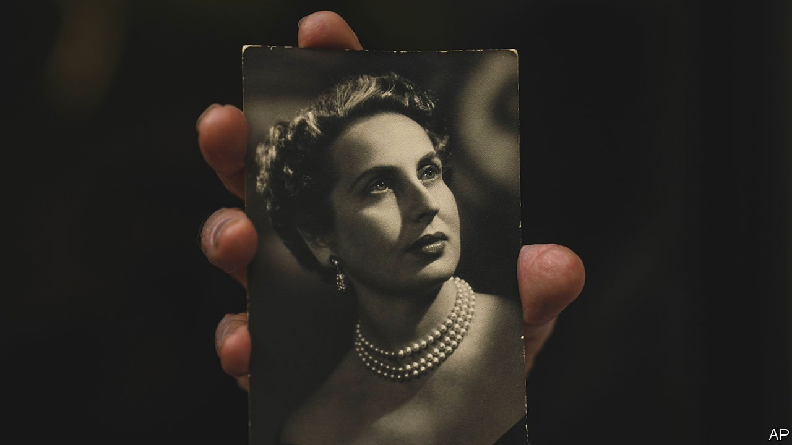

###### One name more

# Mimi Reinhard typed up Schindler’s list 

##### The inmate of Plaszow labour camp died on April 8th, aged 107 

 

> Apr 30th 2022 

SOMETIME IN THE early autumn of 1944 Mimi Weitmann, as she then was, added her name to a list. She thought she would take the risk. Unfortunately she had to use the horrible first name, Carmen, which her opera-loving father had given her; “Mimi”, from “La Bohème”, was the much nicer nickname they settled on later. Sadly, too, she had to add the surname of her dead husband, Yozsi Weitmann, her love since university, who had been shot by the Germans at the gate of the Krakow ghetto as he had tried to escape.

That had happened in 1942. She had been widowed in her 20s, left with a baby son, Sasha, whom she and Yozsi had managed to smuggle to Hungary with her grandmother. She was very uncertain when, or even whether, she would see either of them again. As she typed “Carmen Weitmann”, there seemed to be nothing left of herself. Her old life as carefree Mimi, in a Vienna where Jews were integrated and the word “Aryan” unnecessary, was too long ago and far away. She was now in a blank place, among the dead.


At least she was no longer in the ghetto, which had been liquidated anyway, with those too ill or old to work simply shot in the street. She was in the Plaszow labour camp, to which most of Krakow’s Jews had now been moved. There were horrors in Plaszow, too: a small child killed for refusing to take off his clothes, the digging of a mass-grave which was also meant to be hers. But she was given a relatively sheltered desk-job because, being Austrian, her German was perfect, and because she had learned shorthand from a stenography course. Not that these were much use for taking down and typing up—as she was tasked to—a list that eventually ran to 1,200 names.

The list had been growing for a while. At first it had around 1,000 names, those of the Jews who worked in Oskar Schindler’s German Enamel Factory in Krakow. Then it got longer. It was added to by Mietek Pemper, secretary to Amon Goeth, the vicious camp commandant, and by Itzhak Stern, Schindler’s accountant. Then Schindler himself (and his wife) contributed yet more, the relatives and friends of his employees and, it seemed, anyone he could think of. She typed them up as he asked her. In the end there were at least seven versions, possibly even nine, and her job was to make each one presentable.

Every name was Jewish (with “Ju.” typed before it), even though Schindler was not. These were meant to be essential workers in his factory, which he was going to move from Plaszow (where it had moved from Krakow) westward to Brünnlitz, in his native Sudetenland, and repurpose to make arms. But as Mimi typed the date-of-birth column she could see there were children on it, and as she typed the “skills” column she could spot photographers and rabbis among the metalworkers, so something else was clearly going on. Even her own qualification, Schreibkraft, “typist”, looked odd, especially as she added it with two slow fingers. Typing was something she had never learned.

She did not have much direct contact with Schindler, but liked him as a boss. He was charming and outgoing, and treated his Jewish workers kindly, not like scum. Perhaps even too kindly, for he was a great womaniser, with several pretty secretaries besides her, and got into trouble once for kissing a Jewish girl on the cheek at his birthday party. Maybe she was there because he liked her cool blonde elegance, rather than her mind. She knew, too, that he was very rich, and struck deals with the Nazi high-ups all the time by bribing them with black-market luxuries to get better conditions and more food for “his” Jews, as he called them. But that sounded patronising as well as protective, as if they were just cogs in his factory, since Jewish slave-labour was cheap. She also could not forget that he was a thoroughgoing Nazi, an SS man, who sometimes spent whole nights carousing with the officers.

In short, her boss was no angel. And there was something chilling about the list, with its constant repetition of number, race, name, skill. Perhaps he did not mean to save “his” Jews after all, but simply move them to another camp, a fatal one. His closeness to Goeth, though it was tactical, was worrying. Some people, she knew, had refused to let their names be put on the list for those reasons. She decided, though, that she would trust him. She added her name partly to be useful to him, by swelling the numbers. Then she added three friends as well.

That was a gamble, and for one terrifying moment she seemed to have bet the wrong way. Three hundred of the women and girls on the list, including her, were transferred by mistake to Auschwitz, where they endured two weeks that reminded her (from her language-and-literature studies) of Dante’s “Inferno”. With even more bribery, and threats too, Schindler got them out. In the end the list and the transfers worked, and everyone was saved.

She restarted her life then, moving to Morocco, marrying Albert Reinhard, reclaiming her son and settling first in New York, which she loved, and then in her 90s in Israel. Of the time with Schindler, and the list, she said little or nothing over those years. When Steven Spielberg’s film appeared in 1993 she was invited, with the other Schindlerjuden, to the premiere, but left before the screening. The memory was still too fresh. When at last she felt able to see it, she approved of the casting but not of the prisoners. They were too well-dressed, not demeaned in rags.

Schindler, she heard, had died in 1974 without a penny to his soul. He had spent all his money on saving and feeding his workers, and was never reimbursed as he hoped. His reward was posthumous, to be recognised at Yad Vashem in Jerusalem as righteous among the nations, and by Mimi Reinhard as a Mensch.

They had met one last time, on a sunny day in Vienna around 1960, when she was visiting an aunt. As they passed a café a voice called out “Carmen Weitmann!” and it was Schindler, drinking with other Schindlerjuden. They all dined together and in the taxi he hugged her, proclaiming everyone “my Jews” again. But she could forgive him that, as well as the painful “Carmen Weitmann”. This was the name that had saved her, the one on his list. ■

