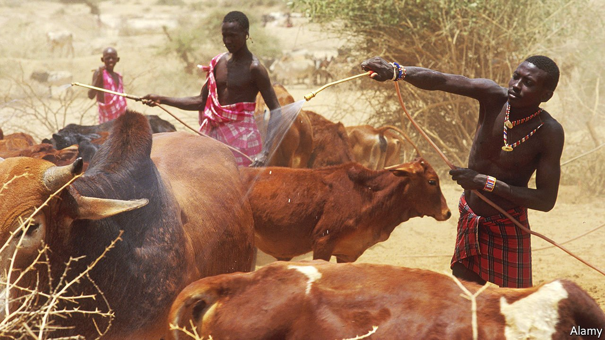

###### East Coast Fever

# A genetic discovery could help fight an African cattle disease 

##### That may allow the introduction of higher-yielding breeds 

 

> Apr 30th 2022 

IT BEGINS WITH a bite near the cow’s ear. In the next few days, the animal’s lymphocytes multiply. Its lymph nodes swell. It stops feeding and starts coughing as fluid fills its lungs. It develops a fever as high as 41°C. A few weeks after the bite, it dies.

Such a story is common in African countries where East Coast Fever (ECF) is rampant. ECF, which is caused by protozoan parasites spread by ticks, kills around 1m cattle a year. It also prevents the introduction of faster-growing, higher-yielding European breeds, which are much more susceptible to the illness than their African kin. Though a vaccine is available, and the ticks can be attacked with sprayed pesticides (see picture), both of these approaches are costly. Most farmers thus continue to use less-productive local varieties—curtailing their incomes and reducing agricultural output. The difference is stark: a Kenyan cow produces around a tenth as much milk as one in Britain.


New research may offer a solution. Veterinary scientists led by Phil Toye of the International Livestock Research Institute’s campus in Nairobi and James Prendergast of the Roslin Institute, in Edinburgh, have found a gene variant associated with resistance to ECF. This result, published in PLOS Genetics, opens up the possibility of breeding—or even gene-editing into existence—cattle that can beat it.

The variant’s discovery came about serendipitously. While observing a small ECF vaccination trial in 2013, researchers at the International Livestock Research Institute noticed that of the 12 unvaccinated animals involved, all three survivors had been sired by the same bull. Further investigation suggested the specific genetic element responsible was a version of a gene called , which they dubbed .  is part of a process of programmed cellular suicide called apoptosis, which helps regulate cell numbers.

The current study examined 20 animals carrying two copies of the variant version. Just one of these succumbed to ECF. In contrast, 44 of 97 cows without the variant succumbed. The results, says Dr Prendergast, suggest that  has a “disproportionately large effect” on cattle’s ECF tolerance. He and his colleagues, though not sure exactly why that might be, think this variant may stop cattle lymphocytes from multiplying as quickly.

Their discovery could soon lead to better selective breeding. Once researchers are sure the variant does not have adverse side-effects, African cattle breeders can test their animals’ DNA for it and breed from those carrying it, thus producing ECF-resistant offspring. In the longer term, gene-editing techniques such as CRISPR-Cas9 may permit the protective version to be spliced into productive European breeds, which can then be raised far more successfully in Africa.

Such gene-editing programmes are increasingly common, and are achieving official acceptance. In March, regulators in America approved the first sales to consumers of meat from gene-edited cattle. (The modification in question gives the animals short, slick hair, to help them cope with a warming climate.) The International Livestock Research Institute and Roslin, meanwhile, are designing livestock resistant to other diseases, including trypanosomiasis, a protozoan illness spread by tsetse flies.

By reducing mortality and increasing productivity, gene-edited European livestock could have a useful effect in Africa—though some worry the benefits are overstated. Dr Prendergast points to the many other animal diseases prevalent on the continent, to which such cattle would still be susceptible. He suggests farmers might be better off breeding local varieties for resistance (and also higher productivity). But no matter whether disease resistance is brought about by conventional breeding or gene editing, it should lead to healthier cattle—and happier farmers. ■

To enjoy more of our mind-expanding science coverage, , our weekly newsletter.

