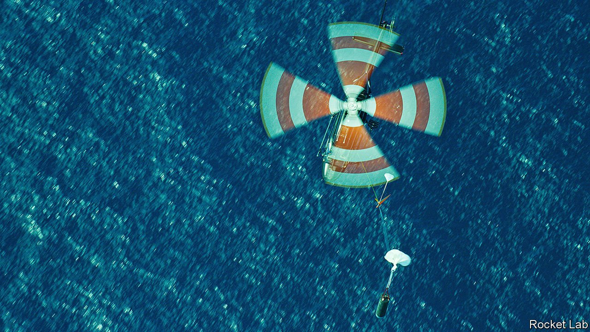

###### Rocket Lab’s grab

# Another rocketry firm experiments with recycling its launchers 

##### If it is successful, it will make getting to orbit cheaper still 

 

> Apr 30th 2022 

AS TECHNOLOGICAL FEATS go, recovering and relaunching the first stage of a space rocket ranks pretty high on the scale of difficulty. So far, only SpaceX, an American giant, has pulled it off. But another outfit now seems close to doing so—albeit on a rather smaller scale. Shortly after the local weather calms (and thus after this story was published), a firm called Rocket Lab plans to dispatch a mission dubbed “There and Back Again”.

There and Back Again will start with the lift-off of one of the company’s two-stage Electron launchers from its spaceport on New Zealand’s North Island. (The mission’s name is a sly allusion to New Zealand’s role as a set for Peter Jackson’s filmed version of “The Hobbit”, the original book of which bore the phrase as part of its subtitle.) Minutes later, the attempt to recover the Electron’s spent first stage will begin. SpaceX, which first did this sort of thing in 2015, uses thrusters to set the descending first stages of its Falcon 9 launch vehicles gently upright on a landing pad. Rocket Lab, by contrast, will employ a helicopter to try to catch its parachuting first stage in flight.


It promises to be quite an operation, even if, at 12.4 metres, an Electron’s first stage is less than a third of the height of a Falcon 9’s. Rocket Lab has designed a grappling mechanism attached to a long line which will dangle from a twin-engined Sikorsky helicopter. The trick will be to manoeuvre the chopper so that this cord first makes contact with, and then slides smoothly along, the incoming stage’s taut parachute line. When that line reaches the grappler, it will snap shut like a gin trap, seizing the line in its jaws.

This sounds both hard and risky. But, in a number of tests, the capture team has successfully grabbed the parachute line of a dummy rocket stage dropped from a second helicopter (see picture). As for keeping the whole shebang out of the helicopter’s rotors, a radio in the stage helps to do this by transmitting its position continuously to the flight crew.

The trickiest technical challenge, therefore, is not the actual process of capture, but rather the manoeuvring of the stage that takes place minutes earlier, while the helicopter is still hovering on standby near the catch zone, some 280km from shore. If all goes well, about 150 seconds after launch the first stage’s nine kerosene-powered engines will switch off. The stage will then separate. As the second stage continues upward to loft 34 small satellites into orbit around Earth, the first, by now about 80km up, will arc back downward. This is when things get really dicey. With the first stage hurtling along at 2.35km a second, atmospheric friction will soon—and quite suddenly—generate tremendous heat. “It just goes whack, like that,” says Peter Beck, Rocket Lab’s boss. His engineers refer to this first stretch of progressively thickening air as the Wall.

To survive the Wall intact, the first stage will use thrusters to flip itself over, so that it is travelling tail first. The bottom part of the stage is already designed to handle the intense heat of the engine’s exhaust, so it makes sense to take advantage of its heat-resistance to slice a pathway through the air. The friction of re-entry will nevertheless create a bow wave of superheated air molecules surrounding the stage, which Mr Beck describes as “a hot knife of plasma”. This renders the margin for error slim. Were the stage to tip slightly, and touch this plasma knife, he says, it would be cut through almost as if it were butter.

Friction from passing through the Wall will slow the stage, but not enough for it to deploy its main parachute immediately. Instead, at an altitude of about 13km, a pneumatic mortar will shoot out a smaller drogue chute. Only when the descending stage has reached an altitude of 6km will the big parachute be released. Even then, a circular “reefing” cord will restrict its opening to a quarter of its maximum surface area. Roughly a minute later, that cord will be severed, to permit the parachute to inflate fully. This will slow the stage’s descent to just ten metres a second. As the earlier trials have shown, at that speed the helicopter’s pilot is able to snag the spent stage with neither great difficulty nor a dangerous downward yank on the aircraft.

Rocket Lab is not the only company which hopes to emulate SpaceX’s feat of recycling. Quilty Analytics, a firm that advises the space industry, is aware of at least five others—though none is as far advanced as Rocket Lab. As to how much money the firm might save if all this proves successful, Mr Beck remains coy. However, Chris Quilty, Quilty Analytics’ founder, reckons the Electron’s first stage may well account for more than two-thirds of the launcher’s cost, so reusing it will cheapen things considerably. It is a fair bet, then, that Rocket Lab’s competitors will be almost as keen as the firm itself to see just how well the operation succeeds. ■

To enjoy more of our mind-expanding science coverage, , our weekly newsletter.

