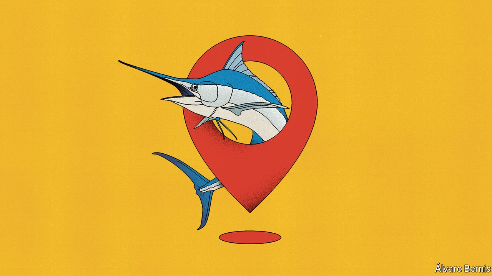

###### Now hear this

# GPS for the oceans 

##### A system based on sound waves could transform marine biology 

 

> Apr 30th 2022 

ZOOLOGISTS ROUTINELY track animals, from albatross to zebra, using global-positioning-system (GPS) tags which then return their data via satellite. Marine biologists have a harder time of it, though, because seawater is infuriatingly opaque to radio signals. This makes it impossible either to receive GPS signals or to transmit any data collected back to base.

That does not stop people tagging sea creatures. Data collected and stored in a tag can either be sent to a satellite in bursts if the species in question is one that comes to the surface from time to time, or the tag can be dispatched on a one-way trip to the surface after a set period. A tag may also be recovered if the animal carrying it is caught by a fishing boat. (Fisherfolk are typically paid a few hundred dollars per tag returned to its home laboratory.)


None of these methods, though, keeps accurate track of where the animal carrying the tag has been. For these and other reasons, it would therefore be useful to have a marine equivalent of GPS. And one is now being deployed. The Woods Hole Oceanographic Institution, in Massachusetts, hopes to fill the seas with sonic beacons that will ape the role of GPS satellites by broadcasting signals which can be used to triangulate a receiver’s location when it is underwater.

Ping pong

The sea is divided into distinct layers that have different temperatures and salinities. During the second world war American naval scientists showed that some of these layers act as sonic waveguides. They dubbed them “sound fixing and ranging” (SOFAR) channels. Sound emitted in one of these channels echoes between the layers above and below, thus staying in the channel—an effect comparable to the way light is carried within an optical fibre. Thus constrained, a sound wave can travel hundreds of kilometres before it becomes too attenuated to detect.

The SOFAR transmitters deployed by Woods Hole, as the institution is known colloquially, are one-tonne buoys moored at an appropriate depth for the channel concerned. Every 12 hours they broadcast a 32-second-long location signal known as a pong. Pongs are so called because they are similar to sonar “pings”, but of lower frequency (300Hz rather than 18kHz). In typical conditions a pong can be picked up 1,000km away. By listening to the pongs from several beacons a receiver can calculate its location.

Existing receivers for the two SOFAR transmitters currently deployed are carried on free-floating instrument packs that measure temperature, salinity and other physical variables. But the plan is to deploy two more transmitters this year, and more in future years, with the aim of “ensonifying” the entire east coast of America, out as far as the Sargasso Sea. At the same time, people are working on shrinking the receivers to the point where they can be attached easily to fish.

Godi Fischer of the University of Rhode Island is one of those attempting this receiver-shrinking. His latest offering, now being tested on submersible drones called gliders, is 24mm long, 11mm in diameter and weighs just nine grams. That makes it tiny enough to be attached to a range of marine creatures. Even if the recipient is not in a SOFAR channel, Dr Fischer says there is enough leakage from such channels for it to pick up a signal at a distance of perhaps 100km. Each tag costs just $200.

Simon Thorrold, an ocean ecologist at Woods Hole, will be an eager adopter of these tags. He plans to attach them to tuna and swordfish later this year. Both species are commercially important, and their behaviour is not properly understood. Swordfish follow a daily pattern, diving at dawn and spending the day at depths of up to 800 metres before rising near the surface again at night. But nobody knows what drives them to do this.

Dr Thorrold suspects it may be related to the way the fish interact with so-called mesoscale features. These are gyres tens of kilometres across which last for a month or so. In particular, a type of feature called a warm-core eddy may be crucial for populations of prey species. Plotting the way swordfish move in relation to eddies could reveal much about the workings of the marine ecosystem. Dr Thorrold says the findings could help both fisherfolk and the environment, by helping ensure that only fish of the desired type are caught, therefore minimising so-called by-catch of forbidden or non-commercial species.

Further down the line, he hopes to track Atlantic salmon. This could shed light on “ocean phase mortality”—the number of fish that go out into the deep ocean from their freshwater spawning grounds but fail to return to them later in life, to spawn themselves. He also hopes, once and for all, to solve the mystery of where Atlantic eels spawn.

Eels have life cycles that are the opposite of salmon. They spawn at sea and the young then swim back to freshwater to live out most of their lives. That Atlantic eels spawn somewhere in the vicinity of the Sargasso Sea is known from work carried out a century ago. But exactly where this happens remains obscure.

SOFAR transmitters will have applications beyond zoology, as well. Melissa Omand, a colleague of Dr Fischer at Rhode Island, specialises in underwater robotics. She has developed small underwater floats she calls Minions. Their purpose is to follow the movement of carbon in the oceans.

Toiling Minions

Each Minion is equipped with a camera of the sort found in a smartphone, and also a Raspberry Pi microprocessor. It uses these to monitor small particles of organic matter (mainly fish faeces) that are known collectively as marine snow. This snow falls from the surface to the ocean depths, where it decays so slowly that it may persist for thousands of years. That makes it an important carbon “sink”, which stores that element in a form in which it cannot contribute to global warming. A fleet of cheap Minions carrying Dr Fischer’s tags could give a better picture of ocean currents and carbon transport in the ocean. Dr Omand says this might guide projects seeking to sequester carbon out of harm’s way in the ocean depths.

A SOFAR beacon of the sort Woods Hole makes clocks in at around $100,000, plus the price of deployment. Thousands could thus be put in place for the cost of a single GPS satellite. Surprisingly, there is no military equivalent (though DARPA, a research arm of America’s defence department, is working on one called POSYDON). And, since Woods Hole is a scientific institution, it is makes sense that the initial applications are scientific. As with GPS, though, once the infrastructure is there, people will probably find commercial employment for it, too. Exactly how humans will use the oceans over coming decades remains to be seen. But having decent navigation beacons in place will surely help. ■

To enjoy more of our mind-expanding science coverage, , our weekly newsletter.

