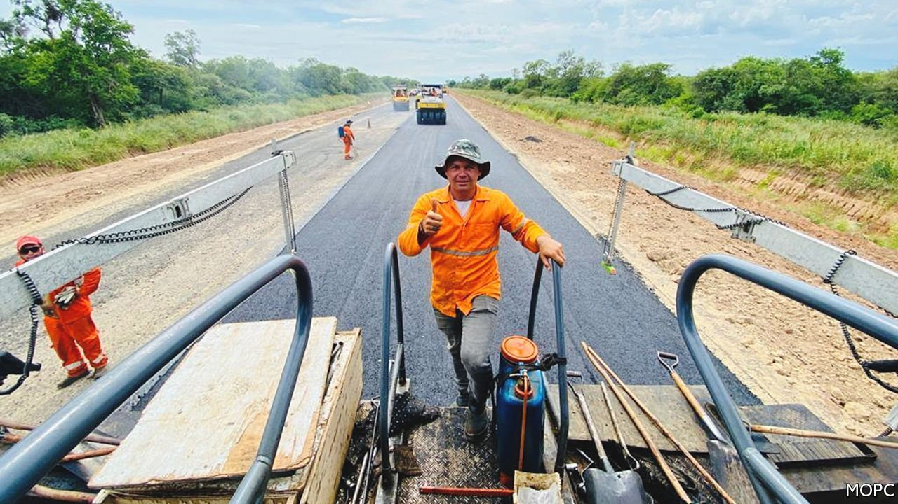
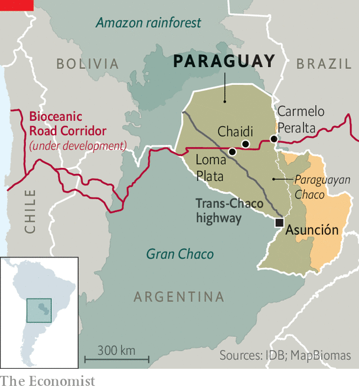

###### Highway through hell

# A new motorway in Paraguay could eventually rival the Panama Canal 

##### That is, if governments in Brazil and Argentina build their connecting roads, too 

 

> Apr 30th 2022 

THE GRAN CHACO, a vast sprawl of swamp, scrub and savannah which stretches across Brazil, Bolivia, Paraguay and Argentina, has long been hard to get through. In the 16th century its nomadic hunters ambushed Spanish would-be conquistadors. When Bolivia and Paraguay fought over the “Green Hell” in the 1930s, thirst was thought to have killed more soldiers than bullets. Until 2019 a region the size of Austria in Paraguay’s part of the Chaco contained no paved roads at all.

But earlier this year Paraguay’s government inaugurated the first half of a dual-carriage motorway that will bisect the region for 544km (338 miles) east to west. It forms the main part of the Bioceanic Road Corridor, an infrastructure project talked about for decades by the countries around the Chaco, which finally seems to be getting off the ground.


The plan is that the road will connect soyabean farmers in Brazil and cattle ranchers in landlocked Paraguay to markets in Asia, by going through northern Argentina and on to Chile’s ports. Arnoldo Wiens, Paraguay’s public-works minister, claims that compared with shipping goods through the Panama Canal, the corridor will save the Southern Cone’s agricultural producers 14 days and $1,000 per container, or a third of their logistics costs.

 


The first stage of the road—a 276km stretch between the riverside village of Carmelo Peralta and the town of Loma Plata—was built by a CCVB, a consortium formed by Queiroz Galvão, a Brazilian conglomerate, and Ocho A, a local company. It was built on time and within the budget of $443m: a rarity in corruption-prone Paraguay. By early 2024 a $103m bridge should link Carmelo Peralta to Brazil, and the corridor will reach the Argentine border. The Trans-Chaco highway, a potholed road running north to Bolivia, is also being widened and improved.

Mario Abdo Benítez, Paraguay’s president from the conservative Colorado Party, is keen to take the credit. Officials say that nearly 3,000km of paved roads have been built since he came to power in 2018. That is far more than any of his predecessors managed, including Alfredo Stroessner, a dictator who ruled for 35 years. Yet many of these projects were enabled by legislation passed under Mr Abdo Benítez’s predecessor, Horacio Cartes, say allies of Mr Cartes.

Not everyone is pleased by the asphalt. The road-building frenzy “deepens an undiversified, extractivist model”, warns Verónica Serafini, an economist. Beef and soyabeans make up almost 70% of Paraguay’s goods exports by value and support a third of GDP. Rather than build more mega projects, the country should support small farmers and invest in better public transport and drainage in Asunción, the flood-prone capital, she thinks. Brazil and Argentina will have to invest in some roadworks too if the corridor is to link up seamlessly, concedes Juan Rivarola, the project’s environmental and social manager.

But for Julio Portillo, a truck driver, the new road is already making life easier. Reaching Carmelo Peralta from Loma Plata used to take 12 hours along a rutted dirt track. If it rained he was marooned in the mud for days. It now takes four hours. He still brings a shotgun to hunt caimans and peccaries, a kind of wild boar, to eat if he gets stranded. “The Paraguayan Chaco is a world apart,” he says. “If you get stuck, no one is coming to help.”

The impact of the new motorway is more uncertain for local indigenous people, especially the few who still live in the forests. “I see both sides, positive and negative,” says Demetrio Picanerei, an indigenous Ayoreo teacher in the village of Chaidi. Before he was born, his parents fled urban Ayoreo neighbourhoods in Bolivia that were ravaged by drugs and alcohol. He worries that the new motorway, and the inevitable truck-stops, motels and diners that will spring up along it, will spread the same “vices”.

Nobody is going to slow me down

Another problem is deforestation. Between 1985 and 2013 the Chaco lost a fifth of its surface area. Trees have been bulldozed and burnt, mainly for crops and pasture. Relative to its size it is shrinking faster than the Amazon rainforest. Many endangered jaguars, tapirs and giant armadillos will soon end up as roadkill or trophies, worries Luis Recalde, a conservationist. To try to prevent this, the consortium of builders has created 15 underpasses for wildlife. The corridor has also been slightly diverted at two places to avoid passing directly through Ayoreo land.

Officials say the integration of the Chaco with the rest of the country is long overdue. The area covers nearly two-thirds of Paraguay’s territory but is home to just 3% of its people. Hundreds of jobs will be created once fleets of Brazilian trucks start to thunder through, Mr Wiens predicts. Even Mr Picanerei concedes that it will make getting to the hospital easier. “The roads were very ugly before,” he says. ■

