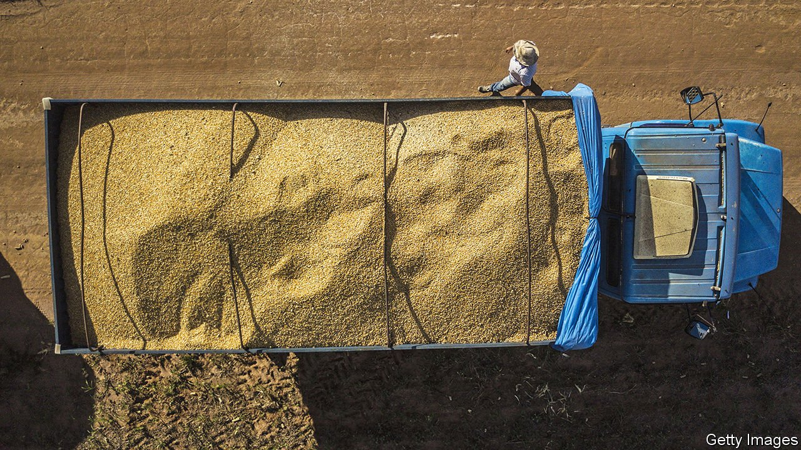
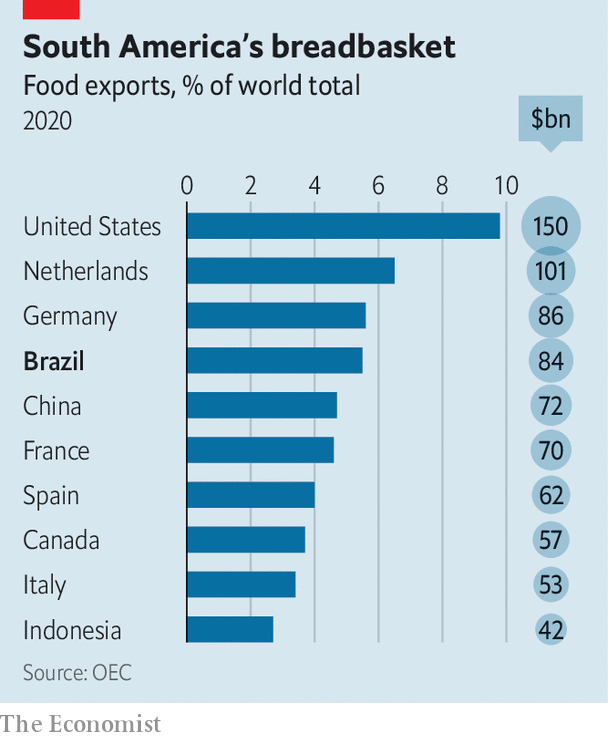

###### Pulling its wheat

# Can Brazil help with food shortages around the world? 

##### In the first two months of this year it has exported more wheat than in the whole of 2021 

 

> Apr 30th 2022 

WHEN MARIZE PORTO’S husband died suddenly in 2002, she was left with three small children and a failing cattle ranch that she had no idea how to run. Desperate, she turned to Embrapa, the Brazilian government’s agricultural research institute, for help. Today her farm in the state of Goiás is a model of technical know-how and productivity. Corn grows tall in the dry, red earth, planted upon the remnants of last season’s soyabeans. Once the corn is harvested, cattle come in to graze.

The practice Ms Porto uses—which combines livestock, crops and forestry—requires less land and can make a farm five times more productive than the average Brazilian holding. It restores degraded pastures, making it ideal for use in the cerrado, the unwieldy savannah which covers a quarter of the country. Yet it has been slow to catch on. Despite the system’s advantages, it has been adopted on only 18.5m hectares, or around 5% of farmland.


This is worrying. In the past four decades Brazil has transformed itself from a net importer into the world’s fourth-biggest food exporter. In 2022 it is expected to produce 285m tonnes of grain, six times the amount it harvested in 1977. Still, the world is hungry for more. Stretched supply chains and shortages caused by Russia’s invasion of Ukraine have piled pressure on food markets. Even before the war, Brazil exported more wheat in the first two months of this year than it did in the whole of 2021. But extreme weather and soaring prices of fuel and fertiliser are making it harder for farmers to meet demand.

No rain, no grain

South America’s breadbasket is also balancing on precarious ecosystems. Cattle and soya farms are destroying parts of the Amazon. Advances in tropical agriculture have also come at the expense of half of the cerrado’s trees. The cerrado, known as the “birthplace of waters”, feeds eight of Brazil’s 12 major river basins. But it depends on moisture in the air from the rainforest for its water supply. So deforestation not only adds to climate change. It also undermines the conditions required to grow food.

 


Responding to these challenges requires innovation. In an executive order on April 22nd President Joe Biden said that the United States would try to reduce the import of food produced on illegally deforested lands, such as the Amazon. In polls, around half of consumers in rich and middle-income countries say that they consider sustainability when buying food and drink. But can Brazilian agriculture respond to this demand by becoming greener, while also ramping up food supply?

Jair Bolsonaro, the populist president, has overseen rapidly rising levels of deforestation and weakened laws protecting native vegetation. Yet on paper at least, his government’s plan for agriculture is ambitious. It aims to reduce emissions in the sector by the equivalent of 1.1bn tonnes of carbon dioxide by 2030. Part of the plan involves developing standards for what constitutes “low-carbon”, “carbon-neutral”, or “negative-carbon” for ten commodities. In 2017 Brazil became the first country in the world to create a label for “carbon-neutral”, or zero-net-emission, beef.

Beef production alone accounts for around 8.5% of the world’s greenhouse-gas emissions. Brazil, as the world’s largest beef exporter, has a big incentive to label its goods “carbon-neutral”. Not all are convinced. Such claims of neutrality rest largely on the metric of carbon sequestration: that the grass cattle graze on, or forests they slumber in, can act as a sink for carbon dioxide. But such calculations do not account for the carbon-opportunity cost, or what the land could have captured if it were used for other things. Biogas captures waste emissions, but not methane from cows’ belches. Carbon-neutral beef “sounds like an oxymoron to me”, says Matthew Hayek of New York University.

Even so, the quest for carbon neutrality is driving change across the sector. Carapreta, a meat company, owns three farms in Minas Gerais, in south-eastern Brazil. In one, tilapia fish are bred in tanks and the water they swim in is used on the farm’s grain. The grain becomes animal feed for the 70,000 cattle the farm slaughters every year. Meat scraps are processed into fish food, while animal waste is converted into fertiliser and biogas. This gas helps make the farm self-sufficient in renewable energy. All this, the company claims, will eventually make the farm carbon-negative. By 2024 Carapreta’s owners expect to have invested $1bn reais ($208m) in the company.

However even with such large resources, Carapreta still struggles to make its farming fully eco-friendly. In a country almost the size of the United States, but with shoddy infrastructure, some of its cattle are moved in trucks thousands of kilometres from other states. The company buys cattle feed from Cargill, an American food giant. Organic fertiliser is difficult to produce: fully 70% of Carapreta’s inputs are chemical.

Breadbasket breaking point

And the Carapreta team is keen to encourage more consumption of meat, not less. “It’s something that you can eat every day, it’s good for you and for the environment as a whole,” says Gabriel Géo, the chief marketing officer. But on the hectare that it takes to graze a Carapreta cow, an average Brazilian farm could produce 28 tonnes of potatoes or five tonnes of corn.

Most Brazilian farmers do not have millions to invest in satisfying conscientious consumers. This includes the small and medium-sized farms which produced around two-thirds of food by value in 2006, the latest year for which data are available. Only 15% of Brazilian farms report having access to credit, according to a study by the World Bank. It is also harder for farms to pivot to different commodities, such as wheat, says Lygia Pimentel of Agrifatto, a consultancy.

Brazil also imports 85% of its fertiliser. Nearly half of that came from Russia and Belarus last year. In March the farm minister said that the country only has enough fertiliser to last until October, raising the possibility of a crisis when the planting season begins in September. Its farmers already feed over 800m people, and more cheaply than other big producers. But filling all the bowls Vladimir Putin has emptied is too big a task for Brazil alone. ■

For more coverage of climate change, register for , our fortnightly newsletter, or visit our 

