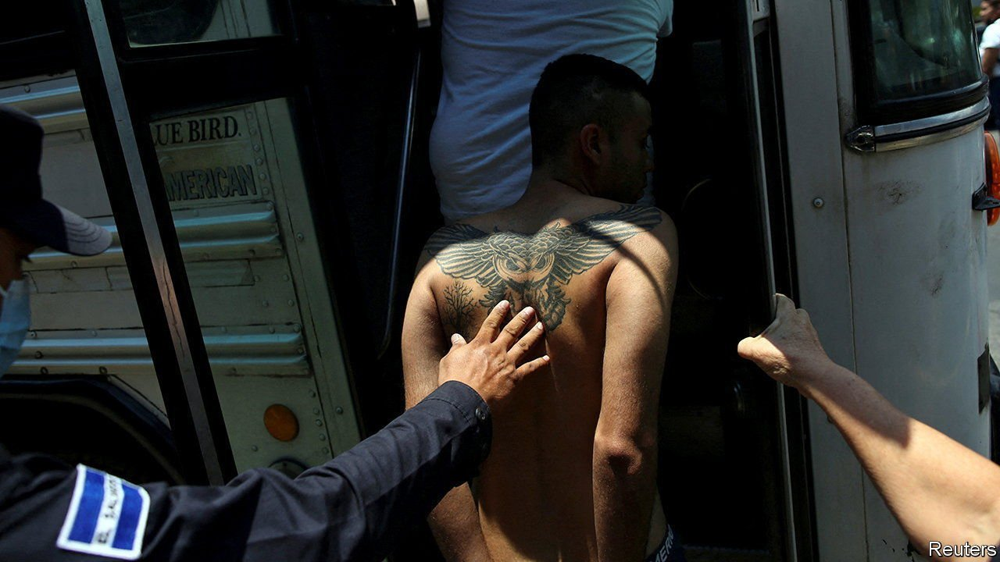

###### Iron fist

# El Salvador’s president has locked up 19,000 people in a month 

##### Many are likely to be gang members. But innocent people are being rounded up, too 

 

> Apr 30th 2022 

OUTSIDE THE public defender’s office in San Salvador, where lawyers employed by the state provide free legal counsel, the pavement throngs with people seeking help for relatives who have been swept up in mass arrests. Lawyers instruct them on which documents to bring to court. A utility bill is helpful proof of identity, says one. “What if we don’t have running water or electricity where we live?” asks a woman.

In a terrifying outburst of gang violence in March, 87 people were killed in three days. President Nayib Bukele has cracked down and—to no one’s surprise—awarded himself more powers. On April 24th the Legislative Assembly, which the president controls, extended a state of emergency for a second month. Citizens are barred from gathering in groups outside. The police no longer need to give an explanation when arresting people. Since the emergency powers came into force they have rounded up more than 19,000. Small crowds wait outside prisons, hoping to locate their loved ones.


Many of those who have been arrested are gang members, or pandilleros. But quite a few are not. Mr Bukele estimates that only 1% of arrests are mistakes. Others suspect the figure is much higher. Mario Alberto Aguirre says his partner Joseline, a 20-year-old street vendor, was detained simply “because she has tattoos”. Gangs are covered in them, but since 2005 they have not accepted women members, although they can be collaborators.

Even if the new measures harm innocent people, they are popular. In one recent poll, nine out of ten Salvadoreans said they approved of the president’s mano dura (iron fist) approach. Alcides, a 58-year-old taxi driver who moved house after receiving threats from Barrio 18, one of the two main gangs in the country, says he did not mind being stopped by police. The cops asked him and his son to remove their shirts to see if they had tattoos. “I told them we’re here to co-operate because God has enlightened the president,” says Alcides.

 


Partly thanks to his tough approach to crime, Mr Bukele’s approval ratings hover around 80%, the highest in the region. Many Salvadoreans give him credit for a sharp fall in the homicide rate, though the trend started well before he took office (see chart). Murders fell from a peak of 103 per 100,000 people in 2015 to 17.6 in 2021.

The president, an avid tweeter, posts photos and videos of half-naked men shackled together in prisons. This creates a vivid impression that he is doing something. But it does little to address the underlying causes of crime. Some analysts speculate that the current crackdown may be intended partly to distract attention from rumours that the recent violence was caused by a rupture in relations between the government and the gangs.

Mr Bukele denies negotiating with gangs, as previous administrations have done. But evidence, such as records of meetings between officials and gang leaders published in El Faro, a local news outlet, suggests that the government gave privileges such as conjugal visits to imprisoned gang members and jobs to those on the outside. In exchange, the gangs agreed to kill fewer people and support the ruling party in elections. In the past year four leaders of MS-13, the other big criminal outfit, have been released and shielded from extradition to the United States.

Mr Bukele has never shown much regard for democratic norms. He has dismissed top judges and replaced them with loyalists. In 2020 he barged into the legislature with gun-toting soldiers to intimidate lawmakers into voting for his security budget. Some fear that the emergency powers will be extended repeatedly.

Previous administrations have also used la mano dura. But Mr Bukele is unusually harsh. When the government arrested gang members in 2003 it took a year to round up 19,000 people, rather than a few weeks. Mr Bukele has introduced new laws to increase the maximum sentence for gang membership from nine years to 45. Children as young as 12 are being locked up. Another law appears to make reporting on crime illegal by banning the reproduction of gang messages that might generate “panic or unease”. Journalists could face up to 15 years for reporting material sourced from gangs. That will make it harder for Salvadoreans to assess whether Mr Bukele is successfully cracking down on crime, or just boasting about it. ■

