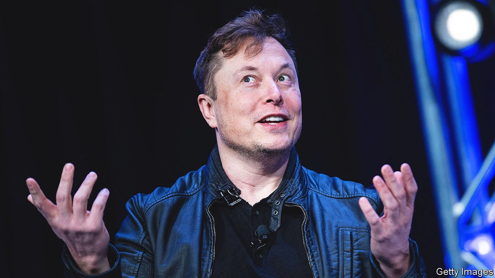

###### 

# Business 

#####  

 

> Apr 30th 2022 

Elon Musk struck a , capping three weeks of drama during which he had revealed he had amassed a 9.2% stake and rejected a seat on the board and Twitter had tried to block a sale. In the end its big investors forced Twitter to the table when Mr Musk revealed a financing package for his offer. At around $44bn it will be one of the largest-ever leveraged buy-outs. The Twitterati went into meltdown at Mr Musk’s pledge to nurture free speech on the platform. But he seemed to have the support of Jack Dorsey, Twitter’s founder, who tweeted: “Taking it back from Wall Street is the correct first step.”

Tesla’s share price tumbled the day after Twitter accepted Mr Musk’s bid. Part of his financing for the offer includes a loan against the stock he owns in the carmaker; a much lower share price would complicate that calculation.


Meta’s quarterly earnings pleased investors, a relief for the company after its results for the previous quarter showed a sharp slowdown in growth, pummelling its share price. Overall revenue grew at the slowest pace since Facebook went public, but the number of daily active users across all Meta’s apps, which include WhatsApp and Instagram, was up.

Microsoft reported solid quarterly revenues and forecast better sales for the current quarter, driven by its cloud-computing services. Satya Nadella, the chief executive, said that the inflationary environment was good for software, as firms seek to “do more with less”.

Revenues from advertising at Alphabet also grew sharply in the latest quarter, though not at the same pace as during the height of the pandemic. It said ad spending on its YouTube platform had not grown as much as it had hoped because of the “outsized impact” of Russia’s war in Ukraine in European markets. Sales from Google’s search advertising were less affected by wider economic concerns and rose by 25%, year on year.

Cook up a storm

America’s Senate confirmed Lael Brainard as vice-chair of the Federal Reserve, becoming deputy to the chair, Jerome Powell. But the confirmation of Lisa Cook to the Fed’s board of governors was temporarily suspended by Democrats because they lacked the numbers to support her (mostly because of covid absences). Ms Cook would be the first black woman to sit on the board, though Republicans contend that she is an activist who would use her position to “promote radical hyperbole”.

It was a tale of two Swiss banks, as UBS reported its best first-quarter profit in 15 years and Credit Suisse fell to a loss and overhauled its management, replacing its chief financial officer. UBS’s investment-banking business rebounded from its exposure a year ago to the collapse of Archegos Capital Management, though income from its asset-management division was sharply lower (Bill Hwang, the founder of Archegos, was charged with fraud in America this week). Credit Suisse’s loss came as revenue fell in investment banking and wealth management, year on year.

In a blow to green investors, shareholders at Bank of America, Citigroup and Wells Fargo overwhelmingly rejected proposals to stop the three big American banks financing new fossil-fuel projects. With energy costs rising, Jane Fraser, Citi’s chief executive, said that moving to a net-zero carbon economy would take time. But in a sign of the growing power of shareholder activists at investor meetings, Ms Fraser was also asked a question about Citi’s policy on reimbursing staff who have to travel to get an abortion.

The largest independent investor in Just Eat Takeaway called for the company’s chief financial officer and most of the supervisory board to be sacked at the forthcoming annual general meeting. The online food-delivery company recently announced that it was assessing its options for Grubhub, which it took over only last year. Furious investors claim they have been misled.

Not a very happy place

Florida’s governor, Ron DeSantis,  that the state had granted to Disney’s theme parks, which in effect had allowed the company to operate as its own local government. Walt Disney World was given its special status in 1967, but the firm has fallen out with Republicans over legislation that bans classroom instruction on sexual orientation or gender identity to young children. Mr DeSantis says that Disney’s privileges were an “aberration”, but critics think he has taken revenge on a private company just because it does not agree with him.

America’s house-price boom continued apace, with the S&amp;P CoreLogic Case-Shiller index registering a rise of nearly 20% in February, year on year. Home prices in Phoenix and Tampa were up by a third. Rising interest rates, the result of high inflation, could soon pierce that bubble.

