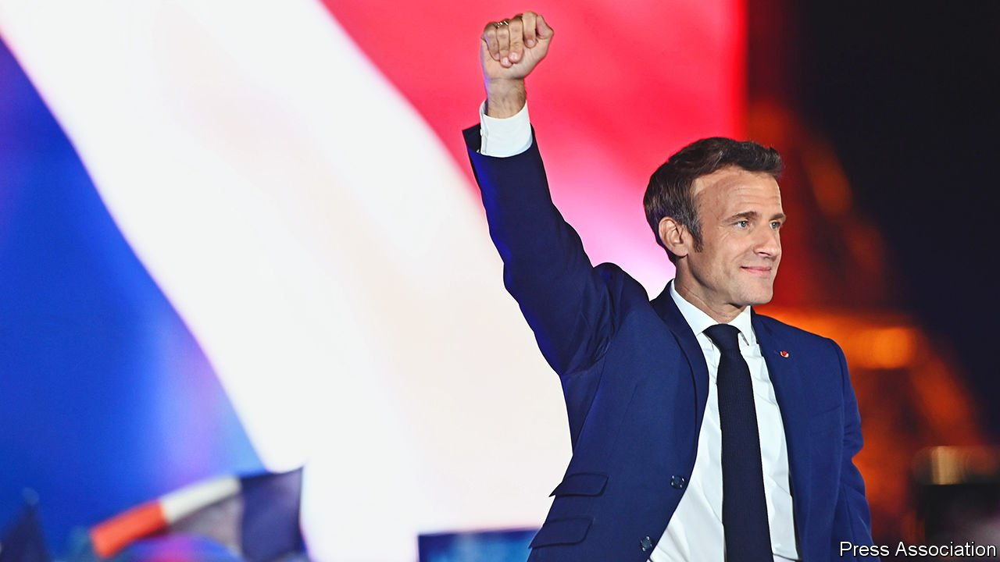
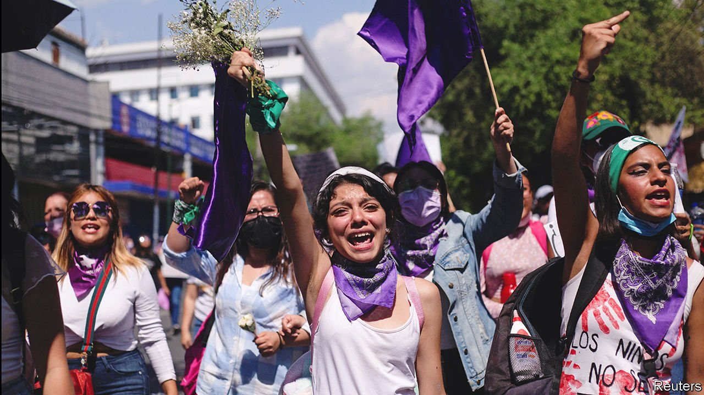

###### 

# Politics 

#####  

 

> Apr 30th 2022 

Emmanuel Macron was , again trouncing his nationalist-populist challenger Marine Le Pen. He won 58.5% of the vote to her 41.5%. However, Ms Le Pen increased her vote share by eight percentage points since their previous contest, in 2017, and turnout was the lowest since 1969. Mr Macron, a pro-European centrist, said he would try to address the anger of those who feel left behind by globalisation. He will now try to hold on to his party’s majority at parliamentary elections due in June.


Fighting continued in eastern and southern Ukraine. The Russian invaders are trying to seize more territory, but have still not vanquished , who are hunkered down in the vast Azovstal steelworks. Russia is using air power and missiles to attack infrastructure across the country, targeting railway lines and stations in an effort to slow the flow of Western arms to Ukrainian forces.

America held a conference at its Ramstein air base in Germany with 40 countries to discuss the defence of Ukraine. Christine Lambrecht, the German defence minister, announced that her country would send armoured vehicles for the first time. This change in policy comes after weeks of criticism levelled at Germany for not doing more to help.

Antony Blinken and Lloyd Austin, America’s secretaries of state and defence, , Ukraine’s president. They later announced an additional $713m in American military aid to 16 countries in the region, $322m of which will go to Ukraine. Mr Austin predicted that Ukraine could win the war and said America was eager to help it do so.

Cutting off the gas

Russia’s state energy giant, Gazprom,  to Bulgaria and Poland because they have not made payments in roubles, a condition Russia has demanded to shore up its currency. European gas prices soared again on the news. Poland said it was prepared and would obtain gas from elsewhere.

Nayib Bukele, the president of El Salvador,  a state of emergency imposed after 87 people were killed in March in a spate of gang violence. The emergency rules allow the police to arrest people without explanation; more than 19,000 have been rounded up in the past month. A new law also appears to make it illegal for journalists to report on gang activity.

 


Protesters took to the streets in Mexico after the body of Debanhi Escobar, an 18-year-old law student, was found in a water tank in a motel in Monterrey. She had been missing for nearly two weeks. A woman in Mexico is nearly three times more likely to be murdered than a woman in the United States.

Mass testing in Beijing . Some neighbourhoods in China’s capital were sealed off. The number of cases in Shanghai, which has been locked down for weeks, started to fall. But some residents there .

Three Chinese academics and their driver were murdered by a suicide-bomber in Karachi,  Pakistan’s commercial capital. One of the academics was the director of the local Confucius Institute, an organisation linked to the Chinese government that promotes Chinese language and culture around the world. The Baloch Liberation Army, a separatist group that opposes Chinese investment in Pakistan, said it carried out the atrocity.

The latest closed-door trial in Myanmar of Aung San Suu Kyi convicted her of corruption, adding five years to her imprisonment. Ms Suu Kyi has been in custody since the army ousted her fledgling democratic government in 2021. She has been tried on a range of trumped-up charges; there are 12 more court cases to come.

Singapore hanged a Malaysian man who was convicted in 2010 of trafficking heroin, despite evidence that he was mentally deficient. It has carried out two executions within a month; another is scheduled for April 29th.

North Korea held a martial parade, at which it displayed banned intercontinental ballistic missiles. Kim Jong Un, the dictator, vowed to increase his nuclear forces and said they were prepared to put “their unique deterrent in motion at any time”.

Clashes between Palestinian protesters at Jerusalem’s al-Aqsa mosque and  Israeli police erupted again. There have been no deaths in the current round of violence, though scores of Palestinians have been injured. Israel’s government and Hamas, the Islamist group that runs the Gaza Strip, have so far managed to prevent a wider conflict.

The juntas running  Burkina Faso and Guinea both missed a deadline to present plans for a transition back to civilian rule. ECOWAS, the west African regional bloc, has already imposed sanctions on Mali after coup leaders there delayed elections and a transfer of power back to a civilian government.

Members of the East African Community, another regional bloc, agreed to send troops to the  Democratic Republic of Congo. There has been a resurgence in violence in the east of the country by groups including the Allied Democratic Forces, a jihadist organisation, and the M23, a militia that was previously backed by Rwanda.

The High Court in Britain ruled that the government acted unlawfully when it released patients from hospital into care homes at the start of the pandemic. The judges found that policy advice issued in March and April 2020 did not take into account the risk to elderly residents of transferring asymptomatic patients into homes.

Harvard released a report into its historical links with slavery. It noted that scores of slaves toiled at the university until slavery was outlawed in Massachusetts in 1783. The university has created a $100m fund that will be used in part to “identify, engage and support” the direct descendants of the slaves. It stopped short of calling for reparations.

Hardly like for like

Although tensions between the two countries are at their highest for decades, America and Russia agreed to a  prisoner swap. Russia released Trevor Reed, a former marine who was imprisoned after a drunken altercation with police in Moscow. His trial in 2020 was described by America as a “theatre of the absurd”. America in return released Konstantin Yaro shenko, a Russian pilot convicted of conspiring to smuggle cocaine.

