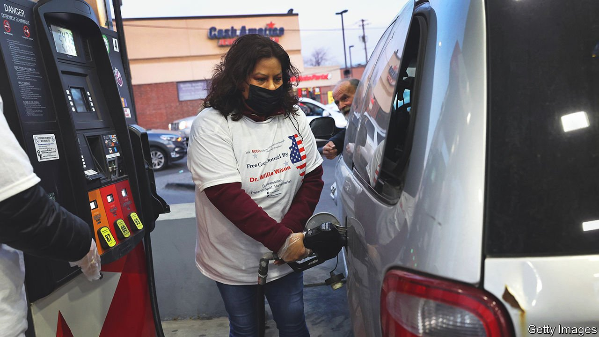

###### Free petrol

# A Chicago millionaire opens his wallet to challenge the mayor 

##### Willie Wilson tries a novel form of tank warfare 

 

> Apr 30th 2022 

EVEN IN A city as congested as Chicago, traffic jams rarely form at seven o’clock in the morning on a Saturday. At that time on April 23rd, however, there were already over 300 cars queuing outside a branch of BP in East Garfield Park. They stretched from the petrol-station forecourt around an entire city block. Drivers sat in their cars, which ranged from battered Toyotas to new Range Rovers, waiting to pull in for $50 worth of free petrol courtesy of Willie Wilson, a Chicago millionaire who is standing for mayor again next year. Those at the front of the queue had arrived at 4am.

The giveaway, which also took place at 15 other places in the city and 11 in the suburbs, was Mr Wilson’s third in two months. He has spent some $2.2m, mostly in majority-black neighbourhoods, buying people petrol. “It’s a good use of the dollar to help a lot of families,” he told the Chicago Sun Times.


That seems questionable. Over a quarter of Chicago households, and higher shares of the poorest, do not own cars. And the city is already choked with traffic too much of the time. Still, Mr Wilson’s largesse is popular. “It’s a good look for Chicago,” said David Jones, queuing in a Chevrolet Impala, its wing mirror hanging off. The rising cost of petrol is of particular concern in the neighbourhoods Mr Wilson targeted, where public transport is often poor.

Will it help him become mayor? Mr Wilson, a 73-year-old who came to Chicago from Louisiana as a child and made his money with a McDonald’s franchise and then a medical-supplies company, is unlikely to win the election next February. But his support among black voters could hurt Lori Lightfoot, the incumbent. In 2015, when Mr Wilson last ran, he won just 11% of the vote, but far more in the black wards which Ms Lightfoot will need if she is to win again.

She is clearly rattled. On April 27th she persuaded the city council to approve a plan to distribute 50,000 pre-paid cards for petrol and public transport, at a cost of $12.5m. Voters may not be impressed. “She’s using the city’s money, he’s using his own money,” notes Derrick Orr, a school principal waiting in his Range Rover and full of praise for Mr Wilson. The city needs other stuff more urgently than free petrol, he argues. But it is hard for a cash-strapped politician to fight a man handing out freebies.

For exclusive insight and reading recommendations from our correspondents in America, , our weekly newsletter.

