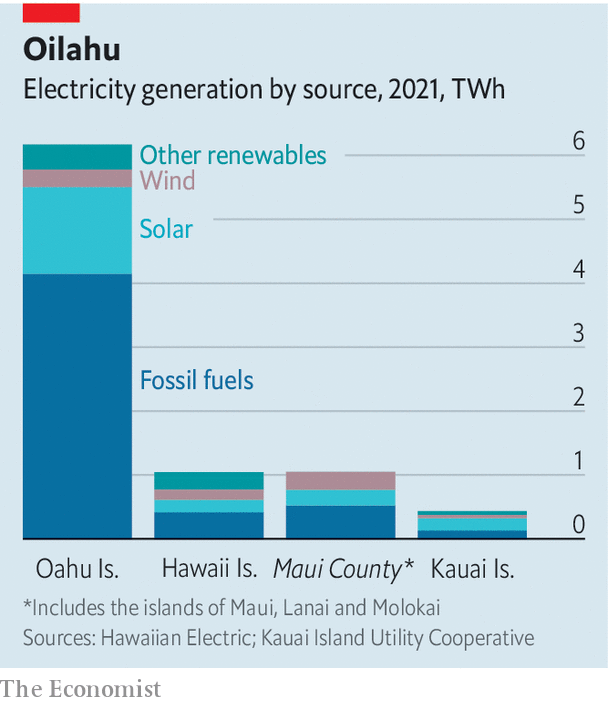

###### Pacific pain from Ukraine

# Hawaii’s oil-dependent economy is being battered by Russia’s war 

##### But rules protecting the Aloha State’s natural wealth hinder green projects 

 

> Apr 30th 2022 

BARELY VISIBLE a mile off the south-western tip of Oahu, an oil tanker floats lazily in the gentle surf. Squinting from shore, an eagle-eyed observer can spot a small yellow metal platform in its shadow, hooked like an intravenous bag to the vessel by a series of tubes. It is here that the tanker’s contents are piped undersea and onto shore, and into the sprawling Kapolei complex. Operated by Par Hawaii, it is the only oil refinery in Hawaii, converting crude oil into refined products dispatched to the other islands to power cars, homes and planes. It is the beating heart of the state’s oil-dependent economy.

, and an American ban on imports from Russia, Hawaii’s reliance on oil is putting pressure on its economy. Despite improving energy efficiency and progress with renewables, big obstacles remain. In the meantime, Hawaiians are not finding much relief from the energy crunch.

 


Among the 50 states, Hawaii is the most reliant on oil, which accounts for over 85% of its energy needs (see chart), compared with 56% for the second-most dependent, Vermont. As in the rest of the country, petrol powers ground transport. But most states use almost no oil to produce electricity, whereas it supplies more than 66% of Hawaii’s. It is also critical for the jet fuel that Hawaiians rely on to travel from island to island, and to the American mainland. When oil prices climbed above $100 a barrel in the 2000s, Hawaii was among the hardest-hit states. The same is true today.


Most of Hawaii’s oil is imported—usually about a third of it from Russia. Par Hawaii announced on March 4th (four days before President Joe Biden declared a national ban) that it would cease importing the stuff from Russia, and would find alternative sources from North and South America. “We do not anticipate this decision will have a meaningful impact on the prices paid by Hawaii consumers,” says Eric Wright, the firm’s president.

Target practice

It may still be painful. The state has the second-highest , behind only California, and the highest electricity prices. Hawaiian Electric, its major utility, warned customers in March that electricity bills could rise by 10% on Oahu, 20% on Maui and Hawaii Island, and 25% on the poorer island of Molokai.

This reliance on oil has long motivated efforts at diversification. A state law passed in 2015 mandates 100% clean energy in electricity by 2045, the first such goal set by an American state, building on targets established in 2007. “Because of the actions we have taken since 2007, things are not nearly as bad as they might have been,” says Scott Glenn, the state’s chief energy officer. Hawaii is blessed with regular sunshine and winds, as well as the potential for geothermal energy on Maui and Hawaii Island. The Aloha State now has the second-highest number of electric vehicles per head in America, and it has by far the greatest penetration of rooftop solar in the country.

 


Weaning itself off oil, however, is not simple. Each of Hawaii’s inhabited islands has its own electric grid, in effect giving the state six different energy systems. Kauai sources almost 70% of its electricity from renewable energy, the highest share of any island, thanks to its ample land for large projects. Hawaii Island can tap geothermal for 30% of its electricity, thanks to its volcanic activity. The populous Oahu, on the other hand, draws just one-third of its electricity from renewable energy, much of it through rooftop solar.

An integrated grid would make the state’s whole system more efficient and resilient. But Hawaii is also handicapped by political constraints. Its constitution requires that any nuclear project be subject to a two-thirds vote in both chambers of the legislature, an obstacle many liken to an effective ban. Rules written to protect Hawaii’s natural environment hinder renewable-energy projects, lest wind turbines interfere with migratory birds or hydro power displace a rare species.

Fights over land use, meanwhile, pit environmentalists and local communities against one another. The planet is in “a moment of extreme trade-offs, and the discussion over land use is no exception,” says Melissa Miyashiro, the executive director of the Blue Planet Foundation, a local advocacy organisation.

In some ways, Hawaii is well placed to weather the storm in global oil markets. Hawaiians are used to paying a premium. The state has a bipartisan tradition of environmentalism—in the mid-2000s it was a Republican governor, Linda Lingle, who helped put Hawaii on the path to renewable energy. Hawaii was the first state to set a net-negative emissions target.

But achieving these ambitions will require hard choices and heavy investment. The current governor, David Ige, has rejected calls for a state of emergency to accelerate the construction of renewable-energy projects, claiming that it would not add capacity soon enough to make a difference. The Kapolei refinery, and high energy prices, may not be going away soon. ■

For exclusive insight and reading recommendations from our correspondents in America, , our weekly newsletter.


