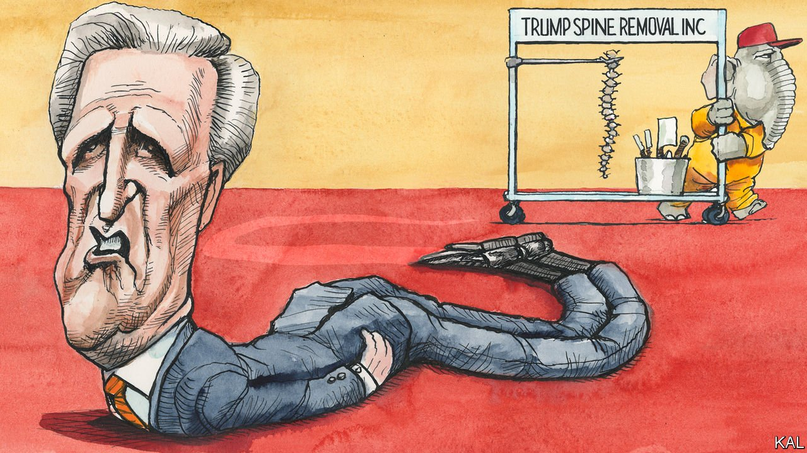

###### Lexington

# Kevin McCarthy’s accidental truthfulness 

##### One of Donald Trump’s favourite congressmen considered the former president’s behaviour a disaster 

 

> Apr 30th 2022 

MOST POLITICIANS have a defining characteristic and Kevin McCarthy’s is not really believing in anything. The House Republican leader is voluble and clubbable, a relentless glad-hander and supremely effective fund-raiser. Yet even among grateful Republican beneficiaries of his efforts, the coiffed Mr McCarthy is not known to hold firm views on any particular issue.

Once ranked alongside the previous Republican Speaker, Paul Ryan, as a pro-business “Young Gun” conservative, he now rails against the Chamber of Commerce for “selling out”. Formerly as relaxed about abortion as most Californian politicos, Mr McCarthy these days claims to have been fiercely pro-life for ever. Since he emerged from the wilderness of Golden State Republican youth politics two decades ago, the affable congressman has taken different sides of most big questions and, as the architect of no major policy, never threatened to settle any of them.


Political opportunism is not uncommon, especially in today’s Republican Party. Mr McCarthy’s counterpart in the Senate, Mitch McConnell, could teach Machiavelli a trick or two. The principled views of Senator Ted Cruz might be listed on a postage stamp. The party’s leading figure is Donald Trump. Yet Mr McCarthy’s fickleness stands out because of how clumsily he advertises it. He once acknowledged in a television interview that his party’s serial investigations into Hillary Clinton’s imagined tie to a jihadist attack in Benghazi were a political stunt. He was taped joshing with Mr Ryan about Mr Trump’s slavish loyalty to Vladimir Putin despite having become one of the former president’s most sycophantic defenders. And it now transpires that his role in covering up Mr Trump’s role in last year’s riot on Capitol Hill was even more dishonest than was previously known.

Mr McCarthy scuppered a bipartisan House investigation (that he had helped instigate) of the insurrection. He then turned viciously on the only two Republicans, Liz Cheney and Adam Kinzinger, who dared to co-operate with the Democrats’ alternative probe. This was despite the fact that he had himself initially acknowledged Mr Trump’s “responsibility” for the violence. Indeed, as the New York Times has now revealed he went so far as to tell a post-insurrection gathering of his House colleagues—including Ms Cheney—that the then president should resign and that he personally would tell him to do so. To Tucker Carlson of Fox News, he sounded “like an MSNBC contributor”.

You might think Americans have nothing left to learn of Mr McCarthy’s hypocrisy. But this latest display is a big story in part because, with defeat looming for the Democrats in the mid-terms, he looks odds-on to become the next House Speaker. It is also because of how acutely the scandal speaks to the biggest source of journalistic frustration in the Trump era. Most Republican politicians ridicule and deride the former president to journalists in private, even as they grovel to him in public, including by excoriating the critical coverage that they are themselves enthusiastically contributing to. The arrangement could not be better designed to erode trust in both politics and the media, two of the country’s most precious and reviled institutions.

The chronology of Republican responses to Mr McCarthy’s blunders helps illustrate his party’s fall. In prelapsarian 2015, many House Republicans claimed to be so scandalised by his accurate characterisation of the Benghazi investigations that they rejected his bid to be Speaker in favour of Mr Ryan. For some this was a pretext; hard-right members considered Mr McCarthy an establishment squish. But neither objection now pertains.

Defending Mr Trump has made his party shameless. There has been no serious discussion in its ranks of what Mr McCarthy’s latest display of bad faith says about his fitness for America’s third-highest-ranking job. The scandal is being debated exclusively in terms of whether he can survive it—which is to say, whether Mr Trump is offended by it. Mr McCarthy was reported to have spent the days after the Times’s story broke calling around House Republicans to assure them that Mr Trump was OK with it. And it seems he is. Most members of the hard-right, Mr Trump’s attack dogs in the House, are still behind Mr McCarthy, in recognition of his efforts to curry favour with them. Where Mr Ryan sometimes held them in check, Mr McCarthy defends Trumpist head-bangers such as Marjorie Taylor Greene—currently the subject of a hearing over her role in the Capitol riot—against all comers.

Besides which, Mr Trump tends to prefer his lieutenants compromised, because that makes them more beholden. The former president intimated as much this week. Mr McCarthy’s trenchant early criticism of him only makes the congressman’s subsequent capitulation appear all the more complete, Mr Trump noted: “I think it’s all a big compliment, frankly.” Indeed the particular way in which Mr McCarthy is now damaged goods may suit Mr Trump especially well. His first demand of the next Republican Speaker will be to end all investigations of the Capitol riot. Mr McCarthy would now be expected to act on that with even more alacrity than he would otherwise have shown.

Purging the competition

His latest scrape may, then, have actually increased his chances of becoming Speaker. It has highlighted how little Republican competition for the role he faces, so long as Mr Trump stays his hand. Mr McCarthy’s fellow Republican House leaders, including Steve Scalise and Elise Stefanik, are similarly defined by their loyalty to Mr Trump, and have been less useful to the former president. Meanwhile, the lack of principled criticism of Mr McCarthy within the party is a reminder that many House Republicans of independent stature, such as Mr Ryan, Justin Amash and Will Hurd, have been driven out by Mr Trump. Ms Cheney, the only House Republican whom Mr McCarthy has disciplined, for having dared to say publicly what he said in private, will probably soon join them. ■

Read more from Lexington, our columnist on American politics:

 (Apr 23rd) (Apr 16th)

 (Apr 9th)

For exclusive insight and reading recommendations from our correspondents in America, , our weekly newsletter.

