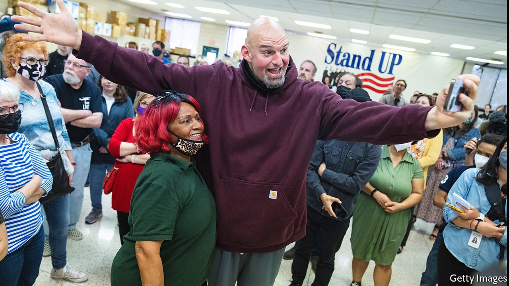

###### The Keystone State

# Pennsylvania’s primaries point to the future of American politics 

##### Trumpism dominates among Republicans and Democrats shuffle to the centre 

 

> Apr 30th 2022 

THE POLITICAL carnival of the Senate primary season in Pennsylvania—featuring a bald, tattooed giant with a billy-goat beard, a celebrity talk-show host and a hedge-fund executive who recently decamped from Connecticut—is settling into an intriguing pattern. The Republican candidates are doing what Republicans do now: panicking about the woke left and rhapsodising about Donald Trump. But the Democrats, rather than trying to excite their own base by espousing progressive causes, are edging towards the centre.

“I wouldn’t categorise myself as progressive,” John Fetterman, the Democratic front-runner and, at just over two metres, the giant, told CNN on April 21st, even as the Philadelphia Inquirer described him on its website as “an unabashed progressive”. The Democrats are competing instead over who will prove most electable statewide this autumn. It is a sign of the focus with which the candidates are approaching the race, one of few across the country where Democrats have a chance to gain a Senate seat. And, in a large swing state that will be crucial to the presidential contest in 2024, it may also reflect a broader return to pragmatism by the party, which has found itself to the left of most voters nationally on issues from crime to spending to immigration.


When the three Democratic candidates faced one another in debate for the first time, on April 21st, they seemed easy to tell apart. To Mr Fetterman’s right (physically and, at least until recently, politically) was Conor Lamb, a congressman from Pittsburgh who might have been assembled from a make-a-centrist kit: white and mild, a former marine and prosecutor without a hair or word out of place. To Mr Fetterman’s left was Malcolm Kenyatta, a state representative who is from Pennsylvania’s other Democratic stronghold, Philadelphia, and seemingly unpacked from the progressive box: black, gay and 31 years old, with warm charisma and a compelling autobiography of working-class struggle.

Yet on policy the three could be hard to distinguish as they spoke of raising the minimum wage, reducing gun violence and combating inflation. Both Mr Fetterman and Mr Lamb said they opposed President Joe Biden’s decision to revoke Title 42, a sweeping immigration restriction imposed by Donald Trump and hated by progressives. Yet even Mr Kenyatta was quick to say Mr Biden’s move should be part of “comprehensive immigration reform”, suggesting he also felt Mr Biden should have a better plan to deal with an influx of migrants, a prospect alarming Democrats in competitive races around the country.

The more raucous Republican race has been dominated by Dr Mehmet Oz, the talk-show host, and David McCormick, the former hedge-fund boss, who has startled ex-colleagues at Bridgewater Associates by embracing Mr Trump’s anti-immigration, anti-China politics. A respecter of television celebrity, Mr Trump has endorsed Dr Oz, who is pounding Mr McCormick in advertisements as “a finance bro” who invested in China “even after they gave us covid”. Ads supporting Mr McCormick have mined Dr Oz’s TV archive for clips of him appearing with Michelle Obama, interviewing a transgender child and kissing his own star on Hollywood Boulevard.

When the five Republican candidates debated in Harrisburg on April 25th, only one, Jeff Bartos, a businessman, committed the heresy of implying the party should move on from contesting the legitimacy of the 2020 election. They bickered over who had authentic ties to Pennsylvania (Dr Oz is a longtime New Jersey resident) and to Mr Trump. “I’m not going to be out-Pennsyvlanian’ed or out-America-first by anybody on this stage,” Mr McCormick said.

With the primary election less than three weeks away, on May 17th, the Republican race is a toss-up between Dr Oz and Mr McCormick. But Mr Fetterman is far ahead of his competitors in the polls and in fundraising. The Harvard-educated son of an insurance executive, he served for 13 years as mayor of Braddock, a tiny Pittsburgh suburb impoverished by the collapse of the steel industry. As mayor he tattooed one arm with the dates of nine murders during his tenure and built a national profile as an apostle of urban revival.

After a first unsuccessful bid for the Senate in 2016, Mr Fetterman won the largely ceremonial post of lieutenant governor in 2018 and in 2020 further enhanced his statewide and national image among Democrats by defending the integrity of the state’s vote; even his dogs, Levi and Artie, have more than 25,000 Twitter followers. Profiles of Mr Fetterman in the national press inevitably emphasise his preference for shorts and Carhartt outerwear instead of suits. GQ, a fashion magazine, declared him “nothing less than an American taste god”.

To some Pennsylvania insiders, Mr Fetterman’s style smacks of gimmick and even privilege, a disrespect to voters that only a white man could get away with. But there is no doubting his appeal to Democrats, particularly in the white enclaves of western and central Pennsylvania where he has mostly campaigned. He manages to appear at once unconventional and safe.

During the debate, Mr Fetterman looked ill at ease in a suit that was baggy even on his frame. His opponents confirmed his front-runner status by attacking him, and Mr Fetterman, frowning and furrowing his brow, seemed poorly prepared to explain himself or his policies. “You know it when you see it,” he replied, when asked to define what level of wealth merited higher taxation. His wardrobe may be ready for the general-election campaign, but his policies might yet benefit from some refinement. In this and other important ways, America’s political future is playing out in Pennsylvania. ■

For exclusive insight and reading recommendations from our correspondents in America, , our weekly newsletter.

