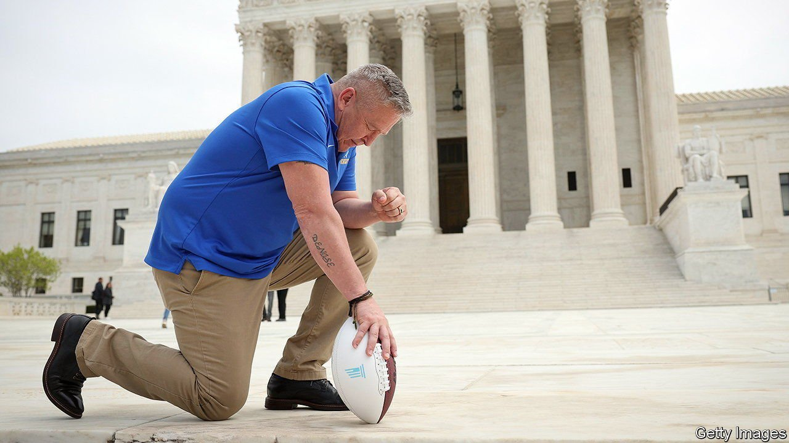

###### Faith and freedom

# The Supreme Court is poised to side with a praying coach 

##### A high-school football coach who knelt at the 50-yard line may get his job back 

 

> Apr 30th 2022 

AMERICA’S CONSTITUTION promises the “free exercise” of religion; it also prohibits religious “establishment”. Recently the Supreme Court has been strengthening the first guarantee—a right to live one’s faith free from government meddling—while chipping away at the wall separating church from state. The divergent trend lines of these First Amendment guarantees are unlikely to converge in the case of Joseph Kennedy, a devout Christian American-football coach who was suspended for praying after games in Washington state.

Kennedy v Bremerton School District, the first case involving prayer and public schools to reach the high court since 2000, is messy. The Supreme Court typically decides on the law, not the facts; ascertaining facts is the district court’s job. But on April 25th factual disputes about what exactly Mr Kennedy did and why he was suspended took centre stage in the oral argument.


Paul Clement, the lawyer for Mr Kennedy, claimed his client lost his job for private, “fleeting” prayers conducted by himself on the 50-yard line after two games in October 2015. Richard Katskee, representing the school board, told a different story: Mr Kennedy had been praying with students since he started coaching in 2008. Teachers and coaches can of course have “quiet prayers by themselves at work even if students can see”, Mr Katskee said, but Mr Kennedy made himself “the centre of attention” during many midfield supplications and “pressured” students to pray.

Justice Stephen Breyer laid out what he took to be six facts. These included an unanswered letter the district sent Mr Kennedy proposing accommodations for him to pray less demonstratively. Mr Clement assented to those, but said there were “lots of other facts that are in the record that I think are highly relevant”.

Justice Samuel Alito urged Mr Katskee to “forget about all of the complicated facts in this case” and ponder whether a football coach praying, without inviting or excluding anyone, risked establishing religion. Chief Justice John Roberts asked whether, if Mr Kennedy’s politicisation of the issue by inviting legislators to pray with him was taken “off the table”, his actions would be kosher in the school board’s eyes.

In building its case against Mr Kennedy, the school board had relied on the “endorsement test”, a standard first used by Justice Sandra Day O’Connor in 1984 whereby a constitutional violation occurs when a “reasonable observer” finds the government’s imprimatur on religious expression. It has fallen out of favour among the justices. As a lower-court judge in 2010, Neil Gorsuch said it was “far from clear” the test remained an appropriate measure.

Recognising this, Mr Katskee sought to characterise the prayers as “coercive”—a test the conservative justices are less suspicious of. But Justice Brett Kavanaugh presented the concerns in Kennedy as a departure from precedent. In contrast to the religious invocations at public-school graduations that the court found coercive in  Lee v Weisman in 1992, he said, Kennedy involves only “subtle” or “implicit” pressure.

The links between Lee and Kennedy are stronger than Justice Kavanaugh lets on: both ask whether youngsters will feel pushed to take part in religious rituals they don’t believe in. And there’s an extra incentive for athletes, as one former Bremerton student attests. Staying on the coach’s good side is crucial for those who want playing time. Participation in the prayer circles, the student said, is “expected”.

Four justices signalled support for Mr Kennedy when the case first came to the Supreme Court in 2019. This week one or two more—Justice Amy Coney Barrett and Chief Justice Roberts—sounded inclined to join that quartet in pooh-poohing religion-state separation in favour of free religious exercise. Mr Kennedy’s chances of redemption seem high. ■

For exclusive insight and reading recommendations from our correspondents in America, , our weekly newsletter.

