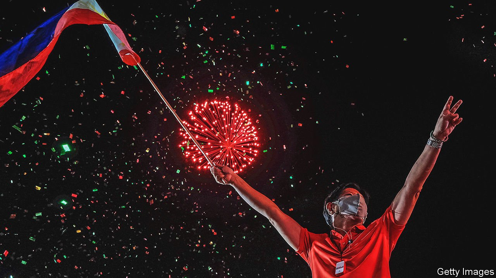
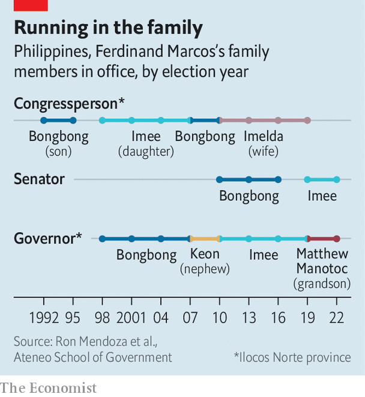

###### The name of the father

# Another Ferdinand Marcos is set to become president of the Philippines 

##### A dictator’s son is expected to be less awful than his dad was 

 

> May 7th 2022 

IT WAS JUST after lunchtime when a group of ageing men and women, dressed in red, and flashing V-for-victory signs, drifted past a Uniqlo store in one of the many malls that pass for public spaces in Manila, the capital of the Philippines. The call had gone out on Facebook for supporters of Ferdinand “Bongbong” Marcos to come out for their presidential candidate. “I hope he will vindicate the family name,” says Carmen, 74, as she rides the escalator down towards the Zara outlet. “They are so hated.”

On the floor below, another group, this one mostly in pink, had come to prove her point. Supporters of Leni Robredo, Mr Marcos’s closest rival for the presidency, were there to show their disdain for Bongbong. “We want a clean and honest government,” says Gina Ramos, 52. She has had enough of corruption, she adds.


She is in for disappointment. Barring an earth-shattering surprise or an unprecedented polling error, Mr Marcos, the son of the Philippines’ former dictator of the same name (minus the bongs), will win by a landslide in an election on May 9th. His vice-president, who is elected on a separate ticket, will be Sara Duterte, the daughter of Rodrigo Duterte, the outgoing president. In a system dominated by dynasties, both members of the all-star team have for months polled at above 50% in their respective races. Ms Robredo’s numbers have remained stuck in the low 20s.

That is a remarkable comeback for the Marcos family, who were run out of the country on February 25th 1986 as massive street protests and the loss of support from the police and army forced Ferdinand senior to reconsider his position. The Marcoses fled to Hawaii—along with at least 24 bars of gold and 22 boxes of cash—where the deposed dictator died three years later.

The family returned to the Philippines, ostensibly to face corruption charges, in 1991. Marcos’s wife, Imelda, ran for president the following year, and lost. But Bongbong won a seat in the House of Representatives. Various members of the family have played musical chairs in provincial and national positions ever since (see chart). In 2016, Bongbong ran for vice-president and lost narrowly to Ms Robredo. Now he is about to move his family back into Malacañang, as the presidential palace is known.

 


Yet it is unclear what Mr Marcos intends to do with power. He has made few promises on the campaign trail, published no policy agenda and appeared in no debates. The slogan of his and Ms Duterte’s campaign is an airy-fairy “Unity”. (The pair call themselves “Uniteam”.) Despite 30 years in public life—as congressman, senator and provincial governor—he has little to show for it. Descriptions of him by supporters, critics and foreign observers are variations on a theme: “easy-going”, “laid-back”, “not very energetic”, “lazy”.

That is because the presidency, for Mr Marcos and his family, is not a means to transforming society, fixing deep-rooted problems or even plundering the treasury. It is instead an end in itself, the culmination of a decades-long effort to rehabilitate the family name, long associated with the late dictator’s brutality and corruption, and the lavish lifestyle enjoyed by Imelda, whose shoe collection now fills a museum in Manila. Thousands of people were killed and tens of thousands jailed or tortured during the period of martial law imposed by Marcos senior. Some $5bn-10bn of public money is alleged to have been looted. “This campaign did not start six years ago”, when Mr Marcos lost his bid for the vice-presidency, says Julio Teehankee of De La Salle University in Manila, but in 1986.

Over time, and more recently helped along by skilful propaganda, the idea took hold that the Marcos dictatorship was a “golden era”, when the Philippines enjoyed stability, high growth and massive investment in infrastructure. On social media and on YouTube, sophisticated campaigns push this revisionist version of history.

The lack of an agenda beyond winning is bad for the Philippines. Its population of some 110m is the second-biggest in South-East Asia. Around a quarter of its people cannot afford enough food and other essentials. Its economy, before the pandemic among the best-performing in the region, was battered by an unduly long and harsh lockdown. It is an American treaty ally with a niggling territorial dispute with China, lying within cellphone-signal distance of Taiwan. It will be on the front line in any conflict between those powers.

Mr Marcos has little to say on any of these subjects. What he has said has alarmed economists. For example, he promises to cap the price of rice at about half the current rate. That may be campaign bluster, however. Analysts expect him to forget unaffordable campaign vows and follow Mr Duterte’s example in appointing technocrats to run the economy.

On foreign policy, Mr Marcos’s family has a long association with China. One of only two Chinese consulates outside the capital is in Ilocos Norte, a province notable only for being the family’s stronghold. He is said to be China’s preferred candidate. Yet Bongbong is a cosmopolitan sort with a fondness for England, where he studied, and for American culture. There are suggestions that he might appoint Jose Manuel Romualdez, the Philippine ambassador to America (and his second cousin), as foreign secretary. But his lack of any strong beliefs of his own, combined with a susceptibility to external influence, is a potential liability. He listens to the last person he spoke to, says an interlocutor.

The greater risks are at home. Mr Marcos’s campaign may have been milquetoast but his candidacy, and probable victory, have been deeply divisive. Ms Robredo has fired up a passionate base. Her rallies draw huge crowds. Lots of Filipinos remain wedded to the ideals of the 1986 revolution that kicked out his father. It is possible they will not accept the result. Attempts to disqualify Mr Marcos are making their way through the elections commission, and will probably get sent to the Supreme Court. Whatever it decides, there will be uproar.

Mr Marcos’s administration is likely to be marked by protests and instability. That will be bad for governance, and for the economy. It will also be a headache for America—and an opportunity for China—as they compete in the Pacific. The Marcos name is rising again. But for how long? ■

