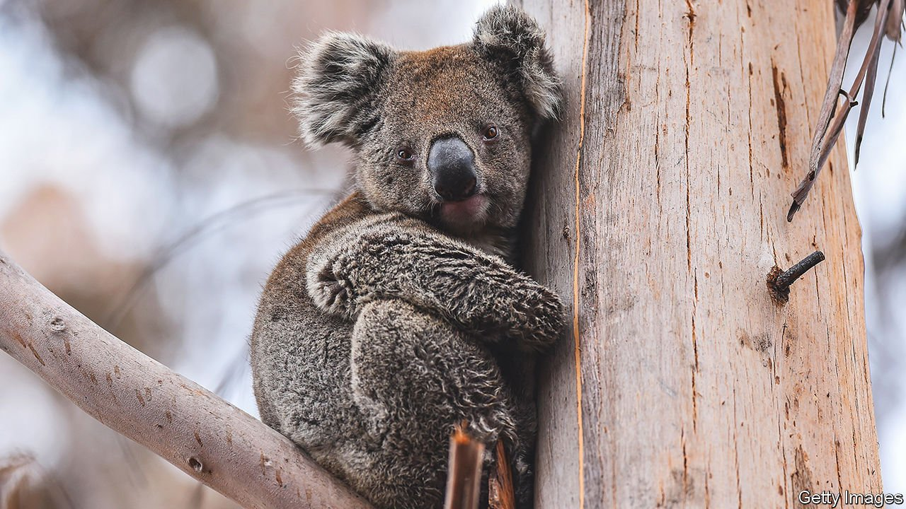

###### A koalossal problem

# Australian scientists are jabbing koalas against chlamydia 

##### The venereal disease is among the biggest killers of the cute marsupial 

 

> May 5th 2022 

WHEN BRITISH colonists first came to Australia they brought with them, among other delights, a bouquet of venereal diseases. They introduced Aboriginals to syphilis and gonorrhoea. Not even Australia’s wildlife was spared. The Europeans shipped in sheep and cattle infected with chlamydia. Scientists suspect that it jumped between species: koalas are now riddled with the disease. In some colonies, every animal tests positive. Only a couple of wild populations are free of it.

This is more than just a matter of embarrassment in polite marsupial society. Chlamydia causes conjunctivitis, which can blind a koala. Worse is a brown bottom. That implies that the disease has led to a bad urinary infection and incontinence. Those animals are hard to save, says Michael Pyne, a vet at Currumbin Wildlife Hospital in Queensland. Often the infection spreads to the kidneys, leading to renal failure. Many survivors are left infertile.


Australia’s iconic “bear” has plenty of other problems, too. Koala numbers in Queensland and New South Wales have fallen by at least half this century. The decline is so steep the federal government recently listed them as endangered. Their habitats have been ripped up for development and burnt down in bushfires. They are regularly hit by cars and attacked by dogs. Yet chlamydia is one of their biggest killers, and growing.

It is not just that randy koalas are spreading disease the old-fashioned way. Females feed their joeys a kind of faeces called “pap” to pass on nutrients from eucalyptus leaves. That transmits the infection, too. Koalas do not respond well to antibiotics, which disrupt the bacteria they need to break down food.

Help may be coming in the form of vaccines. Competing teams at two Queensland universities have spent years developing jabs for koala chlamydia. Both are now testing them in wild populations. A single-shot vaccine, created by the University of the Sunshine Coast, is being administered to some 1,000 animals in Queensland and New South Wales. Early results suggested that it is about 70% effective at preventing the disease, says Samuel Phillips, one of the researchers. Hundreds more koalas are being given a double-shot vaccine by the Queensland University of Technology and Currumbin Wildlife Hospital.

Mass vaccination is still a long way off. Inoculating every wild koala would in any case be impossible. The creatures would first have to be found (they are not exactly conspicuous) before being coaxed out of trees. Yet chlamydia does not spread as virulently as, for example, covid-19. Vaccinating just 10% of a breeding population annually might be enough to stem infections.

