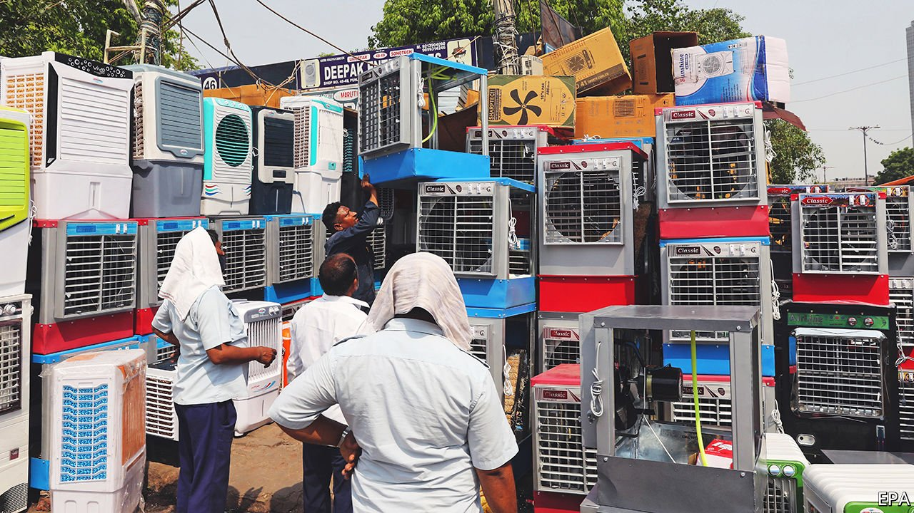
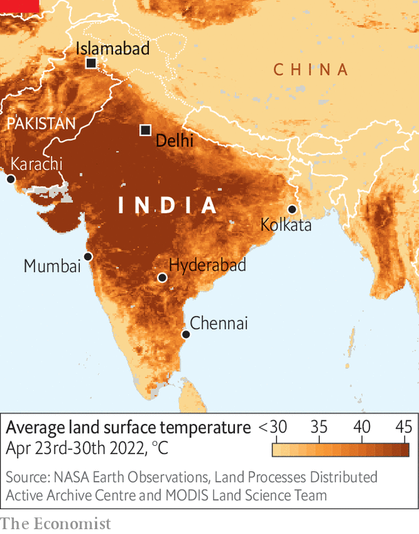

###### Heat and no light

# Indian power plants are running out of coal 

##### The dysfunctional power sector is struggling to handle surging demand 

 

> May 7th 2022 

ELECTRICITY HAS been getting increasingly scarce in India. In a recent survey two-thirds of households said they had been facing regular power cuts. Residents of some rural areas in the northern states report receiving only a few hours of electricity a day. The shortage has even reached posh parts of Delhi, the capital, whose pampered residents are usually insulated from many of the discomforts suffered by their compatriots.

The most immediate reason for the crisis is scorching heat. The past couple of months have been even hotter than usual in South Asia. In north-west and central India average temperatures in March and April were the highest since records began 122 years ago (see map). As a result, air-conditioners in homes and offices have been whirring away at levels not usually seen until mid-May. That has come on top of already rising demand after the easing of covid-19 restrictions and an uptick in economic activity.


 


India no longer lacks capacity. Over the past two decades it has built more coal plants, which generate about 70% of the country’s power, and speeded up the expansion of renewables. It has also connected all but a tiny percentage of households to the grid (though not to 24-hour supply).

But in recent weeks coal plants have not been receiving enough coal to operate at capacity. At the start of this month more than 100 of India’s 173 thermal plants had critically low stocks. At the end of April, officials in Delhi said the capital could run out of coal in a matter of days, threatening electricity supply to hospitals and the metro system. Power plants have been scrambling for fuel from Coal India, a state-owned company, and paying steep prices for coal at auctions.

One reason for the shortage is that coal is cumbersome to move around. Demand for train travel recovered quickly after covid measures eased in March, causing busy tracks. The government has cancelled hundreds of passenger trains over the coming weeks to make way for cargo ones.

But there is a deeper, more long-running reason: electricity producers have no incentive to keep large stocks of coal because they cannot be sure that they will be paid regularly. Billing and payment for electricity is patchy, leaving many distribution companies in the red and unable to pay the power plants, which in turn have a hard time paying the miners. “They have known for two months that coal stocks were declining, but instead of building them up then, we now have a bunch of broke entities scrambling to buy coal and electricity at a premium,” says Karthik Ganesan of the Council on Energy, Environment and Water, a think-tank in Delhi.

In the short term, power plants and distributors have little choice but to muddle through. Longer-term, several fixes are possible. One is to ensure existing coal stocks are used by the most efficient plants, which are disadvantaged by long-standing distribution contracts that favour older, more fuel-hungry plants. Doing that could reduce coal consumption by around 6% a year, reckons Mr Ganesan, freeing up stocks for emergencies. And as the government continues to expand renewables the pressure should ease.

Another solution is to convince more users of electricity actually to pay for it. Farmers in many states are entitled to free power. Around 10% of households connected to the grid do not receive regular bills. Theft is rampant. A study in 2019 by PwC, an accountancy firm, estimated that distribution companies lose about a fifth of their revenue to theft, meter-tampering and leaks from faulty power lines.

Fixing the dysfunctional electricity distribution system will become more urgent as India gets richer. Climate change will make extreme temperatures more common. More Indians will install air-conditioning: currently only one in ten households has it. The International Energy Agency, a forecaster, estimates that to meet electricity demand over the next 20 years, India will have to increase its installed capacity of 400 gigawatts more than threefold, adding another 950GW, or roughly the size of the EU’s power market. Muddling through will no longer be an option. ■

For more coverage of climate change, register for , our fortnightly newsletter, or visit our 

