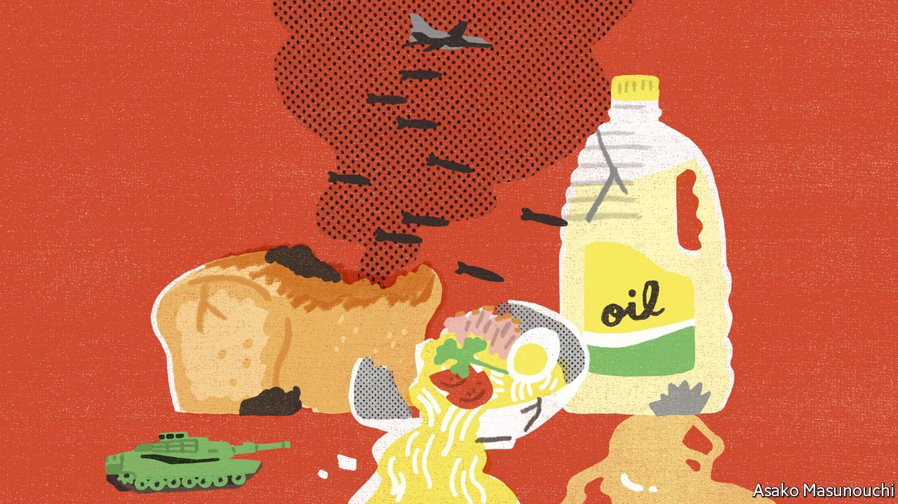

###### Banyan

# Russia’s war is causing hunger in Asia 

##### Unhelpful short-term fixes are not the answer to spiking food prices 

 

> May 7th 2022 

MAHN TUN LYNN says he has thought of little but food since Myanmar’s armed forces mounted their brutal coup in February last year. First, from Yangon, the commercial capital, he used his skills from years running an import-export business to get staples to the resistance groups springing up around the country. When, late last year, hunger began to gnaw even at him, he fled the country. He now shelters in Thailand, by the banks of a river that marks the two countries’ border. Everyone in his makeshift camp knows how conflict disrupts the cycle of sowing seed and harvesting crops. When bullets fly, ricebowls grow emptier.

And now, says Mr Mahn Tun Lynn, another war, on the other side of the Eurasian land mass, has made things even worse. Since Vladimir Putin invaded Ukraine, the prices of food staples available to Burmese refugees have risen sharply. The World Food Programme and other charities that provide aid find their dollars do not go so far. And the refugees are among the lucky ones. Before the coup, some 1m Burmese were in need of humanitarian aid. Today, according to the UN, the number is over 14m, among them 5m children.


Even before Mr Putin’s needless war supply-chain disruptions caused by the pandemic, along with climate-change-related vagaries in the weather, had forced many Asian and Pacific countries to think harder about food. Now the risk is that governments will respond in ways that will make supplies even scarcer and prices even higher in the long run.

The direct effects of the war are bad enough. Ukraine and Russia are both agricultural powerhouses. Before the war they generated 12% of the world’s farm exports, measured by calories. That included nearly a third of all wheat exports and three-quarters of exports of sunflower oil. Fighting has kept many Ukrainian farmers from their fields. Combined with sanctions, it has disrupted trade flows, too. Both countries have restricted food exports to conserve stocks. Russia’s fertiliser exports have been hit. All this adds up to a huge shock to global food markets.

Central Asians are feeling the pain. Russia’s ban in March on exports of grain to fellow members of the Eurasian Economic Union, a club of some former Soviet states, has hit Kazakhstan hard. Though a big wheat producer itself, it normally imports Russian grain for domestic consumption while exporting its own (dearer) wheat to neighbours. The Russian ban led Kazakhstan’s flour-millers to warn that, running out of supplies, they were going bust. Last month the government urged the millers to switch to domestic grain, banning most exports for three months.

Central Asian neighbours, which get 90% of their grain imports from Kazakhstan, are appalled. Uzbekistan, the region’s most populous country, was planning to import 100,000 tonnes of Kazakhstani wheat between April and July. Turkmenistan has long suffered from chronic food shortages, which only last October Kazakhstan’s president, Kassym-Zhomart Tokayev, promised to help end. Now he risks exacerbating them.

The war is pushing up the prices of all kinds of foodstuffs, not just grain. In Indonesia, households have been grumbling about the cost of cooking oil. Late last month the government suddenly halted exports of crude and refined palm oil, of which Indonesia is the world’s biggest producer. The stuff is used not just for frying but also in cakes, cosmetics and much more. India, the world’s biggest importer, is scrambling to find replacements.

In Sri Lanka, food inflation—and staples such as lentils disappearing from shop shelves—are a major factor in popular calls for the president, Gotabaya Rajapaksa, to go. As for nearby Bangladesh, with a population of 164m, its food-security predicament is among the most severe, says the Washington-based International Food Policy Research Institute (IFPRI): paying more for food and fertiliser imports will deplete foreign-currency reserves, while leaving less room for social-safety-net support.

Both Kazakhstan and Indonesia claim their moves are temporary. But as IFPRI argues, even short-term measures can be contagious, generating higher prices and further volatility. Hoarding and panic-buying are similarly counterproductive. And seeking food self-sufficiency, which some Asian governments are promoting, is a costly fool’s errand for most food-importing countries. Open markets, and help for the neediest: these are the best ways to tackle the hunger that Mr Putin is inflicting on the world.

Read more from Banyan, our columnist on Asia: (Apr 30) (April 23rd) (Apr 16th)

